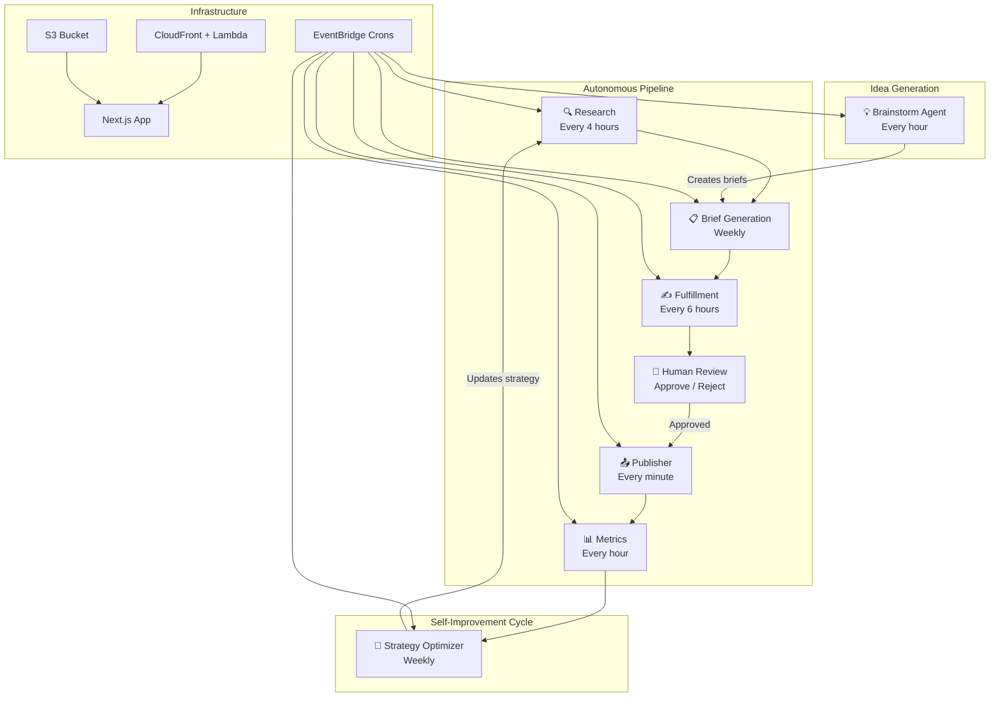

# AI Social


Autonomous AI agents that make professional business capabilities accessible to small teams — starting with social media management. AI agents research trends, generate content briefs, write posts, and optimize strategy — with human-in-the-loop review before anything goes live.

## Architecture



## Key Features

- **Autonomous Content Pipeline** — Research, brief generation, content writing, and publishing run on autopilot via EventBridge crons
- **Self-Improving Strategy Optimizer** — Weekly analysis of post performance feeds back into content strategy, adjusting format mix, cadence, and topics
- **Brainstorm Agent** — Autonomous idea generation that creates content briefs from trending topics and strategy insights
- **Cross-Platform Publishing** — Unified publishing to Twitter, Instagram, Facebook, TikTok, and YouTube via Blotato API
- **Human-in-the-Loop Review** — AI-generated posts require explicit approval before publishing; email notifications alert reviewers
- **AI Onboarding Wizard** — 5-step guided setup extracts content strategy from natural language answers using Claude tool-use
- **Error Tracking & Alerting** — Server-side error reporting with optional SES email alerts for pipeline failures
- **Multi-Business Workspaces** — Support for multiple businesses with independent strategies, accounts, and content calendars

## How It Works

| Cron | Schedule | Handler | Description |
|------|----------|---------|-------------|
| **PostPublisher** | Every 1 minute | `src/cron/publish.ts` | Publishes posts with `SCHEDULED` status when their scheduled time arrives |
| **MetricsRefresh** | Every 60 minutes | `src/cron/metrics.ts` | Refreshes engagement metrics for up to 50 published posts |
| **ResearchPipeline** | Every 4 hours | `src/cron/research.ts` | Gathers trend data and research for content strategy |
| **BriefGenerator** | Sundays 23:00 UTC | `src/cron/briefs.ts` | Creates content briefs from strategy, research, and past performance |
| **BriefFulfillment** | Every 6 hours | `src/cron/fulfill.ts` | Generates AI-written posts from pending briefs |
| **StrategyOptimizer** | Sundays 02:00 UTC | `src/cron/optimize.ts` | Analyzes performance data and refines content strategy |
| **BrainstormAgent** | Every 60 minutes | `src/cron/brainstorm.ts` | Generates new content ideas and creates briefs autonomously |

## Tech Stack

| Layer | Technology |
|-------|-----------|
| **Framework** | Next.js 16 (App Router, Turbopack) |
| **Language** | TypeScript 5.9, Zod 4 |
| **AI** | Claude Sonnet 4.6 (`@anthropic-ai/sdk`), Replicate (image generation) |
| **Database** | Prisma 7 + PostgreSQL (Neon serverless in production, pg locally) |
| **Auth** | NextAuth v4 (Google OAuth, JWT strategy) |
| **UI** | React 19, Tailwind CSS v4, shadcn/ui, Radix UI |
| **Storage** | AWS S3 (media uploads, presigned URLs) |
| **Email** | AWS SES (review notifications, error alerts) |
| **Infrastructure** | SST v3 Ion (Lambda, CloudFront, EventBridge, S3) |
| **Testing** | Jest 30, Playwright, Testing Library |

## Security

- **Access Control** — Route-level protection via NextAuth middleware; access restricted to allowlisted emails (`src/middleware.ts`)
- **SSRF Protection** — Media URL validation ensures only S3-origin URLs are fetched server-side (`src/lib/blotato/ssrf-guard.ts`)
- **Prompt Injection Guards** — User-supplied data is XML-escaped before inclusion in AI prompts; system prompts instruct Claude to treat data tags as content only (`src/lib/ai/index.ts`)
- **Token Encryption** — OAuth tokens encrypted with AES-256-GCM before database storage
- **Admin Separation** — Optional admin role with elevated privileges, configurable via `ADMIN_EMAILS`

## Built With Claude Code

This project is developed with [Claude Code](https://claude.com/claude-code) as the primary development tool. The compound engineering workflow (`/ce:brainstorm` → `/ce:plan` → `/ce:work` → `/ce:review`) drives feature development, and past solutions are documented in `docs/solutions/` for institutional knowledge.

## Getting Started

### Prerequisites

- Node.js 20+
- Docker (for local PostgreSQL)
- Google OAuth credentials (for authentication)

### Setup

```bash
# Clone and install
git clone https://github.com/jsilvia721/ai-social.git
cd ai-social
npm install

# Start local database
docker compose up -d db

# Run migrations
npx prisma migrate dev

# Start dev server
npm run dev
```

### Environment Variables

Create a `.env.local` file with the required variables. See `src/env.ts` for the full schema — key variables include:

| Variable | Description |
|----------|-------------|
| `DATABASE_URL` | PostgreSQL connection string |
| `NEXTAUTH_SECRET` | NextAuth encryption secret |
| `GOOGLE_CLIENT_ID` | Google OAuth client ID |
| `GOOGLE_CLIENT_SECRET` | Google OAuth client secret |
| `ALLOWED_EMAILS` | Comma-separated list of authorized emails |
| `ANTHROPIC_API_KEY` | Claude API key for AI features |
| `AWS_S3_BUCKET` | S3 bucket name for media storage |
| `TOKEN_ENCRYPTION_KEY` | AES-256-GCM key for OAuth token encryption |

## Project Structure

```
src/
├── app/                    # Next.js App Router
│   ├── api/                # API routes (35 endpoints)
│   │   ├── accounts/       # Social account management
│   │   ├── ai/             # AI content generation
│   │   ├── briefs/         # Content brief CRUD
│   │   ├── businesses/     # Business & strategy management
│   │   ├── fulfillment/    # Manual fulfillment triggers
│   │   ├── posts/          # Post CRUD, scheduling, review
│   │   ├── research/       # Research data
│   │   └── upload/         # S3 file uploads (direct + presigned)
│   ├── auth/               # Sign-in pages
│   └── dashboard/          # Dashboard UI
│       ├── accounts/       # Account management
│       ├── briefs/         # Brief management
│       ├── businesses/     # Business settings & onboarding
│       ├── posts/          # Post editor & calendar
│       ├── review/         # Post review queue
│       └── strategy/       # Strategy insights & analytics
├── components/             # React components (shadcn/ui based)
├── cron/                   # EventBridge Lambda handlers
├── lib/                    # Core business logic
│   ├── ai/                 # Claude integration
│   ├── blotato/            # Platform publishing client
│   ├── brainstorm/         # Brainstorm agent
│   ├── optimizer/          # Strategy optimizer
│   └── strategy/           # Content strategy logic
├── types/                  # TypeScript type definitions
└── __tests__/              # Test suite (mirrors src/ structure)
```

## API Routes

| Route | Methods | Description |
|-------|---------|-------------|
| `/api/accounts` | GET, POST | List and import social accounts |
| `/api/ai/generate` | POST | Generate AI post content |
| `/api/ai/generate-image` | POST | Generate images via Replicate |
| `/api/briefs` | GET, POST | List and create content briefs |
| `/api/briefs/[id]` | GET, PATCH, DELETE | Brief CRUD operations |
| `/api/briefs/[id]/fulfill` | POST | Trigger AI fulfillment for a brief |
| `/api/businesses` | GET, POST | List and create businesses |
| `/api/businesses/[id]/onboard` | POST | Run AI onboarding wizard |
| `/api/businesses/[id]/strategy` | GET, PUT | Get/update content strategy |
| `/api/fulfillment/run` | POST | Manually trigger fulfillment pipeline |
| `/api/posts` | GET, POST | List and create posts |
| `/api/posts/[id]` | GET, PATCH, DELETE | Post CRUD operations |
| `/api/posts/[id]/approve` | POST | Approve a post for publishing |
| `/api/posts/[id]/reject` | POST | Reject a post |
| `/api/posts/repurpose` | POST | Repurpose content across platforms |
| `/api/posts/calendar` | GET | Calendar view of scheduled posts |
| `/api/upload` | POST | Direct server-side file upload |
| `/api/upload/presigned` | GET | Get presigned URL for browser upload |
| `/api/health` | GET | Health check endpoint |
