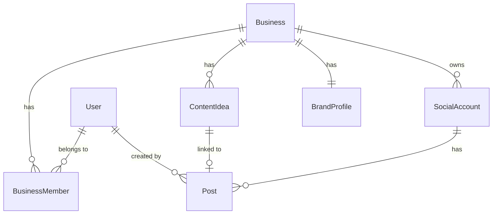

# ✨ Autonomous AI Social Media Platform — Full Product Roadmap

## Overview

Transform the current 3-platform POC (X/Twitter, Instagram, Facebook) into a fully self-managed AI social media platform that can grow any brand's presence across all major platforms. The platform supports two distinct workflow modes per business, configurable autonomy, and a feedback loop where AI continuously improves its strategy based on performance data.

**Two workflow modes (configurable per business):**
- **AI-informed:** Platform acts as a content strategist — recommends what to create, human produces the content, then uploads it to be scheduled and published
- **AI-generated:** Platform autonomously creates (text + images, eventually video) and publishes without human asset creation

**POC validation target:** AI-informed mode with Josh + business partner across all 5 platforms.

*(see brainstorm: docs/brainstorms/2026-03-05-autonomous-social-platform-roadmap-brainstorm.md)*

---

## Milestone Structure (Parallel Tracks)

The roadmap uses **parallel tracks**: platform breadth is achieved in M1, then intelligence layers are added immediately in M2. This avoids holding back AI value until "platforms are done" and gets the less-technical business partner productive fast.

```
M1: All 5 platforms + manual posting (working product)
M2: Brand profile + AI content advisor (AI-informed workflow complete)
M3: AI-generated content + approval queue (AI-generated workflow begins)
M4: Performance intelligence + strategy feedback loop
M5: Multi-business architecture (workspace isolation)
M6: Autonomous AI agents + self-improvement + video generation
```

---

## Milestone 1 — Full Platform Connect

> **Goal:** Both partners can log in, connect all 5 accounts, and manually compose, upload media, and schedule posts.

### Problem Statement

The current platform connects X/Twitter, Instagram, and Facebook but is missing TikTok and YouTube — the two platforms the business partner most urgently needs. The post list UI is basic, there's no content calendar view, and video upload support is size-limited (10MB) and lacks UX (no preview, no progress). TikTok API requires business account approval that must be applied for immediately.

### Proposed Solution

Add TikTok and YouTube as first-class platform integrations following the existing OAuth + platform client patterns. Upgrade the upload pipeline for video. Ship a content calendar view to replace the basic post list.

### Technical Approach

#### Schema Changes

```prisma
// prisma/schema.prisma
enum Platform {
  TWITTER
  INSTAGRAM
  FACEBOOK
  TIKTOK    // new
  YOUTUBE   // new
}
```

> Migration: `npx prisma migrate dev --name add-tiktok-youtube-platforms`

#### New Environment Variables

```bash
# TikTok (OAuth 2.0 PKCE, similar to Twitter)
TIKTOK_CLIENT_ID=
TIKTOK_CLIENT_SECRET=

# YouTube reuses existing Google credentials — add youtube.upload scope
# No new env vars needed for YouTube OAuth
```

Add `TIKTOK_CLIENT_ID` and `TIKTOK_CLIENT_SECRET` to `src/env.ts` Zod schema.

#### New File Structure

```
src/lib/platforms/tiktok/index.ts        # TikTok platform client
src/lib/platforms/youtube/index.ts       # YouTube platform client
src/app/api/connect/tiktok/route.ts      # OAuth init
src/app/api/connect/tiktok/callback/route.ts
src/app/api/connect/youtube/route.ts     # OAuth init (Google)
src/app/api/connect/youtube/callback/route.ts
src/__tests__/lib/platforms/tiktok.test.ts
src/__tests__/lib/platforms/youtube.test.ts
src/__tests__/api/connect/tiktok-init.test.ts
src/__tests__/api/connect/tiktok-callback.test.ts
src/__tests__/api/connect/youtube-init.test.ts
src/__tests__/api/connect/youtube-callback.test.ts
```

#### TikTok OAuth Integration

TikTok uses OAuth 2.0 with PKCE (same flow as Twitter). Required scopes: `video.publish`, `video.upload`, `user.info.basic`.

**Key difference:** TikTok's Content Posting API requires business account approval from TikTok. Build the UI and integration now; gate the actual posting behind an API availability check. The connect flow and OAuth credentials can be wired up before approval is granted.

```
Init:     GET /api/connect/tiktok → state + PKCE in cookie → redirect to TikTok authorize
Callback: GET /api/connect/tiktok/callback → exchange code → upsert SocialAccount (TIKTOK)
```

**TikTok posting flow (Direct Post API):**
1. Initialize upload: `POST https://open.tiktokapis.com/v2/post/publish/video/init/`
2. Upload chunks to the `upload_url` returned
3. Check publish status: `GET https://open.tiktokapis.com/v2/post/publish/status/fetch/`

#### YouTube OAuth Integration

YouTube reuses the existing Google OAuth client ID/secret. Add `youtube.upload` scope to the authorization request.

```
Init:     GET /api/connect/youtube → add youtube.upload scope → redirect to Google
Callback: GET /api/connect/youtube/callback → store tokens → upsert SocialAccount (YOUTUBE)
```

**YouTube posting flow (YouTube Data API v3):**
1. Upload video: `POST https://www.googleapis.com/upload/youtube/v3/videos` (resumable upload)
2. Set metadata (title, description, tags) from post content
3. Return `videoId` as `platformPostId`

**YouTube quota note:** Each video upload costs ~1,600 units of the 10,000/day quota. At ~6 posts/day limit across all YouTube channels using this platform. This is fine for POC scale but worth monitoring.

#### Scheduler Updates

```typescript
// src/lib/scheduler.ts — add cases to the if-else chain in runScheduler()
if (socialAccount.platform === "TIKTOK") {
  const result = await publishTikTokVideo(token, post.content, post.mediaUrls);
  platformPostId = result.id;
} else if (socialAccount.platform === "YOUTUBE") {
  const result = await publishYouTubeVideo(token, post.content, post.mediaUrls);
  platformPostId = result.id;
}
```

#### Upload Pipeline Changes

Current 10MB limit is too restrictive for video content. Increase and add platform-specific guidance:

| Platform | Video limit |
|---|---|
| TikTok | 287MB (typically <100MB) |
| Instagram Reels | 100MB |
| YouTube Shorts | <256MB |
| YouTube regular | Much larger — resumable upload |

Update `src/app/api/upload/route.ts`:
- Raise `MAX_SIZE` to `500 * 1024 * 1024` (500MB) for video
- Add `video/quicktime`, `video/webm`, `video/x-msvideo` to `ALLOWED_TYPES`
- Add file type-specific size limits (image: 10MB, video: 500MB)

#### Content Calendar View

Replace the tabbed post list at `src/app/dashboard/posts/page.tsx` with a weekly/monthly calendar view. No schema changes — query `Post` by `scheduledAt` range.

```
src/app/dashboard/posts/page.tsx         # refactor: calendar toggle + list view
src/components/posts/ContentCalendar.tsx  # new: weekly/monthly grid
src/components/posts/PostCalendarItem.tsx # new: compact post card for calendar cells
```

Features:
- Toggle between calendar view and list view
- Platform color-coded dots per day
- Click a day to create/view posts for that date
- Status badges inline (scheduled/published/failed/draft)

### System-Wide Impact

**Interaction graph:**
- Adding `TIKTOK` + `YOUTUBE` to Platform enum → `runScheduler()` needs new branches → `runMetricsRefresh()` needs TikTok/YouTube analytics fetchers → `src/lib/token.ts` needs to handle YouTube token refresh (Google refresh token pattern) → `PostCard`, `AccountCard`, `PostComposer` components need new platform icons/colors → `src/lib/analytics/fetchers.ts` needs `fetchTikTokMetrics()` + `fetchYouTubeMetrics()`

**Error propagation:**
- If TikTok API approval is pending, `publishTikTokVideo()` must throw a clear error that propagates to `runScheduler()` → post marked `FAILED` with descriptive `errorMessage` ("TikTok API access pending approval")
- YouTube resumable uploads can partially fail mid-transfer — the YouTube client must handle resume or fail cleanly (don't silently produce partial uploads)

**State lifecycle risks:**
- Adding `TIKTOK`/`YOUTUBE` to enum without updating scheduler branches → scheduler will throw unhandled case → post stuck in `SCHEDULED` state forever. Ensure all branches are added atomically.
- YouTube token refresh: Google tokens expire in 1 hour. `ensureValidToken()` in `src/lib/token.ts` only refreshes Twitter tokens today. YouTube needs a Google refresh token path added.

**API surface parity:**
- `src/app/api/accounts/route.ts` returns all `SocialAccount` records — will automatically include TikTok/YouTube once schema is migrated, no changes needed
- `src/app/api/posts/route.ts` is platform-agnostic — no changes needed
- Platform color/icon mappings in components need TIKTOK (black) + YOUTUBE (red-600) added

**Integration test scenarios:**
1. TikTok account connected → post scheduled → scheduler runs → post marked FAILED with "API pending" message (pre-approval path)
2. YouTube token expires → `ensureValidToken()` refreshes via Google → `publishYouTubeVideo()` succeeds
3. Large video (>10MB, <500MB) uploaded → stored in S3 → post scheduled → platform client sends to YouTube
4. Calendar view renders week with mixed-platform posts in correct color coding
5. User connects same YouTube channel twice → upsert resolves correctly, no duplicate `SocialAccount`

### Acceptance Criteria

- [ ] TikTok OAuth connect flow completes (apply for API access in parallel — connect flow works even pre-approval)
- [ ] YouTube OAuth connect flow completes using existing Google credentials with `youtube.upload` scope
- [ ] X/Twitter, Instagram, Facebook posting verified working end-to-end (smoke test on production)
- [ ] Video files up to 500MB accepted by upload endpoint with per-type size limits
- [ ] Content calendar view shows posts by week/month, color-coded by platform
- [ ] All 5 platforms shown in `src/app/dashboard/accounts/page.tsx` with connect/disconnect
- [ ] New Platform enum values in DB migration (no data loss for existing accounts)
- [ ] YouTube token refresh wired into `ensureValidToken()`
- [ ] TikTok and YouTube added to scheduler branches (publish + metrics)
- [ ] Tests written for all new platform clients and OAuth routes
- [ ] Coverage thresholds maintained (75% statements/lines/branches, 70% functions)

### Dependencies & Risks

| Risk | Mitigation |
|---|---|
| TikTok API approval takes weeks | Build UI + OAuth now; gate actual posting with a feature flag / API check. Won't block M1 ship. |
| YouTube quota (10k units/day) | Fine for POC; add a quota usage monitor in M4 |
| Video upload size in Railway | Railway has request timeout limits — large video uploads may timeout. Consider direct-to-S3 upload from browser (presigned URLs) rather than routing through Next.js |
| Google OAuth scope expansion | Adding `youtube.upload` scope may require users to re-consent if they've already connected Google (NextAuth). May need to prompt re-auth on accounts page. |

---

## Milestone 2 — Brand Profile + AI Content Advisor

> **Goal:** Platform acts as content strategist. AI owns the calendar and fills it with content briefs; humans react, create, and upload.

*(see brainstorm: docs/brainstorms/2026-03-05-autonomous-social-platform-roadmap-brainstorm.md)*

### Schema Additions

```prisma
model Business {
  id             String   @id @default(cuid())
  userId         String   // owner
  name           String
  niche          String
  tone           String
  targetAudience String?
  contentPillars String[] // e.g. ["education", "behind-the-scenes", "promotion"]
  postingGoals   String?  // freeform: "3x/week on TikTok, daily on X"
  workflowMode   WorkflowMode @default(AI_INFORMED)
  autonomyLevel  AutonomyLevel @default(APPROVAL_REQUIRED)
  createdAt      DateTime @default(now())
  updatedAt      DateTime @updatedAt
  user           User     @relation(fields: [userId], references: [id])
  contentIdeas   ContentIdea[]
}

model ContentIdea {
  id           String      @id @default(cuid())
  businessId   String
  platform     Platform
  brief        String      @db.Text  // "Create a 60-sec TikTok showing X..."
  suggestedAt  DateTime    @default(now())
  scheduledFor DateTime?
  status       IdeaStatus  @default(PENDING)  // PENDING | ACCEPTED | REJECTED | COMPLETED
  postId       String?     // linked once content is uploaded and scheduled
  business     Business    @relation(fields: [businessId], references: [id])
}

enum WorkflowMode {
  AI_INFORMED
  AI_GENERATED
}

enum AutonomyLevel {
  APPROVAL_REQUIRED
  AUTONOMOUS
}

enum IdeaStatus {
  PENDING
  ACCEPTED
  REJECTED
  COMPLETED
}
```

### Key Features

- Brand profile setup form (niche, tone, audience, content pillars, posting goals)
- AI content brief generator: weekly batch of `ContentIdea` records created by Claude, one per platform per posting slot
- Content idea queue UI: list of upcoming briefs the human can accept, reject, or edit
- Accepted idea → human creates content → uploads it → links to the `ContentIdea` → schedules post
- Calendar view (from M1) shows both scheduled posts and pending content idea slots

### AI Integration

Claude generates briefs using the `Business` profile as context. Prompt pattern:
```
You are a content strategist for a [niche] brand with tone [tone] targeting [audience].
Content pillars: [pillars].
Generate 7 content briefs for the coming week across these platforms: [platforms].
For each brief: platform, best posting day/time, format (video/image/text), topic, angle, hook idea.
```

---

## Milestone 3 — AI-Generated Content (Text + Images)

> **Goal:** Platform can draft and queue posts without human-created assets. First milestone where AI-generated workflow is available.

### Key Features

- AI text generation enhanced with `Business` profile context (already partially exists in `src/lib/ai/index.ts` — extend with brand profile)
- Image generation via Replicate (FLUX or similar) for: quote cards, product mockups, lifestyle graphics
- Per-business `workflowMode` setting in UI
- Approval queue: AI-drafted posts shown in an in-app queue; human reviews approve/reject/edit before publish
- Platform-specific formatting rules enforced (character limits, hashtag count, aspect ratios)

### Schema Additions

```prisma
// Extend Post model
model Post {
  // ... existing fields ...
  aiGenerated    Boolean  @default(false)
  approvalStatus ApprovalStatus? // null = not applicable (manual posts)
}

enum ApprovalStatus {
  PENDING
  APPROVED
  REJECTED
  EDITED
}
```

### Approval Queue UX

In-app queue at `/dashboard/queue`:
- Shows all AI-drafted posts pending approval
- Inline edit of text, image swap, platform selection
- Bulk approve for routine content
- Reject with reason (feeds back into AI strategy in M4)

---

## Milestone 4 — Performance Intelligence + Strategy Loop

> **Goal:** AI reads what's working and updates its content recommendations. First feedback loop closes.

### Key Features

- Cross-platform analytics dashboard (aggregate reach, engagement, growth charts across all 5 platforms)
- Performance scoring per post: engagement rate calculated from existing metrics fields
- Strategy feedback: AI analyzes recent post performance and updates `ContentIdea` generation — surfaces topics/formats/times that historically perform well
- Weekly digest report (email or in-app): what worked, what to do more of, what to drop
- A/B variants: AI generates 2 versions of a content brief; platform chooses winner after 48h

### Technical Approach

Extend `Business` model with `strategyMemory: Json?` — a structured summary that AI updates after each weekly analysis cycle. This becomes the primary context fed into content generation, replacing the static brand profile fields.

```typescript
// src/lib/ai/strategy.ts
export async function analyzePerformanceAndUpdateStrategy(businessId: string): Promise<void>
```

Runs on a new weekly cron: `0 9 * * 1` (Monday 9am).

---

## Milestone 5 — Multi-Business Architecture

> **Goal:** Platform supports multiple isolated brands. Each workspace has its own accounts, profile, settings, and team.

*(see brainstorm: Key decision — business model TBD; build isolation without coupling to any pricing model)*

### Schema Additions

```prisma
model BusinessMember {
  id         String       @id @default(cuid())
  businessId String
  userId     String
  role       MemberRole   @default(MEMBER)
  business   Business     @relation(fields: [businessId], references: [id])
  user       User         @relation(fields: [userId], references: [id])

  @@unique([businessId, userId])
}

enum MemberRole {
  OWNER
  ADMIN
  MEMBER
  VIEWER
}
```

### Key Changes

- `SocialAccount`, `Post`, `ContentIdea` all scoped to `Business` (not just `User`)
- All API routes and queries updated to scope by `businessId` (sourced from session + membership check)
- Business switcher in sidebar for users who belong to multiple businesses
- Admin view: platform owner (`ALLOWED_EMAILS`) sees all businesses, their plan, and activity

### ERD (Updated)



---

## Milestone 6 — Autonomous AI Agents + Self-Improvement

> **Goal:** Platform runs itself. AI generates, publishes, reads metrics, updates strategy — continuously. Humans intervene only on anomalies.

### Architecture

Multi-agent design with four specialized agents, each with distinct tools and memory:

```
StrategyAgent     — owns Business.strategyMemory, proposes strategy changes
ContentAgent      — generates posts (text + image + video script)
SchedulerAgent    — decides optimal timing and platform mix
AnalyticsAgent    — reads metrics, scores performance, feeds StrategyAgent
```

Each agent runs on its own cron schedule. Agents communicate via structured DB state (not direct calls) to keep the system observable and debuggable.

### Key Features

- Fully autonomous posting loop: StrategyAgent → ContentAgent → approval (if required) → publish → AnalyticsAgent → StrategyAgent
- Agent memory: `Business.strategyMemory` accumulates learnings about brand voice, audience resonance, and competitor signals
- Self-improving strategy proposals: StrategyAgent proposes changes (posting frequency, platform mix, content types) for human approval before executing — even in autonomous mode
- Anomaly alerts: notify via in-app notification (and later email/push) when engagement drops >30% week-over-week or posting errors spike
- AI-generated video: Runway ML or similar for short-form video creation from a script

### Human Override Layer

Even in fully autonomous mode, humans can:
- Pause the agent at any time
- Reject any strategy change proposal
- Manually edit or delete any scheduled post
- Set hard guardrails (max posts/day, blocked topics, required approval for specific content types)

---

## Alternative Approaches Considered

| Approach | Rejected Because |
|---|---|
| Platform-first (all platforms stable before any AI) | Delays AI value too long; partner needs posting capability now |
| AI-first (build the AI advisor before all platforms are wired) | Platform breadth is the partner's immediate need |
| Vertical slice (one platform end-to-end before adding others) | Violates the "all 5 platforms in M1" constraint from brainstorm |
| Structured onboarding form for brand context | YAGNI — evolving from performance data is simpler and more accurate |

---

## Acceptance Criteria

### Milestone 1 (Immediate)
See detailed criteria in the Milestone 1 section above.

### Full Roadmap Success
- [ ] All 5 platforms post content without errors for 30 consecutive days
- [ ] AI-informed workflow: business partner uses content briefs weekly without engineer involvement
- [ ] AI-generated workflow: posts created and published with zero human-created assets
- [ ] Strategy loop: measurable improvement in engagement rate after 4 weeks of AI feedback
- [ ] Multi-business: second brand onboarded in <30 minutes without code changes
- [ ] Autonomous mode: 30-day run with no human intervention, week-over-week metric improvement

## Success Metrics

| Milestone | Metric |
|---|---|
| M1 | All 5 accounts connected; 0 publish errors over 1-week smoke test |
| M2 | Partner generates and acts on AI content briefs weekly |
| M3 | First AI-generated post published without human-created assets |
| M4 | Engagement rate improves after strategy feedback cycle |
| M5 | Second business onboarded without code changes |
| M6 | Platform runs autonomously for 30 days with improving metrics |

## Dependencies & Prerequisites

- **TikTok API approval:** Apply immediately — critical path for full M1 completion
- **YouTube quota monitoring:** Track API unit consumption starting M1
- **AWS S3 bucket configuration:** Confirm max file size for video uploads (Railway → S3 direct upload may be needed for large files)
- **Replicate API key:** Needed for M3 image generation
- **Video generation API (Runway/Sora):** Evaluate and select before M6 scoping

## Risk Analysis

| Risk | Likelihood | Impact | Mitigation |
|---|---|---|---|
| TikTok API approval delayed | High | Medium | Ship M1 without TikTok posting; connect UI works; posting gates on approval |
| YouTube quota exhaustion | Low | High | Monitor from day 1; add quota check before scheduling YouTube posts |
| Large video upload timeouts (Railway) | Medium | Medium | Move to presigned S3 URL direct upload from browser in M1 |
| Strategy feedback loop produces worse content | Medium | Medium | A/B test all strategy changes; human approval for strategy changes in M4 |
| Multi-tenant data isolation bug | Low | Critical | Row-level `businessId` scoping + integration tests enforcing isolation in M5 |

## Future Considerations

- Mobile app / PWA for on-the-go approvals (identified in brainstorm, deferred to post-M3)
- Competitor monitoring agent (feed into StrategyAgent in M6)
- White-label / client portal (clients view their own analytics without platform access)
- Monetization layer (Stripe subscriptions per business workspace — M5 billing hooks are the placeholder)

## Documentation Plan

- Update `CLAUDE.md` after each milestone with new env vars, platform patterns, and schema notes
- Create `docs/solutions/` entries for non-obvious patterns (TikTok chunked upload, YouTube resumable upload, Google scope expansion re-consent)

---

## Sources & References

### Origin
- **Brainstorm document:** [docs/brainstorms/2026-03-05-autonomous-social-platform-roadmap-brainstorm.md](../brainstorms/2026-03-05-autonomous-social-platform-roadmap-brainstorm.md)
  - Key decisions carried forward: parallel tracks structure, AI-informed first, AI owns calendar / human reacts, TikTok built in parallel with API approval, in-app approval queue for M3, configurable autonomy per business

### Internal References
- OAuth pattern (Twitter): `src/app/api/connect/twitter/route.ts`, `src/app/api/connect/twitter/callback/route.ts`
- OAuth pattern (Meta): `src/app/api/connect/meta/route.ts`, `src/app/api/connect/meta/callback/route.ts`
- Platform client pattern: `src/lib/platforms/twitter/index.ts`, `src/lib/platforms/instagram/index.ts`
- Scheduler: `src/lib/scheduler.ts:39-58` (platform dispatch if-else)
- Token refresh: `src/lib/token.ts`
- Analytics fetchers: `src/lib/analytics/fetchers.ts`
- Upload route (size limit to update): `src/app/api/upload/route.ts:24`
- Env validation (add TIKTOK vars): `src/env.ts`
- Prisma config (migrations): `prisma.config.ts`

### External References
- TikTok Content Posting API: https://developers.tiktok.com/doc/content-posting-api-get-started/
- TikTok OAuth 2.0: https://developers.tiktok.com/doc/oauth-user-access-token-management/
- YouTube Data API v3 (video upload): https://developers.google.com/youtube/v3/guides/uploading_a_video
- YouTube API quota calculator: https://developers.google.com/youtube/v3/determine_quota_cost
- Replicate API (image generation): https://replicate.com/docs
