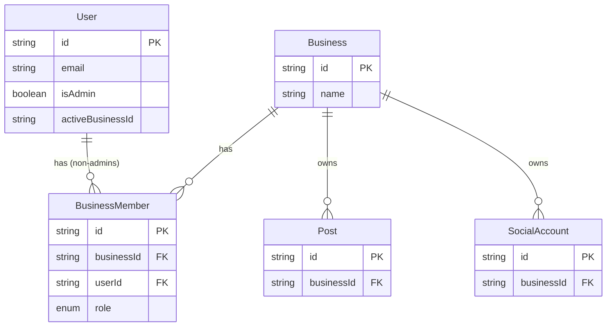

# feat: Admin Role with Global Workspace Access

## Overview

A user signed into the app can currently only see workspaces (businesses) they are explicitly a member of via the `BusinessMember` join table. Two users — the app owner and their business partner — should be designated as **global admins** who can see and manage all workspaces without being individually added to each one. All other authorization behavior (workspace scoping, data isolation between workspaces) remains unchanged.

This feature also lays the groundwork for future per-workspace access control, where individual workspaces can be restricted to specific non-admin accounts.

## Problem Statement

Every API route and server component enforces a strict `BusinessMember` membership filter:
```ts
{ business: { members: { some: { userId: session.user.id } } } }
```
The business partner account has no `BusinessMember` rows, so every data query returns empty and the workspace selector shows nothing. There is no existing mechanism to grant cross-workspace access without manually creating a membership record for every workspace.

## Proposed Solution

### Phase 1 — Schema: Add `isAdmin` to User

Add an `isAdmin Boolean @default(false)` field to the `User` model. This is the **source of truth** — it persists across sessions and survives token expiry.

### Phase 2 — Bootstrap: `ADMIN_EMAILS` env var

Add an optional `ADMIN_EMAILS` env var (comma-separated). In the NextAuth `signIn` callback, any user whose email appears in `ADMIN_EMAILS` gets `User.isAdmin` set to `true` in the database. This is a one-time bootstrap mechanism — after the flag is set in DB it persists, so the env var can remain as a long-term gate (set it and forget it).

### Phase 3 — Session: Propagate `isAdmin` through JWT

In the `jwt()` callback, read `dbUser.isAdmin` at sign-in and store it as `token.isAdmin`. In the `session()` callback, forward `token.isAdmin` to `session.user.isAdmin`. This makes the admin flag available on every server request without a per-request DB lookup.

### Phase 4 — Access Control: Bypass Membership Filter for Admins

Every protected route that uses the membership filter needs a conditional bypass:

```ts
// Pattern for admin-aware membership filter
function membershipFilter(userId: string, isAdmin: boolean) {
  return isAdmin ? {} : { business: { members: { some: { userId } } } };
}
```

Admin users still scope to the active workspace (businessId) — they just aren't blocked by the membership check. They can also freely switch to any workspace.

### Phase 5 — Dashboard Layout: All Businesses for Admins

The dashboard layout fetches the workspace list for the sidebar. For admins, fetch all `Business` records instead of only those with a `BusinessMember` row.

## Architecture

### Updated Schema

```prisma
// prisma/schema.prisma
model User {
  id               String    @id @default(cuid())
  email            String?   @unique
  emailVerified    DateTime?
  name             String?
  image            String?
  isAdmin          Boolean   @default(false)   // NEW
  activeBusinessId String?
  createdAt        DateTime  @default(now())
  updatedAt        DateTime  @updatedAt
  // ... relations unchanged
}
```

### ERD



### JWT Token Fields (after change)

| Field | Source | Description |
|---|---|---|
| `token.sub` | `user.id` | DB user ID |
| `token.activeBusinessId` | `User.activeBusinessId` or first membership | Active workspace |
| `token.isAdmin` | `User.isAdmin` | **NEW** — admin bypass flag |

## Files to Change

### Schema + Migration

- **`prisma/schema.prisma`** — add `isAdmin Boolean @default(false)` to `User` (line 17 region)
- **`prisma/migrations/`** — new migration: `add_user_is_admin`
- Run `npx prisma generate` after schema change

### Env

- **`src/env.ts`** — add `ADMIN_EMAILS: z.string().optional()` (optional so non-admin deploys don't break)

### Auth

- **`src/lib/auth.ts`**
  - `signIn` callback (line 19): if email is in `ADMIN_EMAILS`, upsert `User.isAdmin = true`
  - `jwt` callback (line 27 region): read and store `dbUser.isAdmin` → `token.isAdmin`
  - `session` callback (line 62): forward `token.isAdmin` → `session.user.isAdmin`

### Dashboard Layout

- **`src/app/dashboard/layout.tsx`** (lines 18–24)
  - If `session.user.isAdmin`: `prisma.business.findMany({ orderBy: { createdAt: 'asc' } })`
  - Else: existing membership-based query

### API Routes — Membership Filter Bypass

All 12 protected routes listed below need a conditional membership check. The pattern is the same for each:

```ts
const isAdmin = (session.user as ExtendedUser).isAdmin ?? false;
const memberFilter = isAdmin ? {} : { business: { members: { some: { userId: session.user.id } } } };
```

| Route | Method | Current filter location |
|---|---|---|
| `src/app/api/posts/route.ts` | GET | line 21 |
| `src/app/api/posts/route.ts` | DELETE | line 54 |
| `src/app/api/posts/route.ts` | POST (account verify) | line 80 |
| `src/app/api/posts/[id]/route.ts` | PATCH | line 17 |
| `src/app/api/posts/[id]/retry/route.ts` | POST | line 16 |
| `src/app/api/posts/calendar/route.ts` | GET | line 39 |
| `src/app/api/accounts/route.ts` | GET | line 17 |
| `src/app/api/accounts/route.ts` | DELETE | line 55 |
| `src/app/api/businesses/route.ts` | GET | line 12 |
| `src/app/api/businesses/switch/route.ts` | POST | line 17 |
| `src/app/api/connect/blotato/route.ts` | GET | line 37 |
| `src/app/api/businesses/[id]/onboard/route.ts` | POST | line 18 |

### Server Components — Membership Filter Bypass

- **`src/app/dashboard/page.tsx`** (line 40): `memberFilter` used in 7 `Promise.all` queries → bypass for admins
- **`src/app/dashboard/analytics/page.tsx`** (line 29): `memberFilter` → bypass for admins

> Note: Both server components already scope by `activeBusinessId` (added in PR #6). Admins still benefit from this scoping — they explicitly choose which workspace to view. The only change is removing the membership requirement.

## Session Type

The existing cast pattern in the codebase (`session.user as { id: string; activeBusinessId?: string | null }`) should be extended consistently:

```ts
// Reusable type — could live in src/types/index.ts or inlined per-file
type ExtendedUser = {
  id: string;
  isAdmin?: boolean;
  activeBusinessId?: string | null;
};
```

## Technical Considerations

- **Security**: The admin bypass only applies after a valid authenticated session exists. The `ALLOWED_EMAILS` gate still prevents unauthorized sign-ins entirely. Admin status in the JWT is set from the DB (not user-supplied), so it cannot be spoofed.
- **Bootstrap safety**: The `signIn` callback upserts `isAdmin = true` for admin emails. Since `ALLOWED_EMAILS` is already required, any email in `ADMIN_EMAILS` must also be in `ALLOWED_EMAILS` to reach the `signIn` callback. This means `ADMIN_EMAILS` should be a strict subset of `ALLOWED_EMAILS`.
- **JWT staleness**: If `isAdmin` changes in the DB (e.g. revoking admin), the user's JWT persists until it expires or they sign out. For a small team this is acceptable. A future improvement could force a re-login on role change.
- **No migration data loss**: `isAdmin` defaults to `false`, so all existing users are unaffected until explicitly promoted.
- **Blotato callback route**: `src/app/api/connect/blotato/callback/route.ts` does not have a membership check at write time — it relies on the `state` parameter set during initiation. The initiation route (`src/app/api/connect/blotato/route.ts`) does have a membership check (line 37) that needs the admin bypass.

## System-Wide Impact

**Interaction graph:** User signs in → `signIn` callback checks `ADMIN_EMAILS` → if match, `prisma.user.update({ isAdmin: true })` → `jwt` callback reads `dbUser.isAdmin` → stored as `token.isAdmin` → `session` callback forwards to `session.user.isAdmin` → all server requests read from JWT (no extra DB lookup) → membership filters skipped for admins.

**Error propagation:** If `ADMIN_EMAILS` env var is missing or empty, the feature degrades gracefully — no users get promoted to admin, and all existing behavior is unchanged. `isAdmin` defaults to `false`.

**State lifecycle risks:** The one-time upsert in `signIn` is idempotent (setting `true` again is a no-op). No orphaned state risk.

**API surface parity:** `GET /api/businesses` currently includes `role` per business in its response. For admins fetching all businesses, there may be no matching `BusinessMember` row, so the join cannot return a role. The route should return `role: null` or omit it for businesses where no membership exists.

## Acceptance Criteria

- [x] Partner account can sign in and see all workspaces in the BusinessSelector dropdown
- [x] Partner account can switch to any workspace and view its posts, analytics, accounts, and dashboard stats
- [x] Partner account can create posts and connect accounts within any workspace
- [x] Owner account behavior is unchanged (still sees all workspaces, can do everything)
- [x] Non-admin accounts (future users added via `ALLOWED_EMAILS`) still see only their own memberships
- [x] Setting `ADMIN_EMAILS` in env and signing in promotes the user to `isAdmin = true` in DB
- [x] If `ADMIN_EMAILS` is not set, all users are treated as non-admins (no breakage)
- [x] Admin JWT correctly carries `isAdmin: true` — verified by checking session in tests
- [x] `POST /api/businesses/switch` allows admins to switch to any business without a `BusinessMember` row
- [x] All existing tests pass; new tests added for admin bypass behavior
- [x] No schema migration breaks existing data (`isAdmin` defaults to `false`)

## Future Considerations

The "restrict workspaces to specific accounts" requirement maps cleanly to the existing `BusinessMember` model:

- **Phase A (this PR):** Global admins bypass membership checks entirely
- **Phase B (future):** Non-admin users can be invited to specific workspaces by creating a `BusinessMember` row for them (already supported by the data model, just needs a UI)
- **Phase C (future):** A workspace can be set as "restricted" (a `restricted: Boolean` flag on `Business`), meaning only explicitly added members can access it. Admins always bypass this.
- **Phase D (future):** Workspace-level permissions beyond OWNER/MEMBER (e.g., VIEWER = read-only)

The `BusinessRole` enum currently has `OWNER | MEMBER` (both stored but never enforced). Future can add `VIEWER` or use the existing `OWNER` role to gate destructive operations.

## Implementation Order (for `/ce:work`)

1. Add `isAdmin` to `prisma/schema.prisma` + run migration + generate
2. Add `ADMIN_EMAILS` to `src/env.ts`
3. Update `src/lib/auth.ts` — signIn, jwt, session callbacks
4. Update `src/app/dashboard/layout.tsx` — admin business list fetch
5. Update `src/app/api/businesses/switch/route.ts` — admin bypass
6. Update `src/app/api/businesses/route.ts` — admin bypass (return all businesses)
7. Update all data API routes (posts, calendar, accounts, connect, onboard) — admin bypass
8. Update server components (dashboard/page.tsx, analytics/page.tsx) — admin bypass
9. Write/update tests for all changed surfaces
10. Add `ADMIN_EMAILS` to `.env.local` for local dev

## Sources & References

- Session/JWT pattern: `src/lib/auth.ts:18–74`
- Membership filter pattern (used in 12 routes): `src/app/api/posts/route.ts:21`
- Dashboard layout (business list fetch): `src/app/dashboard/layout.tsx:18–24`
- BusinessSelector sidebar: `src/components/dashboard/Sidebar.tsx:55–98`
- BusinessMember schema: `prisma/schema.prisma:72–82`
- User schema: `prisma/schema.prisma:11–23`
- ALLOWED_EMAILS gate: `src/lib/auth.ts:19–21`
- Business switch route: `src/app/api/businesses/switch/route.ts:17–28`
- Related PR: #6 (workspace-scoped data filtering)
