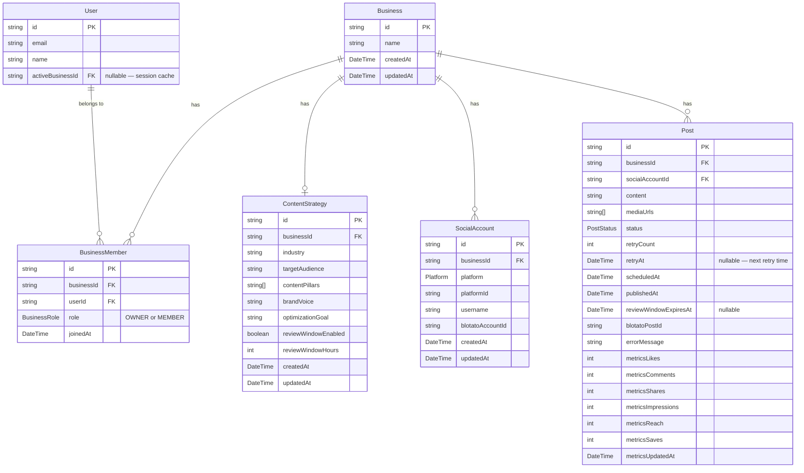

# feat: Blotato Integration + Workspace Model (Milestone 1)

## Enhancement Summary

**Deepened on:** 2026-03-07
**Research agents used:** kieran-typescript-reviewer, security-sentinel, architecture-strategist, performance-oracle, data-migration-expert, data-integrity-guardian, agent-native-reviewer, best-practices-researcher, framework-docs-researcher, frontend-design, julik-frontend-races-reviewer, code-simplicity-reviewer, pattern-recognition-specialist

### Key Improvements Over Original Plan

1. **Scope cuts** — Remove `GenerationModule`, `WorkspaceModuleConfig`, `Business.slug`, `postingCadence` field, and review-window auto-publish from M1. These are M2 features that add schema migrations and complexity before the core flow is working. Saves 6–8 files and 2 schema tables.

2. **`BusinessMember` junction table with `role`** — Adding a bare `userId` FK to Business is not extensible. A `BusinessMember` join table with `role: OWNER | MEMBER` supports future team collaboration without a schema migration.

3. **Active business in JWT session** — Not a URL query param (`?business=xxx`). App Router layouts cannot read `searchParams`; the sidebar needs the active business context. Storing it in the NextAuth session is the idiomatic extension of the existing auth pattern.

4. **Separate `retryAt` column** — Don't overwrite `scheduledAt` for RETRYING posts. Use a dedicated `retryAt DateTime?` column so original scheduling intent is preserved for analytics and UI.

5. **Three-release migration strategy** — Never drop `accessToken`/`refreshToken` columns in the same migration that adds `blotatoAccountId`. Make nullable first, drop in Release 3 after code is fully switched.

6. **Critical indexes** — The scheduler query `(status, scheduledAt)` cannot use either existing index (both are prefixed by `userId`). Add `@@index([status, scheduledAt])` and `@@index([status, metricsUpdatedAt])`.

7. **`BlotatoApiError` class hierarchy** — Enables smart retry: don't consume a retry slot on 4xx (non-429) errors. Zod validation on every Blotato response.

8. **`PUBLISHING` intermediate status** — Prevents double-publish race between scheduler auto-expiry and manual partner approval. Acts as a distributed lock without external infrastructure.

9. **SSRF trailing-slash fix** — `startsWith(env.AWS_S3_PUBLIC_URL)` without a trailing slash allows `https://storage.example.com.attacker.com/...` to pass. Fix is one line.

10. **Neon `DIRECT_URL` for migrations** — Prisma 7 + Neon requires a non-pooled direct URL for `prisma migrate deploy`. Add `DIRECT_URL` GitHub secret alongside existing `DATABASE_URL`.

### Scope Changes from Original

| Area | Original | Revised |
|---|---|---|
| `Business.slug` | Required, unique | **Cut** — use CUID in URLs |
| `GenerationModule` DB model | M1 stub | **Cut** — TypeScript config registry in M2 |
| `WorkspaceModuleConfig` DB model | M1 stub | **Cut** — M2 |
| `postingCadence` on ContentStrategy | M1 field | **Cut** — M2 field (nothing reads it in M1) |
| Review window auto-publish in scheduler | M1 | **Cut to M2** — `PENDING_REVIEW` status stays; auto-publish logic is M2 |
| Approve/reject as separate route files | 2 files | **Merged** into `PATCH /api/posts/[id]` |
| Active business via `?business=xxx` | Query param | **Cookie + JWT session** |
| `src/lib/email.ts` | Standalone module | **Inline in scheduler** until M2 adds more email types |
| Business model shape | `userId` FK direct | **`BusinessMember` junction with `role`** |

---

## Overview

Replace all direct platform API integrations (Twitter, Instagram, Facebook, TikTok, YouTube) with the Blotato API as a unified publishing layer. Introduce a Business/workspace data model with a `BusinessMember` join table so one partner login can manage a portfolio of client accounts. Add an AI-driven onboarding wizard that synthesizes client answers into a `ContentStrategy` using Claude's tool_use API. Ship manual scheduling and publishing end-to-end across all platforms via Blotato. Add configurable per-workspace review windows and auto-retry with SES alerts on persistent publish failure.

**Exit criteria:** Partner can manage 3+ client workspaces, each with multiple platform accounts connected via Blotato, and schedule/publish posts manually to all platforms.

(see brainstorm: docs/brainstorms/2026-03-07-autonomous-ai-social-media-manager-brainstorm.md — Milestone 1)

---

## Problem Statement

The current codebase has four platform OAuth flows, four sets of encrypted token management, and four platform-specific publish/metrics functions. Meta app review is blocking Instagram/Facebook access. TikTok approval is still pending. This architecture requires maintaining per-platform API compliance, managing token refresh, and completing separate approval processes for each platform.

Blotato acts as an intermediary: it holds OAuth tokens on behalf of clients and exposes a single publish API. Switching to Blotato eliminates the Meta and TikTok approval blockers entirely and reduces the platform integration surface from ~2,000 lines of platform-specific code to a single `src/lib/blotato/` module.

The current data model (`User → SocialAccount, Post`) does not support the multi-client portfolio model. A `Business` workspace layer is required so one partner account can manage multiple client brands independently.

---

## Proposed Solution

### Architecture After M1

```
User (partner)
 └── BusinessMember[] (role: OWNER | MEMBER)
      └── Business (client workspace)
           ├── ContentStrategy (1:1, AI-generated during onboarding)
           ├── SocialAccount[] (Blotato account references — no tokens stored)
           └── Post[] (all scheduled/published content for this workspace)

Active business: stored in JWT session (session.user.activeBusinessId)
  Updated via POST /api/businesses/switch

Publishing layer:
  src/lib/blotato/ → Blotato API (single endpoint, BLOTATO_API_KEY)
  Replaces: src/lib/platforms/, src/lib/token.ts, src/lib/crypto.ts

Connect flow:
  GET /api/connect/blotato?platform=X → state cookie set →
  Blotato OAuth → callback → verify state → upsert SocialAccount.blotatoAccountId

Retry + alerts:
  scheduler → publish via Blotato → on failure: retryCount++ + retryAt = now + delay →
  3rd failure: inline SES call to partner email
```

---

## Data Model

### Updated ERD



### Schema Changes Summary

**New models:**
- `Business` — workspace entity (`id`, `name`) — no `slug` (use CUID in URLs)
- `BusinessMember` — join table (`businessId`, `userId`, `role: OWNER | MEMBER`, `joinedAt`); `@@unique([businessId, userId])`
- `ContentStrategy` — AI-generated per-business. Fields: `industry`, `targetAudience`, `contentPillars[]`, `brandVoice`, `optimizationGoal`, `reviewWindowEnabled`, `reviewWindowHours`. **No `postingCadence` in M1** — nothing reads it until M2's autonomous scheduler.

**Modified models:**
- `User` — add `activeBusinessId String?` (denormalized cache for active workspace, validated against `BusinessMember` on session hydration)
- `SocialAccount` — add `businessId`, replace `accessToken`/`refreshToken`/`expiresAt` with `blotatoAccountId String`; remove `userId` (owned through Business)
- `Post` — add `businessId`, `retryCount Int @default(0)`, `retryAt DateTime?`, `reviewWindowExpiresAt DateTime?`; rename `platformPostId` → `blotatoPostId`; remove `userId` (owned through Business)

**PostStatus enum additions:**
- `PENDING_REVIEW` — held for partner approval before scheduling
- `RETRYING` — in retry backoff, will be re-attempted at `retryAt`
- `PUBLISHING` — claimed by scheduler or approve route; acts as distributed lock preventing double-publish

**New indexes:**
```prisma
// Post model
@@index([status, scheduledAt])   // scheduler query — existing userId-prefixed indexes don't cover this
@@index([status, retryAt])       // retry pickup query
@@index([status, metricsUpdatedAt])  // metrics refresh query
```

> **Why `@@index([status, scheduledAt])` is critical:** Both existing indexes (`[userId, status, scheduledAt]`, `[userId, scheduledAt]`) lead with `userId`. The scheduler query has no `userId` filter — it processes all users' posts. Without this index, the scheduler does a full sequential scan on every Lambda invocation.

---

## Technical Approach

### Phase 1: Database Schema Migration (Three-Release Strategy)

**Why three releases:** Dropping `accessToken`/`refreshToken` in the same migration that adds `blotatoAccountId` creates a window between `prisma migrate deploy` and `sst deploy` where the Lambda reads a column that no longer exists. Solution: make columns nullable in Release 1, deploy code that reads `blotatoAccountId` in Release 2, drop stale columns in Release 3.

**Files:**
- `prisma/schema.prisma` — apply all model changes
- `prisma/migrations/20260308_add_business_member/` — new Business + BusinessMember models, backfill
- `prisma/migrations/20260308_update_social_account/` — add blotatoAccountId, make token cols nullable, add businessId
- `prisma/migrations/20260308_update_post/` — add businessId, retryCount, retryAt, reviewWindowExpiresAt, RENAME COLUMN
- `prisma/migrations/20260308_add_post_status_values/` — PENDING_REVIEW, RETRYING, PUBLISHING (**separate file, `transactional = false`**)
- `prisma/migrations/20260315_drop_token_columns/` — drop accessToken, refreshToken, expiresAt (Release 3 only)

**Migration gotchas:**

1. **Enum additions require non-transactional migration.** `ALTER TYPE ... ADD VALUE` cannot run inside a transaction block in Postgres < 16. Create a separate migration file and add `migration.toml` with `transactional = false`:
   ```toml
   # prisma/migrations/20260308_add_post_status_values/migration.toml
   transactional = false
   ```
   ```sql
   ALTER TYPE "PostStatus" ADD VALUE IF NOT EXISTS 'PENDING_REVIEW';
   ALTER TYPE "PostStatus" ADD VALUE IF NOT EXISTS 'RETRYING';
   ALTER TYPE "PostStatus" ADD VALUE IF NOT EXISTS 'PUBLISHING';
   ```

2. **Column rename via `--create-only` + manual SQL.** Prisma treats renames as drop+add (data loss). Use:
   ```bash
   npx prisma migrate dev --name rename_platformPostId --create-only
   # Edit generated SQL: replace DROP+ADD with:
   # ALTER TABLE "Post" RENAME COLUMN "platformPostId" TO "blotatoPostId";
   ```

3. **NOT NULL businessId backfill sequence.** Add nullable → backfill UPDATE → SET NOT NULL. Never in one step:
   ```sql
   -- Step 1: add nullable
   ALTER TABLE "Post" ADD COLUMN "businessId" TEXT;
   -- Step 2: backfill (in same migration, after Business rows exist)
   UPDATE "Post" p SET "businessId" = (
     SELECT b.id FROM "Business" b
     JOIN "BusinessMember" bm ON bm."businessId" = b.id
     WHERE bm."userId" = p."userId" AND bm."role" = 'OWNER'
     LIMIT 1
   );
   -- Step 3: enforce NOT NULL
   ALTER TABLE "Post" ALTER COLUMN "businessId" SET NOT NULL;
   ```

4. **Business backfill must be collision-safe.** No `slug` in M1, but if Business.name is derived from User.name (nullable), use email prefix as fallback:
   ```sql
   INSERT INTO "Business" (id, name, "createdAt", "updatedAt")
   SELECT gen_random_uuid()::text,
          COALESCE(u.name, split_part(u.email, '@', 1)),
          NOW(), NOW()
   FROM "User" u;
   -- Then insert BusinessMember rows for each User→Business pair
   ```

5. **Neon requires `DIRECT_URL` for migrations.** Neon's pooled URL (`-pooler` suffix) does not work for `prisma migrate deploy`. Add a non-pooled connection string as a separate GitHub secret:
   - `STAGING_DIRECT_DATABASE_URL` — no `-pooler`, same host
   - `PROD_DIRECT_DATABASE_URL` — no `-pooler`

   Update `prisma.config.ts`:
   ```typescript
   datasource: { url: env("DIRECT_URL") }  // non-pooled for CLI migrations
   ```
   Runtime `src/lib/db.ts` continues using `DATABASE_URL` (pooled for Lambda connections).

---

### Phase 2: Blotato API Client (`src/lib/blotato/`)

**Files:**
```
src/lib/blotato/
  types.ts        — BlotatoAccount, BlotatoPublishResult interfaces
  client.ts       — base fetch wrapper, BlotatoApiError hierarchy, Zod validation, timeout
  accounts.ts     — getConnectUrl(platform, callbackUrl, state), listAccounts(), getAccount(id)
  publish.ts      — publishPost(accountId, content, mediaUrls)
  metrics.ts      — getPostMetrics(blotatoPostId)
  ssrf-guard.ts   — assertSafeMediaUrl() moved here from src/lib/platforms/
```

**`src/lib/blotato/client.ts` — production pattern:**

```typescript
// src/lib/blotato/client.ts
import { z } from "zod";
import { env } from "@/env";

const BASE = "https://api.blotato.com/v1";
const TIMEOUT_MS = 15_000;

export class BlotatoApiError extends Error {
  constructor(
    message: string,
    public readonly status: number,
  ) {
    super(message);
    this.name = "BlotatoApiError";
  }
}

export class BlotatoRateLimitError extends BlotatoApiError {
  constructor(public readonly retryAfterMs: number) {
    super("Rate limited by Blotato", 429);
    this.name = "BlotatoRateLimitError";
  }
}

export async function blotatoFetch<T>(
  path: string,
  schema: z.ZodType<T>,
  options: RequestInit = {},
): Promise<T> {
  const controller = new AbortController();
  const timer = setTimeout(() => controller.abort(), TIMEOUT_MS);

  let res: Response;
  try {
    res = await fetch(`${BASE}${path}`, {
      ...options,
      signal: controller.signal,
      headers: {
        Authorization: `Bearer ${env.BLOTATO_API_KEY}`,
        "Content-Type": "application/json",
        ...options.headers,
      },
    });
  } catch (err) {
    if ((err as Error).name === "AbortError") throw new BlotatoApiError("Request timed out", 408);
    throw err;
  } finally {
    clearTimeout(timer);
  }

  if (res.status === 429) {
    const retryAfter = Number(res.headers.get("Retry-After") ?? 60);
    throw new BlotatoRateLimitError(retryAfter * 1000);
  }
  if (!res.ok) {
    const body = await res.text();
    throw new BlotatoApiError(`Blotato API error ${res.status}: ${body}`, res.status);
  }

  const data: unknown = await res.json();
  const parsed = schema.safeParse(data);
  if (!parsed.success) {
    throw new BlotatoApiError(`Unexpected response shape: ${parsed.error.issues[0]?.message}`, 200);
  }
  return parsed.data;
}
```

**Smart retry decision — don't retry 4xx (except 429):**
```typescript
// src/lib/scheduler.ts
function shouldRetry(err: unknown, retryCount: number): boolean {
  if (retryCount >= 3) return false;
  if (err instanceof BlotatoApiError && err.status >= 400 && err.status < 500 && err.status !== 429) {
    return false; // client error — retrying won't help
  }
  return true;
}
```

**SSRF guard fix — add trailing slash:**
```typescript
// src/lib/blotato/ssrf-guard.ts
export function assertSafeMediaUrl(url: string): void {
  const allowedPrefix = env.AWS_S3_PUBLIC_URL.endsWith("/")
    ? env.AWS_S3_PUBLIC_URL
    : `${env.AWS_S3_PUBLIC_URL}/`;
  if (!url.startsWith(allowedPrefix)) {
    throw new Error(`SSRF guard: mediaUrl must start with ${allowedPrefix}. Got: ${url}`);
  }
}
```
> **Why the trailing slash matters:** Without it, `https://storage.example.com.attacker.com/file.jpg` passes the `startsWith` check. Add a test case for this bypass.

Also fix the existing Twitter SSRF gap: `src/lib/platforms/twitter/index.ts` `uploadTwitterMedia()` does not call `assertSafeMediaUrl()`. Add it before the `fetch(url)` call.

---

### Phase 3: Remove Platform-Specific Code + Update Env

**Delete:**
```
src/app/api/connect/twitter/        (route + callback)
src/app/api/connect/meta/           (route + callback)
src/app/api/connect/tiktok/         (route + callback)
src/app/api/connect/youtube/        (route + callback)
src/lib/platforms/                  (all 5 platforms + ssrf-guard)
src/lib/token.ts
src/lib/crypto.ts
src/__tests__/lib/token.test.ts
src/__tests__/lib/crypto.test.ts
src/__tests__/api/connect/twitter-callback.test.ts
src/__tests__/api/connect/tiktok-callback.test.ts
src/__tests__/api/connect/youtube-callback.test.ts
```

**`src/env.ts` — remove:**
```
TWITTER_CLIENT_ID, TWITTER_CLIENT_SECRET
META_APP_ID, META_APP_SECRET
TIKTOK_CLIENT_ID, TIKTOK_CLIENT_SECRET
TOKEN_ENCRYPTION_KEY
```

**`src/env.ts` — add:**
```typescript
BLOTATO_API_KEY: z.string().min(1),
SES_FROM_EMAIL: z.string().email(),  // .email() validates format at startup, not at send time
```

**`sst.config.ts`** — remove 7 secrets (`twitterClientId/Secret`, `metaAppId/Secret`, `tiktokClientId/Secret`, `tokenEncryptionKey`); add `blotatoApiKey`, `sesFromEmail`.

**`.github/workflows/ci.yml` E2E env block** — remove old platform vars; add:
```yaml
BLOTATO_API_KEY: test-blotato-api-key
SES_FROM_EMAIL: noreply@example.com
DIRECT_URL: ${{ secrets.STAGING_DIRECT_DATABASE_URL }}
```

**`src/__tests__/setup.ts`** — remove 7 deleted vars; add `BLOTATO_API_KEY` and `SES_FROM_EMAIL` stubs.

---

### Phase 4: Blotato Connect Flow

**New files:**
```
src/app/api/connect/blotato/route.ts          — GET: set state cookie, redirect to Blotato OAuth URL
src/app/api/connect/blotato/callback/route.ts — GET: verify state, upsert SocialAccount
```

**CSRF state cookie pattern (match existing Twitter/TikTok pattern):**
```typescript
// GET /api/connect/blotato?platform=INSTAGRAM&businessId=xxx
export async function GET(req: NextRequest) {
  const session = await getServerSession(authOptions);
  if (!session) return NextResponse.redirect(new URL("/auth/signin", req.url));

  const { searchParams } = new URL(req.url);
  const platform = searchParams.get("platform");
  const businessId = searchParams.get("businessId");

  // Verify business ownership before issuing redirect
  const member = await prisma.businessMember.findFirst({
    where: { businessId, userId: session.user.id },
  });
  if (!member) return NextResponse.json({ error: "Not found" }, { status: 404 });

  const state = crypto.randomBytes(16).toString("hex");
  const cookieStore = await cookies();
  cookieStore.set("blotato_oauth_state", JSON.stringify({ state, businessId, platform }), {
    httpOnly: true, secure: true, sameSite: "lax", maxAge: 300,
  });

  const { url } = await getConnectUrl(platform, `${env.NEXTAUTH_URL}/api/connect/blotato/callback`, state);
  return NextResponse.redirect(url);
}
```

**Callback pattern (mirror twitter-callback.test.ts for testing):**
```typescript
// GET /api/connect/blotato/callback?account_id=xxx&platform=xxx&username=xxx&state=xxx
export async function GET(req: NextRequest) {
  const session = await getServerSession(authOptions);
  if (!session) return NextResponse.redirect(new URL("/auth/signin", req.url));

  const cookieStore = await cookies();
  const raw = cookieStore.get("blotato_oauth_state")?.value;
  if (!raw) return NextResponse.redirect(new URL("/dashboard/accounts?error=missing_state", req.url));

  let savedState: string, businessId: string, platform: string;
  try {
    ({ state: savedState, businessId, platform } = oauthStateCookieSchema.parse(JSON.parse(raw)));
  } catch {
    return NextResponse.redirect(new URL("/dashboard/accounts?error=invalid_state", req.url));
  }

  const { searchParams } = new URL(req.url);
  if (searchParams.get("state") !== savedState) {
    return NextResponse.redirect(new URL("/dashboard/accounts?error=state_mismatch", req.url));
  }

  const blotatoAccountId = searchParams.get("account_id");
  const username = searchParams.get("username");
  const platformId = searchParams.get("platform_id"); // platform's native account ID

  // Pre-check: if this Blotato account is already claimed by another user, reject
  const existing = await prisma.socialAccount.findFirst({
    where: { blotatoAccountId, NOT: { businessId } },
  });
  if (existing) {
    return NextResponse.redirect(new URL("/dashboard/accounts?error=account_claimed", req.url));
  }

  await prisma.socialAccount.upsert({
    where: { platform_platformId: { platform: platform as Platform, platformId } },
    create: { businessId, platform: platform as Platform, platformId, username, blotatoAccountId },
    update: { username, blotatoAccountId },
  });

  cookieStore.delete("blotato_oauth_state");
  return NextResponse.redirect(new URL(`/dashboard/businesses/${businessId}/accounts`, req.url));
}
```

---

### Phase 5: Environment + Active Business in JWT Session

**Extend NextAuth session with active business** — consistent with existing `session.user.id` extension pattern in `src/lib/auth.ts` and `src/types/next-auth.d.ts`:

```typescript
// src/types/next-auth.d.ts — add:
declare module "next-auth" {
  interface Session {
    user: { id: string; activeBusinessId: string | null };
  }
}

// src/lib/auth.ts — extend session callback:
session: async ({ session, token }) => {
  session.user.id = token.sub!;
  // Fetch active business from DB (cached in JWT after first load)
  if (token.activeBusinessId) {
    session.user.activeBusinessId = token.activeBusinessId as string;
  } else {
    // Default to first owned business
    const first = await prisma.businessMember.findFirst({
      where: { userId: token.sub!, role: "OWNER" },
      select: { businessId: true },
      orderBy: { joinedAt: "asc" },
    });
    session.user.activeBusinessId = first?.businessId ?? null;
  }
  return session;
},
```

**Business switch endpoint:**
```
POST /api/businesses/switch   — { businessId } → verify membership → update JWT token → return 204
```

---

### Phase 6: Business/Workspace API + UI

**Authorization helper — use everywhere:**
```typescript
// src/lib/businesses.ts
export async function assertBusinessMember(businessId: string, userId: string) {
  const member = await prisma.businessMember.findFirst({
    where: { businessId, userId },
    include: { business: true },
  });
  if (!member) return null;
  return { member, business: member.business };
}
```

Every route that accepts a `businessId`: call `assertBusinessMember(businessId, session.user.id)` before any other query. Return 404 (not 403) to avoid confirming ID existence.

**New API routes:**
```
GET  /api/businesses              — list businesses for session user (via BusinessMember)
POST /api/businesses              — create business + BusinessMember(role: OWNER) + trigger onboarding
GET  /api/businesses/[id]         — get business (membership check)
PATCH /api/businesses/[id]        — update name (owner only)
DELETE /api/businesses/[id]       — delete + cascade (owner only)
GET  /api/businesses/[id]/accounts — list SocialAccounts for business
POST /api/businesses/switch       — switch active business in JWT
POST /api/businesses/[id]/onboard — wizard synthesis → ContentStrategy
```

**URL routing — use path segments, not query params:**
```
/dashboard/businesses/           — list all workspaces
/dashboard/businesses/new/       — onboarding wizard
/dashboard/[businessId]/         — active workspace layout (validates membership in layout.tsx)
/dashboard/[businessId]/accounts/
/dashboard/[businessId]/posts/
/dashboard/[businessId]/strategy/
/dashboard/[businessId]/review/
```

**`/dashboard/[businessId]/layout.tsx` pattern:**
```typescript
// Server Component — validates membership, provides BusinessContext
export default async function BusinessLayout({ children, params }) {
  const { businessId } = await params; // Next.js 16: params is a Promise
  const session = await getServerSession(authOptions);
  const result = await assertBusinessMember(businessId, session.user.id);
  if (!result) notFound();

  return (
    <BusinessProvider businessId={businessId} businessName={result.business.name}>
      {children}
    </BusinessProvider>
  );
}
```

**`src/components/providers/BusinessProvider.tsx`** — client context so components can call `useBusiness()` without prop drilling:
```typescript
"use client";
const BusinessContext = createContext<{ businessId: string; businessName: string } | null>(null);
export function useBusiness() { /* throws if outside provider */ }
```

For simple client components: `useParams<{ businessId: string }>()` from `next/navigation` is sufficient — no context needed.

**`BusinessSelector` in Sidebar — UI design:**
- `Popover` (not `Select`) — allows custom item rendering with initials avatars
- Shows current business name + chevron icon; full-width in sidebar
- Initials avatar: 2 chars, deterministic bg color from `name.charCodeAt(0) % palette.length`
- "New workspace" footer item separated by `Separator`, violet-600 text + `Plus` icon
- On select: POST `/api/businesses/switch` + `router.push(/dashboard/${businessId})`
- Optimistic active state — update immediately, revert on error

---

### Phase 7: AI Onboarding Wizard + ContentStrategy

**Use Claude tool_use for structured extraction — not prompt engineering:**

```typescript
// src/lib/ai/index.ts — add as second exported function (keep same file, same Anthropic client)
export async function extractContentStrategy(
  wizardAnswers: Record<string, string>
): Promise<ContentStrategyInput> {
  const response = await anthropic.messages.create({
    model: "claude-sonnet-4-6",
    max_tokens: 2048,
    tools: [contentStrategyTool],
    tool_choice: { type: "any" }, // forces tool call — no free-text response possible
    messages: [
      ...CONTENT_STRATEGY_FEW_SHOT,  // few-shot examples as completed user/assistant pairs
      {
        role: "user",
        content: buildOnboardingPrompt(wizardAnswers),
      },
    ],
  });

  const toolUse = response.content.find((b) => b.type === "tool_use");
  if (!toolUse || toolUse.type !== "tool_use") {
    throw new Error("Claude did not call save_content_strategy");
  }

  // Zod validates at runtime — catches schema drift even if tool_use forces a call
  return ContentStrategyInputSchema.parse(toolUse.input);
}
```

**Why `tool_choice: { type: "any" }` beats prompt-engineered JSON:**
- ~99%+ reliability vs. ~85% for prompt-engineered JSON (hallucinated keys, wrong types)
- Schema enforced by Anthropic API on the tool definition
- Zod parse provides type safety in TypeScript without casting
- Claude cannot produce free-text instead of the extraction

**Few-shot examples** — place as completed `user`/`assistant` pair in `messages` before the real turn. The example teaches Claude that `contentPillars` are rich objects (not flat strings), `brandVoice` is a paragraph (not a word), and tone is an enum value:

```typescript
const CONTENT_STRATEGY_FEW_SHOT: MessageParam[] = [
  { role: "user", content: "Q: What does your business do?\nA: Boutique HIIT fitness studio for busy professionals..." },
  { role: "assistant", content: [{ type: "tool_use", id: "ex_01", name: "save_content_strategy", input: { /* rich example */ } }] },
];
```

**Idempotent onboard endpoint** — if ContentStrategy already exists, return it without calling Claude:
```typescript
// POST /api/businesses/[id]/onboard
const existing = await prisma.contentStrategy.findUnique({ where: { businessId } });
if (existing) return NextResponse.json({ strategy: existing });
// Only call Claude if no strategy exists
```

**Wizard UX design:**
- Multi-step client component: Zustand store for answers, `react-hook-form` + Zod per step, `router.push` for step navigation (keeps step in URL for browser back support)
- Final step: disable submit button immediately on click (`isSubmitting = true`, no reset on navigate-away)
- Loading state: animated copy cycling through "Analyzing your audience...", "Building content pillars..." every 2s
- Error state: toast + "Try again" — re-submits without re-entering wizard (answers persisted in Zustand)
- Detect orphaned Business (no ContentStrategy) in businesses list — show "Complete Setup" CTA

---

### Phase 8: Update Scheduler — Blotato Publish + Retry + SES

**`src/lib/scheduler.ts` — complete rewrite of `runScheduler()`:**

```typescript
const BATCH_SIZE = 20; // prevent Lambda timeout on large post volumes

export async function runScheduler() {
  const now = new Date();

  // Pick up SCHEDULED posts due now AND RETRYING posts whose retryAt has passed
  const duePosts = await prisma.post.findMany({
    where: {
      OR: [
        { status: "SCHEDULED", scheduledAt: { lte: now } },
        { status: "RETRYING", retryAt: { lte: now } },
      ],
    },
    include: { socialAccount: true, business: { include: { members: { include: { user: true }, where: { role: "OWNER" } } } } },
  });

  // Process in batches to bound Lambda wall-clock time
  for (let i = 0; i < duePosts.length; i += BATCH_SIZE) {
    await Promise.allSettled(
      duePosts.slice(i, i + BATCH_SIZE).map((post) => publishOne(post, now))
    );
  }
}

async function publishOne(post: DuePost, now: Date) {
  // Atomic claim — prevents double-publish if two invocations race
  const claimed = await prisma.post.updateMany({
    where: { id: post.id, status: { in: ["SCHEDULED", "RETRYING"] } },
    data: { status: "PUBLISHING" },
  });
  if (claimed.count === 0) return; // another invocation claimed it

  try {
    const { blotatoPostId } = await publishPost(
      post.socialAccount.blotatoAccountId,
      post.content,
      post.mediaUrls,
    );
    await prisma.post.update({
      where: { id: post.id },
      data: { status: "PUBLISHED", publishedAt: now, blotatoPostId, retryCount: 0, retryAt: null },
    });
  } catch (err) {
    await handlePublishFailure(post, err);
  }
}
```

**Retry delays — full jitter, no fixed intervals:**
```typescript
const RETRY_BASE_MS = 60_000;   // 1 min base for social API rate limits
const RETRY_CAP_MS  = 30 * 60_000; // 30 min cap

function retryDelayMs(attempt: number): number {
  const ceiling = Math.min(RETRY_CAP_MS, RETRY_BASE_MS * Math.pow(2, attempt));
  return Math.random() * ceiling; // full jitter — reduces thundering herd
}

async function handlePublishFailure(post: DuePost, err: unknown) {
  const errorMessage = err instanceof Error ? err.message : String(err);
  const retryCount = post.retryCount + 1;

  if (shouldRetry(err, post.retryCount)) {
    await prisma.post.update({
      where: { id: post.id },
      data: {
        status: "RETRYING",
        retryCount,
        retryAt: new Date(Date.now() + retryDelayMs(retryCount)),
        errorMessage,
      },
    });
  } else {
    await prisma.post.update({
      where: { id: post.id },
      data: { status: "FAILED", errorMessage },
    });
    await sendFailureAlert(post, errorMessage); // inline SES call
  }
}
```

**Inline SES alert (no separate module in M1):**
```typescript
// Inline in src/lib/scheduler.ts — extract to src/lib/email.ts in M2 when there are multiple email types
import { SESClient, SendEmailCommand } from "@aws-sdk/client-ses";
const ses = new SESClient({ region: "us-east-1" }); // module-scope singleton

async function sendFailureAlert(post: DuePost, errorMessage: string) {
  const ownerEmail = post.business.members[0]?.user.email;
  if (!ownerEmail) return;
  try {
    await ses.send(new SendEmailCommand({
      Source: env.SES_FROM_EMAIL,
      Destination: { ToAddresses: [ownerEmail] },
      Message: {
        Subject: { Data: "[AI Social] Post failed to publish after 3 attempts", Charset: "UTF-8" },
        Body: { Text: { Data: `Post ID: ${post.id}\nError: ${errorMessage.slice(0, 500)}`, Charset: "UTF-8" } },
      },
    }));
  } catch (sesErr) {
    console.error("[scheduler] SES alert failed:", sesErr); // best-effort — don't let alert failure cascade
  }
}
```

> **SES IAM requirement:** Add `ses:SendEmail` + `ses:SendRawEmail` to the Lambda execution role in `sst.config.ts` (`permissions` block on `sst.aws.Nextjs` and `sst.aws.Cron`). No AWS-managed policy exists for SES.

> **SES deployment checklist (add to verification steps):**
> 1. Verify sender domain in AWS SES Console (us-east-1) via DNS DKIM records
> 2. Request SES production access (exit sandbox) via AWS Console → SES → Account Dashboard

---

### Phase 9: Update PostComposer + Accounts Page

**`src/components/posts/PostComposer.tsx`:**
- Add `businessId` from `useBusiness()` hook — no prop needed
- Accounts `useEffect` must include `businessId` in dependency array; reset `selectedAccountId` when it changes:
  ```typescript
  useEffect(() => {
    setSelectedAccountId("");
    setAccounts([]);
    const controller = new AbortController();
    fetch(`/api/businesses/${businessId}/accounts`, { signal: controller.signal })
      .then(r => r.json()).then(setAccounts)
      .catch(err => { if (err.name !== "AbortError") setError(err); });
    return () => controller.abort();
  }, [businessId]);
  ```
- POST body: include `businessId`
- If `ContentStrategy.reviewWindowEnabled`: create post as `PENDING_REVIEW` and set `reviewWindowExpiresAt = now + reviewWindowHours * 3600_000`

**Server-side cross-workspace ownership check in `POST /api/posts`:**
```typescript
// Verify socialAccount.businessId === body.businessId atomically — prevents cross-workspace posting
const account = await prisma.socialAccount.findFirst({
  where: {
    id: body.socialAccountId,
    businessId: body.businessId, // both must match
    business: { members: { some: { userId: session.user.id } } },
  },
});
if (!account) return NextResponse.json({ error: "Not found" }, { status: 404 });
```

**`src/components/accounts/AccountCard.tsx`:**
- Replace platform OAuth connect buttons with `<button>` (not `<a href>`) that navigates to Blotato connect URL on click and sets `isConnecting = true` to prevent double-click
- "Connected via Blotato" badge: `bg-zinc-700 text-zinc-300` with link icon
- "Manage in Blotato" link (external) instead of native disconnect for Blotato-connected accounts

**AccountCard connect button UX — disable on click to prevent CSRF double-submission:**
```typescript
const [isConnecting, setIsConnecting] = useState(false);
<Button
  disabled={isConnecting}
  onClick={() => { setIsConnecting(true); window.location.href = connectUrl; }}
>
  {isConnecting ? <Loader2 className="animate-spin" /> : "Connect"}
</Button>
```

---

### Phase 10: Review Window — PENDING_REVIEW Queue

**`PATCH /api/posts/[id]` — approve/reject merged into existing route:**
```typescript
// PATCH body: { status: "SCHEDULED" | "DRAFT", content?: string }
// Approve: status = "SCHEDULED"
// Reject:  status = "DRAFT"

// Atomic claim — prevents race with scheduler auto-expiry
const result = await prisma.post.updateMany({
  where: {
    id: params.id,
    status: "PENDING_REVIEW",
    business: { members: { some: { userId: session.user.id } } },
  },
  data: { status: body.status === "SCHEDULED" ? "PUBLISHING" : "DRAFT" },
});
if (result.count === 0) {
  return NextResponse.json({ error: "Post not found or window already expired" }, { status: 409 });
}
// For approval: trigger Blotato publish, then set PUBLISHED
// For rejection: already set to DRAFT, done
```

> **Why `PUBLISHING` in the approve path:** The scheduler checks `status IN (SCHEDULED, RETRYING)` and approves claim `status IN (PENDING_REVIEW)`. Neither will claim a post in `PUBLISHING` state — it's the distributed lock. If the approve route publishes and fails, it sets `FAILED`. No double-publish.

**Review queue UI (`/dashboard/[businessId]/review/page.tsx`):**
- Sort by `reviewWindowExpiresAt` ascending (most urgent first)
- `ReviewCountdown` component: updates every 30s, turns `text-red-400` under 30 min, `text-amber-400` under 2h
- Optimistic card removal on Approve/Reject — remove immediately, undo toast for 5s, revert on API error
- When countdown hits zero: refetch post status, show "Auto-published" badge, disable Approve/Reject
- Empty state: "No posts awaiting review" — not just text, include a subtle icon

---

## System-Wide Impact

### Interaction Graph

**Publish flow:** `EventBridge (1min) → Lambda: runScheduler() → updateMany(status=PUBLISHING) [claim] → Blotato API → post.status = PUBLISHED`

**Retry flow:** `failure → RETRYING + retryAt = now + jitter → scheduler picks up at retryAt → 3rd failure: FAILED + SES.sendEmail()`

**Review window:** `Post created as PENDING_REVIEW → scheduler sees reviewWindowExpiresAt <= now → updateMany(status=PUBLISHING) [claim] → publish → PUBLISHED`

**Approval race prevention:** `scheduler claims PENDING_REVIEW → PUBLISHING → approve route finds updateMany.count=0 → returns 409`

**Connect flow:** `AccountCard button click → GET /api/connect/blotato (state cookie set) → Blotato OAuth → callback (state verified) → SocialAccount.blotatoAccountId saved`

### Error & Failure Propagation

- `BlotatoApiError` (non-429 4xx): no retry, immediate FAILED + SES alert
- `BlotatoRateLimitError` (429): retry respecting `retryAfterMs` from response header
- Blotato timeout (408): treated as transient, retried with jitter
- SES send failure: logged and swallowed — post already FAILED, don't cascade
- Claude onboarding failure: surface error to partner in wizard UI, allow retry; endpoint is idempotent (existing strategy returned if present)
- Blotato callback state mismatch: redirect to `?error=state_mismatch`, no DB write

### State Lifecycle Risks

- `PUBLISHING` is a transient status: if the Lambda crashes mid-publish (cold start, OOM), the post is stuck in `PUBLISHING`. Add a "stuck post" recovery: in `runScheduler()`, also query `{ status: "PUBLISHING", updatedAt: { lt: new Date(Date.now() - 5 * 60_000) } }` and reset to `RETRYING`.
- Lambda concurrency=1 (set in `sst.config.ts`) prevents two scheduler invocations from running simultaneously. Do not change this.
- `retryAt` overwrite on each retry — original `scheduledAt` is preserved for display and analytics.

### Integration Test Scenarios

1. Partner creates Business → completes wizard → ContentStrategy saved → switch to business in sidebar → see it as active
2. Partner connects Instagram via Blotato flow → state cookie verified → `SocialAccount` upserted with `blotatoAccountId` → appears in PostComposer account selector
3. Partner creates post with review window enabled → `status = PENDING_REVIEW` → partner approves before expiry → `PUBLISHING` → `PUBLISHED` (no double-publish)
4. Blotato returns 500 → `retryCount = 1, status = RETRYING, retryAt = now + ~1min (jittered)` → second attempt fails → `retryAt = now + ~2min` → third fails → `status = FAILED, SES email sent`
5. Business A and B both owned by same user → posts from A do not appear in B's `/dashboard/[businessId]/posts` — businessId scoping enforced at DB query level

---

## Acceptance Criteria

### Functional

- [x] All 8 platform OAuth connect routes deleted; single Blotato connect flow at `/api/connect/blotato`
- [x] `src/lib/platforms/`, `src/lib/token.ts`, `src/lib/crypto.ts` deleted
- [x] `src/lib/blotato/` module: client (with `BlotatoApiError` hierarchy + Zod validation), publish, accounts, metrics, ssrf-guard
- [x] SSRF guard has trailing-slash check; test for subdomain-bypass vector exists
- [x] Twitter `uploadTwitterMedia` calls `assertSafeMediaUrl()` (existing bug fixed)
- [x] Partner can create a Business workspace
- [x] `BusinessMember` junction table with `role: OWNER | MEMBER`
- [x] Active business stored in JWT session; `POST /api/businesses/switch` updates it
- [x] `BusinessSelector` in Sidebar updates active business without full page reload
- [x] AI onboarding wizard collects 5-10 answers; Claude tool_use synthesizes into ContentStrategy
- [x] Onboarding endpoint is idempotent — returns existing ContentStrategy on re-submit
- [x] Post composer workspace-scoped (filtered accounts, businessId on post create, server-side cross-ownership check)
- [ ] Review window: configurable per workspace (default off); when enabled, posts create as `PENDING_REVIEW`
- [ ] `PATCH /api/posts/[id]` handles approve (→ `SCHEDULED`) and reject (→ `DRAFT`) with atomic `PUBLISHING` claim
- [x] Auto-retry: 3 attempts with full-jitter delays, `RETRYING` status + `retryAt`; smart retry skips 4xx non-429
- [x] After 3 failures: `FAILED` + partner SES email (best-effort)
- [x] `PUBLISHING` stuck-post recovery in scheduler (reset to `RETRYING` after 5 min)

### Non-Functional

- [x] Env vars `TWITTER_CLIENT_ID/SECRET`, `META_APP_ID/SECRET`, `TIKTOK_CLIENT_ID/SECRET`, `TOKEN_ENCRYPTION_KEY` removed from all env contexts
- [x] `BLOTATO_API_KEY`, `SES_FROM_EMAIL` added everywhere (env.ts, sst.config.ts, CI, test setup)
- [ ] `DIRECT_URL` (non-pooled Neon) added as GitHub Actions secret; referenced in `prisma.config.ts`
- [x] No AES-256 token encryption anywhere (Blotato manages tokens)
- [x] All `Post` and `SocialAccount` queries scoped by `businessId` via `assertBusinessMember`
- [x] New indexes: `[status, scheduledAt]`, `[status, retryAt]`, `[status, metricsUpdatedAt]` on Post
- [ ] SES sender domain verified in us-east-1; SES production access requested

### Quality Gates

- [x] `npm run ci:check` passes (lint + typecheck + tests)
- [x] Coverage thresholds maintained: `src/lib/blotato/` covered, scheduler retry logic covered
- [ ] E2E tests updated for new connect flow and workspace-scoped composer
- [x] Test for SSRF subdomain-bypass vector: `https://storage.example.com.evil.com/file.jpg` must throw

---

## Implementation Phases

| Phase | Description | Deliverable |
|---|---|---|
| 1 | Schema migration (three-release strategy) | TypeScript types for all new models |
| 2 | Blotato client module | `src/lib/blotato/` tested in isolation |
| 3 | Delete platform code + update env | `ci:check` passes without platform code |
| 4 | Blotato connect flow | Partner can connect social accounts via Blotato |
| 5 | Business API + BusinessSelector + JWT session | Business creation and switching works |
| 6 | AI onboarding wizard | Full onboarding flow creates Business + ContentStrategy |
| 7 | Scheduler rewrite + retry + SES | Publishing via Blotato, smart retry, partner alerts |
| 8 | PostComposer + review window | Full M1 feature set working end-to-end |

---

## Dependencies & Prerequisites

- Blotato API key (staging + production) — must be provisioned before Phase 4
- Blotato API documentation — review before Phase 2 to confirm endpoint shapes and auth pattern
- AWS SES: verify sender domain (`ses:SendEmail` IAM permission + domain DNS records + production access request)
- Neon `DIRECT_URL` (non-pooled) secrets added to GitHub Actions before Phase 1 runs in CI
- `connect_timeout=15` added to both `DATABASE_URL` and `DIRECT_URL` Neon connection strings (prevents cold-start timeouts)

---

## Risk Analysis

| Risk | Likelihood | Impact | Mitigation |
|---|---|---|---|
| Blotato API shape differs from assumed | Medium | Medium | Review docs before Phase 2; `blotatoFetch` with Zod validation surfaces mismatches immediately |
| SES sandbox blocks emails on staging | High | Low | Use verified email address for testing; request production access early |
| Neon `DIRECT_URL` not added to CI | Medium | High | Migrations fail; add to secrets checklist |
| `PUBLISHING` stuck post on Lambda OOM | Low | Medium | 5-min recovery check in scheduler |
| Double-publish on review expiry + approve | Low (with mitigation) | High | `updateMany` CAS in both paths; 409 response to UI |
| Blotato doesn't support all platforms | Low | High | Confirmed Instagram + Facebook; verify TikTok + Twitter + YouTube in docs |
| Token columns dropped before code switch | Low (with three-release plan) | High | Three-release strategy prevents this; never drop in Release 1 |

---

## Files Deleted in M1

```
src/app/api/connect/twitter/route.ts
src/app/api/connect/twitter/callback/route.ts
src/app/api/connect/meta/route.ts
src/app/api/connect/meta/callback/route.ts
src/app/api/connect/tiktok/route.ts
src/app/api/connect/tiktok/callback/route.ts
src/app/api/connect/youtube/route.ts
src/app/api/connect/youtube/callback/route.ts
src/lib/platforms/twitter/index.ts
src/lib/platforms/instagram/index.ts
src/lib/platforms/facebook/index.ts
src/lib/platforms/tiktok/index.ts
src/lib/platforms/youtube/index.ts
src/lib/platforms/ssrf-guard.ts        (re-created in src/lib/blotato/)
src/lib/token.ts
src/lib/crypto.ts
src/__tests__/lib/token.test.ts
src/__tests__/lib/crypto.test.ts
src/__tests__/api/connect/twitter-callback.test.ts
src/__tests__/api/connect/tiktok-callback.test.ts
src/__tests__/api/connect/youtube-callback.test.ts
```

## New Files in M1

```
src/lib/blotato/types.ts
src/lib/blotato/client.ts
src/lib/blotato/accounts.ts
src/lib/blotato/publish.ts
src/lib/blotato/metrics.ts
src/lib/blotato/ssrf-guard.ts
src/lib/businesses.ts                 — assertBusinessMember() helper
src/lib/ai/index.ts                   — (existing, add extractContentStrategy function)
src/app/api/connect/blotato/route.ts
src/app/api/connect/blotato/callback/route.ts
src/app/api/businesses/route.ts
src/app/api/businesses/[id]/route.ts
src/app/api/businesses/[id]/accounts/route.ts
src/app/api/businesses/[id]/onboard/route.ts
src/app/api/businesses/switch/route.ts
src/app/dashboard/businesses/page.tsx
src/app/dashboard/businesses/new/page.tsx
src/app/dashboard/[businessId]/layout.tsx
src/app/dashboard/[businessId]/page.tsx
src/app/dashboard/[businessId]/accounts/page.tsx
src/app/dashboard/[businessId]/strategy/page.tsx
src/app/dashboard/[businessId]/review/page.tsx
src/components/dashboard/BusinessSelector.tsx
src/components/providers/BusinessProvider.tsx
src/components/businesses/OnboardingWizard.tsx
src/__tests__/lib/blotato/client.test.ts
src/__tests__/lib/blotato/publish.test.ts
src/__tests__/api/businesses.test.ts
src/__tests__/api/businesses-onboard.test.ts
src/__tests__/lib/scheduler.test.ts    (rewritten)
```

---

## Sources & References

### Origin

- **Brainstorm document:** [docs/brainstorms/2026-03-07-autonomous-ai-social-media-manager-brainstorm.md](docs/brainstorms/2026-03-07-autonomous-ai-social-media-manager-brainstorm.md)

  Key decisions carried forward:
  - Blotato as unified publishing layer — eliminates Meta + TikTok approval blockers
  - `Business` workspace model with `BusinessMember` junction (role: OWNER | MEMBER)
  - AI onboarding wizard → ContentStrategy via Claude tool_use
  - Auto-retry: 3× with full-jitter delays; SES alert on persistent failure
  - Review window: opt-in per workspace, `PENDING_REVIEW` status, `PUBLISHING` lock prevents double-publish

### Internal References

- Current scheduler: `src/lib/scheduler.ts` (complete rewrite in Phase 7)
- Current schema: `prisma/schema.prisma` (Phase 1)
- Current env validation: `src/env.ts` (Phase 3)
- Existing SSRF guard: `src/lib/platforms/ssrf-guard.ts` → moved to `src/lib/blotato/ssrf-guard.ts`
- Twitter SSRF gap: `src/lib/platforms/twitter/index.ts:8` — `uploadTwitterMedia` missing guard
- Existing auth pattern: `src/lib/auth.ts` — extend session callback for `activeBusinessId`
- Existing AI pattern: `src/lib/ai/index.ts` — add `extractContentStrategy()` as second function
- OAuth callback test pattern: `src/__tests__/api/connect/twitter-callback.test.ts` — copy for Blotato

### External References

- [AWS Exponential Backoff with Jitter](https://aws.amazon.com/builders-library/timeouts-retries-and-backoff-with-jitter/)
- [Prisma Customizing Migrations](https://www.prisma.io/docs/orm/prisma-migrate/workflows/customizing-migrations)
- [Prisma 7 Upgrade Guide](https://www.prisma.io/docs/orm/more/upgrade-guides/upgrading-versions/upgrading-to-prisma-7)
- [Neon + Prisma Guide](https://neon.com/docs/guides/prisma) — DIRECT_URL requirement for migrations
- [Next.js Multi-Tenant Guide](https://nextjs.org/docs/app/guides/multi-tenant) — URL segment routing
- [Claude Structured Outputs](https://platform.claude.com/docs/en/build-with-claude/structured-outputs) — tool_use pattern
- [AWS SES SDK v3](https://docs.aws.amazon.com/sdk-for-javascript/v3/developer-guide/ses-examples-sending-email.html)
- [SES Production Access](https://docs.aws.amazon.com/ses/latest/dg/request-production-access.html) — sandbox exit
- Blotato API documentation — review before implementing Phase 2
