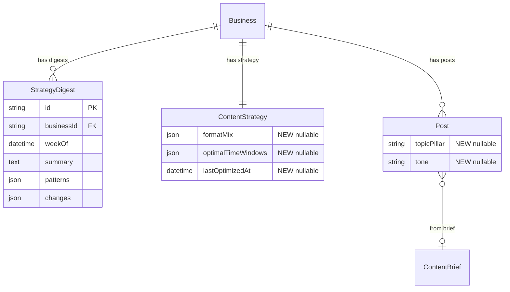

# Self-Improving AI: Performance Learning + Claude Optimizer

## Overview

Milestone 3 closes the feedback loop: every published post becomes a learning signal. The platform tracks what works (format, topic, tone), and a weekly Claude analysis identifies patterns and updates the workspace's `ContentStrategy`. The partner gets a plain-language weekly digest of what the AI learned and changed.

**Why not Thompson Sampling?** Research into industry practices revealed that **no major social media tool** (Buffer, Hootsuite, Sprout Social, Later, Jasper) uses multi-armed bandits for organic content optimization. MABs require hundreds of observations per arm to converge — at 3-5 posts/week, that's 30 weeks to 4 years of data. Each post is unique content with massive confounders (topic, timing, platform algorithm changes), violating the MAB assumption of repeated identical trials. Instead, industry leaders use: (1) AI-powered pattern recognition over historical data, (2) simple content scoring, and (3) human-guided experimentation. That's what we build here.

**What actually moves the needle** (Buffer 2026, 52M+ posts analyzed):
- Posting consistency: 450% more engagement per post for regular posters
- Replying to comments: 21-42% engagement lift depending on platform
- Right format per platform: simple lookup, not algorithmic optimization
- Quality content informed by what worked before

**Exit criteria (from brainstorm):** After 4 weeks, demonstrable strategy shifts based on performance data — measurable improvement in engagement rates per workspace.

## Problem Statement

Currently, content strategy is static. The AI generates posts based on the initial `ContentStrategy` set during onboarding but never adjusts based on what actually works. This means:
- No learning from high/low performers
- No insight into which formats, topics, or tones work best per workspace
- No cadence tuning
- The partner has no data-driven weekly summary of what's working

## Proposed Solution

Two components, not four:

1. **Post Tagging + Performance Tracking** — Each published post gets metadata tags (format, topic pillar, tone). After a platform-specific observation window, engagement metrics are snapshotted. This is the raw data.

2. **Claude Weekly Optimizer** (`src/cron/optimize.ts`) — Weekly cron where Claude analyzes 30 days of tagged performance data, identifies patterns ("your tutorial videos get 3x more comments than product posts"), updates `ContentStrategy`, and generates a plain-language digest.

No bandit engine. No Beta distributions. No arm posteriors. Just structured data collection and AI pattern recognition — which is what every successful tool in this space actually does.

## Technical Approach

### Architecture

```
Post published (scheduler.ts)
    |
    v
Post already has: format (from ContentBrief.recommendedFormat), content pillar tags, platform
    |
    v  [metrics.ts cron, every hour — already exists]
Engagement metrics collected as usual
    |
    v  [optimize.ts cron, weekly Sunday 2am UTC]
Claude analyzes 30 days of published posts with metrics:
  - Groups by format, topic pillar, platform
  - Identifies top/bottom performers and patterns
  - Suggests ContentStrategy adjustments (format mix, cadence, topics)
  - Generates plain-language digest for partner
    |
    v
ContentStrategy updated within guardrails -> StrategyDigest saved
    |
    v
Next week's brief generation reads updated strategy
```

### What Already Exists (No Changes Needed)

- **Post metrics fields**: `metricsLikes`, `metricsComments`, `metricsShares`, `metricsSaves`, `metricsImpressions`, `metricsReach`, `metricsUpdatedAt` — all on Post model
- **Metrics cron** (`src/cron/metrics.ts`): hourly, refreshes metrics for up to 50 PUBLISHED posts
- **ContentBrief.recommendedFormat**: already tracks format per brief (TEXT, IMAGE, CAROUSEL, VIDEO)
- **ContentStrategy.contentPillars**: already stores topic categories
- **ContentStrategy.postingCadence**: already stores per-platform posting frequency

### Data Model Changes

Minimal schema additions — we leverage what exists.

```prisma
// --- New model ---

model StrategyDigest {
  id          String   @id @default(cuid())
  businessId  String
  weekOf      DateTime
  summary     String   @db.Text    // plain-language digest for partner
  patterns    Json                  // { topPerformers: [...], insights: [...] }
  changes     Json                  // { formatMix: {...}, cadence: {...}, ... }
  createdAt   DateTime @default(now())
  business    Business @relation(fields: [businessId], references: [id], onDelete: Cascade)

  @@unique([businessId, weekOf])   // prevent duplicate digests per week
  @@index([businessId, createdAt])
}
```

**Post model additions:**
```prisma
model Post {
  // ... existing fields
  topicPillar  String?   // which content pillar this maps to (from ContentStrategy.contentPillars)
  tone         String?   // "educational" | "entertaining" | "promotional" | "community" | etc.
}
```

**ContentStrategy additions:**
```prisma
model ContentStrategy {
  // ... existing fields
  formatMix          Json?      // { "TEXT": 0.2, "IMAGE": 0.3, "VIDEO": 0.5 } — target mix
  optimalTimeWindows Json?      // { "TWITTER": ["09:00-11:00"], ... }
  lastOptimizedAt    DateTime?
}
```

**Business model addition:**
```prisma
model Business {
  // ... existing fields
  strategyDigests StrategyDigest[]
}
```

### Research Insight: Observation Windows by Platform

Real engagement half-life data (Graffius 2026, 5.6M+ posts):

| Platform | Half-Life | Metrics "Done" After |
|----------|-----------|---------------------|
| Twitter/X | 52 minutes | ~24 hours |
| Facebook | 86 minutes | ~24 hours |
| Instagram | 18.3 hours | ~72 hours |
| TikTok | ~0 (algorithmic resurface) | ~72 hours |
| YouTube | 10.6 days | ~7 days |

The existing metrics cron already refreshes hourly. For the weekly optimizer, we simply filter to posts where sufficient time has passed since publish. No separate observation pipeline needed.

```typescript
// src/lib/optimizer/constants.ts
export const METRICS_MATURE_HOURS: Record<Platform, number> = {
  TWITTER: 24,
  FACEBOOK: 24,
  INSTAGRAM: 72,
  TIKTOK: 72,
  YOUTUBE: 168,
};
```

### ERD (Additions Only)



### Implementation Phases

#### Phase 1: Schema + Post Tagging

**Prisma migration:**
- [x] Add `topicPillar` (String?) and `tone` (String?) to `Post`
- [x] Add `formatMix` (Json?), `optimalTimeWindows` (Json?), `lastOptimizedAt` (DateTime?) to `ContentStrategy`
- [x] Create `StrategyDigest` model with `@@unique([businessId, weekOf])`
- [x] Add `strategyDigests` relation to `Business`

**Zod schemas (`src/lib/optimizer/schemas.ts`):**
- [x] `FormatMixSchema` — `z.record(z.nativeEnum(BriefFormat), z.number().min(0).max(1))`
- [x] `TimeWindowsSchema` — `z.record(z.nativeEnum(Platform), z.array(z.string()))`
- [x] `PatternsSchema` — validated shape for StrategyDigest.patterns
- [x] `ChangesSchema` — validated shape for StrategyDigest.changes

**Post tagging in brief fulfillment:**
- [x] When a ContentBrief is fulfilled and creates a Post, copy `recommendedFormat` -> determine `topicPillar` from brief topic (match to `ContentStrategy.contentPillars`)
- [ ] Set `tone` based on brief content guidance or default to "mixed" (deferred — tone tagging requires more complex NLP)
- [x] For manually created posts (no brief), leave tags nullable — optimizer handles sparse data

**Tests (`src/__tests__/lib/optimizer/schemas.test.ts`):**
- [x] FormatMixSchema validates correct shapes, rejects invalid
- [x] ChangesSchema validates guardrail bounds
- [x] PatternsSchema validates expected structure

#### Phase 2: Performance Analysis Engine

**`src/lib/optimizer/analyze.ts`** — Pure functions, no DB calls

- [x] `groupPostsByDimension(posts, dimension: 'format' | 'topicPillar' | 'tone' | 'platform')` — Groups posts and computes per-group engagement stats (avg likes, comments, shares, saves, engagement rate)
- [x] `computeEngagementRate(post)` — Weighted composite: `likes*1 + comments*3 + shares*5 + saves*4`, normalized by platform baseline. Returns a simple number, not a branded type.
- [x] `identifyTopPerformers(posts, n: number)` — Returns top N posts by engagement rate with their tags
- [x] `identifyBottomPerformers(posts, n: number)` — Returns bottom N
- [x] `computeFormatMix(posts)` — Current actual format distribution vs. target
- [x] `isMetricsMature(post, now: Date)` — Check if enough time has passed per platform for metrics to be meaningful

**Platform baselines** (static constants, updated manually as we get real data):
```typescript
// Baseline engagement per post for normalization
const PLATFORM_BASELINES: Record<Platform, { likes: number; comments: number; shares: number; saves: number }> = {
  TWITTER:   { likes: 50,  comments: 10, shares: 15,  saves: 5 },
  INSTAGRAM: { likes: 200, comments: 30, shares: 20,  saves: 40 },
  FACEBOOK:  { likes: 100, comments: 20, shares: 25,  saves: 10 },
  TIKTOK:    { likes: 500, comments: 50, shares: 100, saves: 80 },
  YOUTUBE:   { likes: 100, comments: 30, shares: 10,  saves: 20 },
};
```

**Tests (`src/__tests__/lib/optimizer/analyze.test.ts`):**
- [x] `groupPostsByDimension` groups correctly, computes averages
- [x] `computeEngagementRate` returns higher scores for above-baseline engagement
- [x] `computeEngagementRate` handles zero/null metrics gracefully
- [x] `identifyTopPerformers` returns correct top N by score
- [x] `computeFormatMix` returns percentage distribution
- [x] `isMetricsMature` respects per-platform windows

#### Phase 3: Claude Weekly Optimizer

**`src/lib/ai/index.ts` — Add `analyzePerformance()` function:**

- [x] Uses existing module-scope `client` singleton (do NOT create new Anthropic client)
- [x] Uses same model `"claude-sonnet-4-6"`
- [x] Accepts: posts with metrics + tags, current ContentStrategy, current format mix
- [x] Returns: structured response with patterns, suggested changes, plain-language digest
- [x] Uses `tool_use` for reliable structured output (matches existing pattern)

```typescript
// Added to src/lib/ai/index.ts
export async function analyzePerformance(input: {
  posts: PerformancePost[];       // last 30 days, with tags and metrics
  strategy: ContentStrategyData;  // current strategy
  currentFormatMix: Record<string, number>; // actual distribution
  platform: Platform;
}): Promise<PerformanceAnalysis> {
  const response = await client.messages.create({
    model: "claude-sonnet-4-6",
    max_tokens: 2048,
    tools: [{
      name: "update_strategy",
      description: "Analyze performance and suggest strategy updates",
      input_schema: {
        type: "object",
        properties: {
          patterns: {
            type: "array",
            items: { type: "string" },
            description: "3-5 key performance patterns observed",
            maxItems: 5,
          },
          formatMixChanges: {
            type: "object",
            description: "Suggested format mix adjustments (deltas, e.g. { 'VIDEO': 0.1, 'TEXT': -0.1 })",
            additionalProperties: { type: "number", minimum: -0.2, maximum: 0.2 },
          },
          cadenceChanges: {
            type: "object",
            description: "Suggested posting frequency changes per platform (deltas, e.g. { 'TWITTER': 1 })",
            additionalProperties: { type: "integer", minimum: -2, maximum: 2 },
          },
          topicInsights: {
            type: "array",
            items: { type: "string" },
            description: "Which content pillars to lean into or pull back from",
          },
          digest: {
            type: "string",
            description: "Plain-language weekly summary for the partner (2-3 paragraphs)",
            maxLength: 1000,
          },
        },
        required: ["patterns", "digest"],
      },
    }],
    tool_choice: { type: "tool", name: "update_strategy" },
    messages: [{ role: "user", content: buildPerformancePrompt(input) }],
  });

  const toolResult = extractToolUseResult(response);
  return PerformanceAnalysisSchema.parse(toolResult); // Zod validation
}
```

**`src/lib/optimizer/run.ts` — `runWeeklyOptimization()`:**

- [x] For each active business with >10 PUBLISHED posts with mature metrics in last 30 days:
  - Fetch posts with metrics, format (via ContentBrief), topicPillar, tone
  - Compute performance stats via `analyze.ts` functions
  - Call `analyzePerformance()` in `src/lib/ai/index.ts`
  - Validate response with Zod
  - Apply changes within guardrails
  - Update ContentStrategy
  - Create StrategyDigest record
- [x] Skip businesses with insufficient data (<10 mature posts)

**`src/cron/optimize.ts`** — Thin EventBridge Lambda handler

- [x] Export single `handler` async function
- [x] Delegate to `runWeeklyOptimization()` — no business logic in cron file
- [x] Follows existing cron pattern (`publish.ts`, `metrics.ts`)

**Guardrails:**
- [x] Cap format mix changes at +/- 20% per week
- [x] Cap cadence changes at +/- 2 posts/week per platform
- [x] Require minimum 10 posts with mature metrics before any strategy changes
- [x] All Claude responses validated with Zod before persisting
- [x] Log all changes in StrategyDigest.changes JSON for auditability

**SST config (`sst.config.ts`):**
- [x] Add EventBridge cron for optimize.ts (weekly, `cron(0 2 ? * SUN *)`)
- [x] Lambda handler: `src/cron/optimize.handler`
- [x] Timeout: 300s (Claude calls may be slow)
- [x] Concurrency: 1 (matches existing cron pattern)

**Tests (`src/__tests__/lib/optimizer/run.test.ts`):**
- [x] Skips businesses with <10 mature posts
- [x] Calls Claude with correct prompt structure including performance data
- [x] Validates response with Zod (rejects invalid shapes)
- [x] Applies guardrails: caps format mix at 20%, cadence at +/-2
- [x] Creates StrategyDigest with @@unique enforced
- [x] Handles Claude API failure gracefully (logs, doesn't crash, strategy unchanged)
- [ ] Does not double-create digest for same business+week (enforced by @@unique constraint at DB level)

**Tests (`src/__tests__/cron/optimize.test.ts`):**
- [x] Handler delegates to runWeeklyOptimization
- [x] Follows thin-handler pattern (no business logic)

#### Phase 4: Wire Into Brief Generation

**Update brief generation to use learned strategy:**

- [x] When generating weekly ContentBriefs, read `ContentStrategy.formatMix` to weight format selection
- [ ] If formatMix is null (pre-optimization), use platform defaults:
  ```typescript
  const DEFAULT_FORMAT_MIX: Record<Platform, Record<BriefFormat, number>> = {
    TWITTER:   { TEXT: 0.6, IMAGE: 0.3, VIDEO: 0.1, CAROUSEL: 0 },
    INSTAGRAM: { TEXT: 0, IMAGE: 0.3, VIDEO: 0.5, CAROUSEL: 0.2 },
    FACEBOOK:  { TEXT: 0.3, IMAGE: 0.3, VIDEO: 0.3, CAROUSEL: 0.1 },
    TIKTOK:    { TEXT: 0, IMAGE: 0, VIDEO: 1.0, CAROUSEL: 0 },
    YOUTUBE:   { TEXT: 0, IMAGE: 0, VIDEO: 1.0, CAROUSEL: 0 },
  };
  ```
- [x] Pass format mix + recent top performers to Claude during brief generation for context
- [ ] Include `optimalTimeWindows` in scheduling if set (deferred — requires schedule slot logic changes)

**Tests:**
- [x] Brief generation uses formatMix when available
- [x] Brief generation falls back to platform defaults when formatMix is null
- [ ] Format distribution roughly matches target mix (statistical test over N briefs) — requires integration test with live Claude

#### Phase 5: Strategy Digest Display

**Simple UI to surface digests:**

- [x] API endpoint: `GET /api/businesses/[businessId]/digests` — returns last 4 digests
- [ ] Dashboard widget showing latest digest summary (UI — separate task)
- [ ] Link to full digest history (UI — separate task)
- [x] Business membership auth required (`assertBusinessMembership`)

**Tests:**
- [x] API returns 401 for unauthenticated
- [x] API returns 403 for non-members
- [x] API returns digests ordered by weekOf desc
- [x] API caps at 4 results

### What's Deferred

| Deferred Item | Reason | When to Add |
|---------------|--------|-------------|
| Thompson Sampling / MABs | Insufficient volume (3-5 posts/week), massive confounders, no industry tool uses this for organic content | Never (unless managing 100+ accounts with high volume) |
| Multi-armed bandits | Same as above | Never for this use case |
| Automated A/B testing | At 5 posts/week, manual observation is faster and accounts for context | When a workspace posts 5+ times/day |
| Transfer learning between businesses | Zero businesses exist; privacy concerns | When 10+ businesses have 50+ posts each |
| Adaptive baselines | Premature for pre-launch product | When a workspace reaches 100+ posts |
| Analytics API endpoints (full dashboard) | No UI to consume them yet | M4 with client portal |
| Notification of digest via email | SES integration exists but digest email template not built | After validating digest quality |

## System-Wide Impact

### Interaction Graph
- Post publish (scheduler.ts) -> metrics cron collects engagement (existing) -> weekly optimize cron reads metrics -> calls Claude -> updates ContentStrategy -> next brief generation reads updated strategy
- New workspace onboarding -> ContentStrategy created (existing) -> optimizer starts running after 10+ posts publish

### Error Propagation
- Optimize cron failure: strategy stays unchanged, retried next week. No data loss.
- Claude API failure: strategy unchanged, logged, StrategyDigest not created. Next week tries again.
- Invalid Claude response: Zod validation rejects it, strategy unchanged, error logged.
- Missing metrics on posts: `isMetricsMature()` filters them out. Optimizer works with whatever data is available.

### State Lifecycle Risks
- **Duplicate StrategyDigest:** `@@unique([businessId, weekOf])` prevents duplicate weekly digests even if cron fires twice.
- **Stale strategy:** If optimizer fails for multiple weeks, strategy remains at last good state. No degradation.
- **Null tags on posts:** `topicPillar` and `tone` are nullable. Optimizer groups "untagged" posts separately and still extracts useful patterns from format + platform data.

### Security Considerations
- **Business membership auth:** Digest API endpoint MUST call `assertBusinessMembership(session, businessId)`.
- **Claude output validation:** All optimizer responses validated with Zod before persisting. Guardrails cap all numeric changes.
- **No cross-business data leakage:** All queries scoped to single businessId.

### Integration Test Scenarios
1. Full loop: publish 15 posts across 2 formats -> run metrics cron -> run optimize cron -> verify ContentStrategy.formatMix updated and StrategyDigest created
2. Insufficient data: business with 5 posts -> run optimize cron -> verify no changes, no digest
3. Guardrails: mock Claude returning extreme changes -> verify caps applied
4. Digest dedup: run optimize cron twice for same week -> verify only one digest
5. Sparse tags: posts with null topicPillar/tone -> verify optimizer still runs with available data

## Acceptance Criteria

### Functional Requirements
- [ ] Published posts tagged with topicPillar and tone (from brief or manual entry)
- [ ] Weekly optimization cron analyzes 30 days of mature post data
- [ ] Claude identifies patterns and suggests strategy adjustments
- [ ] Guardrails cap strategy changes (20% format mix, +/-2 cadence per week)
- [ ] ContentStrategy updated with formatMix, optimalTimeWindows, lastOptimizedAt
- [ ] StrategyDigest created with plain-language summary
- [ ] Brief generation reads learned formatMix and adjusts format selection
- [ ] Digest API endpoint with business membership auth
- [ ] Minimum 10 mature posts required before optimizer runs

### Non-Functional Requirements
- [ ] Optimize cron Lambda timeout: 300s
- [ ] Optimize cron concurrency: 1
- [ ] All JSON fields validated with Zod schemas
- [ ] No new npm dependencies (Claude SDK already installed, Zod already installed)

### Quality Gates
- [ ] Unit tests for analyze.ts: grouping, scoring, top/bottom performers
- [ ] Unit tests for run.ts: guardrails, Zod validation, Claude failure handling
- [ ] Unit tests for optimize cron: thin handler pattern
- [ ] Integration test: full publish -> optimize -> strategy update loop
- [ ] Coverage stays above 75% thresholds

## Dependencies & Risks

| Risk | Impact | Mitigation |
|------|--------|------------|
| M1 (Blotato/workspace) not merged yet | Can't apply migration — no Business model | Sequence: merge M1 PR first, then start M3 |
| Insufficient post volume for patterns | Claude has sparse data, weak insights | Minimum 10 posts threshold; Claude prompted to be honest about confidence |
| Claude optimizer hallucinates bad strategy | Engagement drops | Zod validation + guardrails cap changes + StrategyDigest audit trail |
| Metrics cron hasn't run for older posts | Missing engagement data | `isMetricsMature()` filters out posts without fresh metrics |
| Platform baseline constants are wrong | Skewed engagement scores | Start with conservative estimates, update quarterly from real data |

## Success Metrics

- After 4 weeks per workspace: ContentStrategy has been updated at least 2x with specific, non-generic insights
- Weekly digests contain actionable patterns (not "post more often" filler)
- Format mix in generated briefs reflects learned preferences
- Partner can see clear connection between post performance and strategy shifts

## Comparison: This Plan vs. Thompson Sampling

| Aspect | Thompson Sampling (old plan) | AI Pattern Recognition (this plan) |
|--------|------------------------------|-------------------------------------|
| New models | 4 (ContentArm, PostObservation, PostObservationArm, StrategyDigest) | 1 (StrategyDigest) |
| New fields | 8+ across Post, ContentStrategy, Business | 5 (2 on Post, 3 on ContentStrategy) |
| New crons | 2 (observe hourly, meta-optimize weekly) | 1 (optimize weekly) |
| New dependencies | @stdlib/random-base-beta or inline implementation | None |
| Lines of code (est.) | ~800-1000 (bandit engine + selection + observation + optimizer) | ~300-400 (analyze + optimizer + cron) |
| Time to value | 30+ weeks for arm convergence | First useful digest after 2-3 weeks |
| Handles confounders | No (treats each format as independent arm) | Yes (Claude reasons about context) |
| Works at low volume | Poorly (needs 50-200 obs per arm) | Well (Claude can spot patterns in 10-20 posts) |

## Sources & References

### Origin
- **Brainstorm document:** [docs/brainstorms/2026-03-07-autonomous-ai-social-media-manager-brainstorm.md](docs/brainstorms/2026-03-07-autonomous-ai-social-media-manager-brainstorm.md) — Key decisions carried forward: observation windows, composite reward weighting, Claude as weekly meta-optimizer. Thompson Sampling replaced with simpler approach after industry research.

### Industry Research (informing the pivot away from bandits)
- Buffer 2026 State of Social Media Engagement (52M+ posts): consistency > optimization
- No major SMM tool (Buffer, Hootsuite, Sprout Social, Later) uses MABs for organic content
- MABs used in ads/email (Braze, Unbounce) where volume is 1000x higher
- Thompson Sampling needs 50-200+ observations per arm to converge (Russo et al. 2018)
- At 3-5 posts/week, convergence takes 30 weeks to 4 years

### Internal References
- Existing metrics cron pattern: `src/cron/metrics.ts` (50-post batch, hourly)
- Existing scheduler pattern: `src/cron/publish.ts` (EventBridge, concurrency: 1)
- AI generation: `src/lib/ai/index.ts` (Claude integration — optimizer function goes here)
- ContentStrategy model: `prisma/schema.prisma`
- ContentBrief model: `prisma/schema.prisma` (already has recommendedFormat)
- Post engagement fields: `prisma/schema.prisma`

### External References
- Social media engagement half-lives: Graffius 2026 (5.6M+ posts)
- Buffer 2026 creator growth playbook: consistency, replies, format selection
- Sprout Social 2024 content strategy report: edutainment, topic focus
