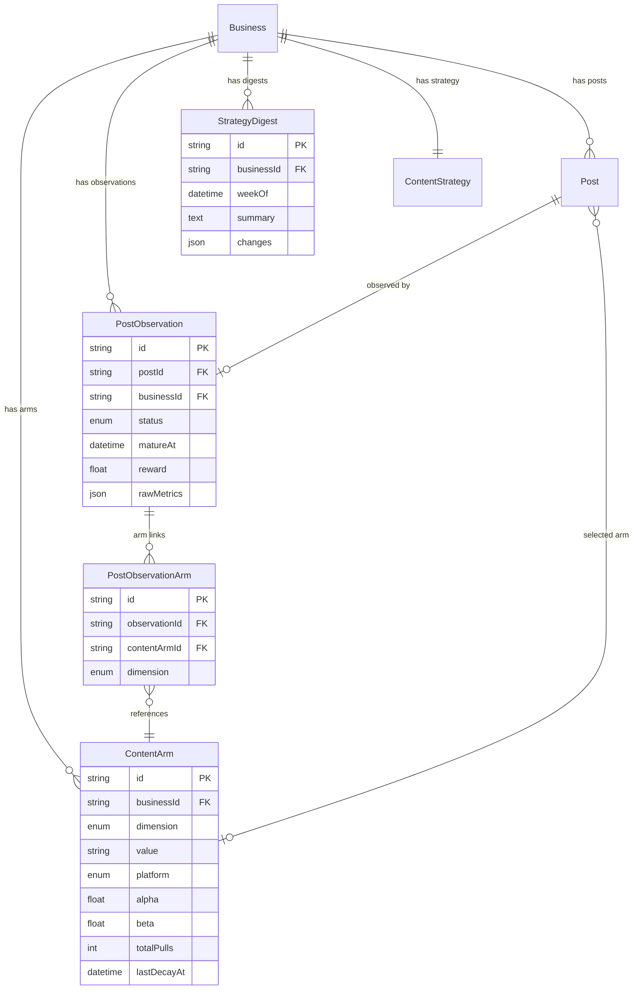

# Self-Improving AI: Thompson Sampling + Claude Meta-Optimizer

## Enhancement Summary

**Deepened on:** 2026-03-07
**Sections enhanced:** All 6 phases + architecture + data model
**Research agents used:** TypeScript Reviewer, Performance Oracle, Security Sentinel, Architecture Strategist, Data Integrity Guardian, Simplicity Reviewer, Pattern Recognition Specialist, Best Practices Researcher, Framework Docs Researcher, Data Migration Expert

### Key Improvements
1. **Drastically simplified scope** -- Start with 1 dimension (format only), defer transfer learning, adaptive baselines, and analytics endpoints to future iterations
2. **Drop jStat dependency** -- Use `@stdlib/random-base-beta` (typed, tiny, maintained) or inline Marsaglia-Tsang implementation (~20 lines)
3. **Replace JSON blobs with proper relations** -- `armSelections` becomes a join table; `armId` becomes a proper FK with `onDelete: SetNull`
4. **Add Zod validation for all JSON fields** -- Match existing `src/env.ts` pattern
5. **Separate pure math from DB calls** -- `src/lib/bandit/engine.ts` (pure) + `src/lib/bandit/selection.ts` (Prisma)
6. **Fix race condition** -- Observation cron must verify metrics have been fetched (not stale) before computing reward
7. **Per-platform observation windows** -- Based on real half-life research: Twitter 52min, Instagram 18h, YouTube 10.6 days

### Critical Findings from Review Agents
- **Business/ContentStrategy model is a prerequisite** -- The current `staging` branch already has these models (M1/Blotato work), so this is satisfied. Plan must not ship before M1 merges.
- **Business membership auth must exist before analytics endpoints** -- Use `assertBusinessMembership(session, businessId)` helper
- **Transfer learning leaks cross-business intelligence** -- Deferred entirely; use only industry aggregate priors
- **Claude meta-optimizer output must be Zod-validated** -- Prevent hallucinated strategy values from corrupting ContentStrategy

---

## Overview

Milestone 3 adds a closed-loop optimization engine that makes the platform measurably smarter over time. Every published post becomes a data point: after a platform-specific observation window, engagement metrics feed into a Discounted Thompson Sampling bandit that learns which content format performs best per workspace. A weekly Claude Meta-Optimizer reasons over performance patterns, updates workspace `ContentStrategy`, and generates a plain-language digest for the partner.

**Exit criteria (from brainstorm):** After 4 weeks, demonstrable strategy shifts based on performance data -- measurable improvement in engagement rates per workspace.

## Problem Statement / Motivation

Currently, content strategy is static. The AI generates posts based on the initial `ContentStrategy` set during onboarding (M1) but never adjusts based on what actually works. This means:
- No learning from high/low performers
- No format optimization (the platform doesn't know if video outperforms images for a workspace)
- No cadence tuning (posting frequency stays at defaults)
- The partner has no data-driven weekly summary of what's working

Thompson Sampling is the right algorithm because: it's naturally robust to delayed feedback (observation window), self-tunes exploration vs exploitation, requires no parameter tuning, and outperforms UCB (which over-commits before delayed feedback arrives) and epsilon-greedy (which wastes scarce posts on random exploration). (see brainstorm: resolved questions)

### Research Insights: Algorithm Choice

**Bernoulli vs continuous rewards:** The plan uses Bernoulli updates (`alpha += reward, beta += 1 - reward`) with sigmoid-squashed rewards in [0,1]. This is mathematically valid -- the Beta-Bernoulli model works with any reward in [0,1], not just binary outcomes. The sigmoid squash maps the composite engagement score to a probability-like value, which the Beta distribution models correctly. (Source: Russo et al. "A Tutorial on Thompson Sampling" 2018)

**Discounted TS gamma value:** The plan proposed gamma=0.95/week. Research shows this is **too aggressive**. At 2 posts/day, gamma=0.95 gives an effective window of only ~20 observations. **Use gamma=0.998 per observation** (effective window ~500 observations / ~8 months), which balances learning from history with adapting to trend shifts. Apply decay per observation, not per week. (Source: Qi 2023, "Non-stationary Bandits with Discounted Thompson Sampling")

## Proposed Solution

Three interconnected components:

1. **Bandit Engine** (`src/lib/bandit/engine.ts`) -- Pure TypeScript functions. Beta sampling, reward computation, posterior updates. Zero dependencies or DB calls.

2. **Bandit Selection** (`src/lib/bandit/selection.ts`) -- Prisma-calling orchestrator. Fetches arms, delegates to engine, persists updates.

3. **Observation Pipeline** (`src/cron/observe.ts`) -- EventBridge cron that matures posts past their observation window, computes reward scores, and updates arm posteriors.

4. **Claude Meta-Optimizer** (`src/lib/ai/index.ts` addition) -- Weekly function where Claude analyzes 30 days of performance data + current posteriors, identifies patterns, and updates `ContentStrategy`. Called from `src/cron/meta-optimize.ts` thin handler.

### Research Insight: Module Separation (Architecture Strategist)

The existing codebase establishes clear separation: `src/lib/crypto.ts` is pure functions, `src/lib/scheduler.ts` is the orchestrator. The bandit engine MUST follow this pattern:
- `src/lib/bandit/engine.ts` -- Pure functions: `sampleBeta()`, `computeReward()`, `updatePosteriors()`, `decayPosteriors()`
- `src/lib/bandit/selection.ts` -- DB-calling orchestrator: `selectArmsForPost()`, `processObservation()`
- Claude analysis function goes in `src/lib/ai/index.ts` alongside existing `generatePostContent()` -- do NOT create a new Anthropic client

## Technical Approach

### Architecture

```
Post published (scheduler.ts)
    |
    v
PostObservation created (status: PENDING, matureAt: publishedAt + platform observation window)
    |
    v  [observe.ts cron, every hour]
Check: is matureAt <= now AND post.metricsUpdatedAt > post.publishedAt?
  Yes -> compute reward -> update ContentArm posteriors -> mark MATURED
  No metrics yet -> skip (retry next hour)
    |
    v  [meta-optimize.ts cron, weekly Sunday 2am UTC]
Claude analyzes 30-day performance + posteriors -> updates ContentStrategy -> generates digest
    |
    v  [brief generation reads updated strategy + arm posteriors]
Next week's briefs use improved strategy
```

### Research Insight: Observation Windows by Platform

Real engagement half-life data (Graffius 2026, analysis of 5.6M+ posts):

| Platform | Half-Life | Recommended Observation Window |
|----------|-----------|-------------------------------|
| Twitter/X | 52 minutes | 24 hours (captures ~99% of engagement) |
| Facebook | 86 minutes | 24 hours |
| Instagram | 18.3 hours | 72 hours |
| TikTok | ~0 (algorithmic resurface) | 72 hours (TikTok can resurface content) |
| YouTube | 10.6 days | 7 days (168 hours) |

**Implementation:** Store observation window per platform as a constant, not hardcoded 72h for all.

```typescript
const OBSERVATION_HOURS: Record<Platform, number> = {
  TWITTER: 24,
  FACEBOOK: 24,
  INSTAGRAM: 72,
  TIKTOK: 72,
  YOUTUBE: 168,
};
```

### Data Model Changes

**Prerequisite:** The Business/ContentStrategy/BusinessMember models from M1 (Blotato workspace) must be merged first. The current `staging` branch already has these. This migration MUST NOT be applied against the pre-M1 schema.

```prisma
// --- New enum ---

enum ArmDimension {
  FORMAT
}
// Start with FORMAT only. Add TOPIC, TONE, CTA, LENGTH when data proves need.
// Using an enum (not string) matches existing codebase convention (Platform, PostStatus).

enum ObservationStatus {
  PENDING
  MATURED
}
// Simplified: no FAILED state. If metrics missing, just skip and retry next hour.

// --- New models ---

model ContentArm {
  id          String       @id @default(cuid())
  businessId  String
  dimension   ArmDimension
  value       String       // e.g. "text", "image", "video_talking_head"
  platform    Platform
  alpha       Float        @default(1.0)
  beta        Float        @default(1.0)
  totalPulls  Int          @default(0)
  lastDecayAt DateTime     @default(now())
  createdAt   DateTime     @default(now())
  updatedAt   DateTime     @updatedAt
  business    Business     @relation(fields: [businessId], references: [id], onDelete: Cascade)
  posts       Post[]

  @@unique([businessId, dimension, value, platform])
  @@index([businessId, platform])
}

model PostObservation {
  id           String            @id @default(cuid())
  postId       String            @unique
  businessId   String
  status       ObservationStatus @default(PENDING)
  matureAt     DateTime
  reward       Float?
  rawMetrics   Json?             // snapshot of metrics at observation time
  createdAt    DateTime          @default(now())
  updatedAt    DateTime          @updatedAt
  post         Post              @relation(fields: [postId], references: [id], onDelete: Cascade)
  business     Business          @relation(fields: [businessId], references: [id], onDelete: Cascade)
  armLinks     PostObservationArm[]

  @@index([status, matureAt])
  @@index([businessId, createdAt])
}

// Join table replacing armSelections Json blob (Data Integrity Guardian recommendation)
model PostObservationArm {
  id            String          @id @default(cuid())
  observationId String
  contentArmId  String
  dimension     ArmDimension
  observation   PostObservation @relation(fields: [observationId], references: [id], onDelete: Cascade)
  contentArm    ContentArm      @relation(fields: [contentArmId], references: [id], onDelete: Cascade)

  @@unique([observationId, dimension])
  @@index([contentArmId])
}

model StrategyDigest {
  id          String   @id @default(cuid())
  businessId  String
  weekOf      DateTime
  summary     String   @db.Text
  changes     Json
  createdAt   DateTime @default(now())
  business    Business @relation(fields: [businessId], references: [id], onDelete: Cascade)

  @@unique([businessId, weekOf])  // Prevent duplicate digests per week
}
```

**Post model additions:**
```prisma
model Post {
  // ... existing fields
  format       String?           // "text" | "image" | "video_talking_head" | etc.
  armId        String?           // FK to primary arm selected
  arm          ContentArm?       @relation(fields: [armId], references: [id], onDelete: SetNull)
  observation  PostObservation?

  @@index([armId])  // Needed for "all posts using arm X" queries
}
```

**ContentStrategy additions:**
```prisma
model ContentStrategy {
  // ... existing fields
  postingCadence     Json?      // { TWITTER: 4, INSTAGRAM: 7, ... } posts/week
  formatMix          Json?      // { "text": 0.2, "image": 0.3, "video_talking_head": 0.5 }
  optimalTimeWindows Json?      // { TWITTER: ["09:00-11:00", "17:00-19:00"], ... }
  lastOptimizedAt    DateTime?
}
```

**Business model additions:**
```prisma
model Business {
  // ... existing fields
  contentArms     ContentArm[]
  observations    PostObservation[]
  strategyDigests StrategyDigest[]
}
```

### Research Insight: JSON Field Validation (TypeScript Reviewer)

All JSON fields MUST have Zod schemas for runtime validation. The project already uses Zod (`src/env.ts`). Never cast with `as SomeType`.

```typescript
// src/lib/bandit/schemas.ts
import { z } from 'zod';

export const RawMetricsSchema = z.object({
  likes: z.number().int().nonnull(),
  comments: z.number().int().nonnull(),
  shares: z.number().int().nonnull(),
  saves: z.number().int().nonnull(),
  impressions: z.number().int().nullable(),
  reach: z.number().int().nullable(),
});

export const StrategyChangesSchema = z.object({
  formatMix: z.record(z.string(), z.number()).optional(),
  postingCadence: z.record(z.string(), z.number()).optional(),
  optimalTimeWindows: z.record(z.string(), z.array(z.string())).optional(),
  newArms: z.array(z.object({ dimension: z.string(), value: z.string(), platform: z.string() })).optional(),
});

export const FormatMixSchema = z.record(z.string(), z.number());
export const PostingCadenceSchema = z.record(z.string(), z.number());

export type RawMetrics = z.infer<typeof RawMetricsSchema>;
export type StrategyChanges = z.infer<typeof StrategyChangesSchema>;
```

### Research Insight: Branded Types for Reward (TypeScript Reviewer)

```typescript
type Reward = number & { readonly __brand: 'Reward' };

function asReward(value: number): Reward {
  return Math.max(0, Math.min(1, value)) as Reward;
}
```

This prevents accidentally passing raw engagement counts where a [0,1] reward is expected. Zero runtime cost.

### ERD



### Implementation Phases

#### Phase 1: Bandit Engine + Schema (Core)

**`src/lib/bandit/engine.ts`** -- Pure Thompson Sampling functions (zero dependencies)

- [ ] `sampleBeta(alpha: number, beta: number): number` -- Beta distribution sample. Use `@stdlib/random-base-beta` or inline Marsaglia-Tsang (~20 lines). Do NOT use jStat (unmaintained since 2022, no TS types, 50KB).
- [ ] `computeReward(metrics: RawMetrics, platform: Platform): Reward` -- Weighted composite: `likes*1 + comments*3 + shares*5 + saves*4`, divide by platform baseline, sigmoid-squash to [0,1], return as branded `Reward` type
- [ ] `updatePosteriors(alpha: number, beta: number, reward: Reward): { alpha: number; beta: number }` -- Bernoulli update: `alpha += reward, beta += (1 - reward)`. Pure function, returns new values.
- [ ] `decayPosteriors(alpha: number, beta: number, gamma: number, observationsSinceDecay: number): { alpha: number; beta: number }` -- Multiply by `gamma^n`, floor at 1.0. Pure function.
- [ ] `PLATFORM_BASELINES` -- Static per-platform engagement baselines (hardcoded constants, no adaptive baseline yet)
- [ ] `OBSERVATION_HOURS` -- Per-platform observation windows based on half-life research

### Research Insight: Beta Sampling Without jStat

**jStat is unmaintained** (last update Nov 2022), has no TypeScript types, and is 50KB minified for a single function call. Three better options:

1. **`@stdlib/random-base-beta`** (recommended) -- Individual npm package, TypeScript types, actively maintained. Usage: `import beta from '@stdlib/random-base-beta'; const sample = beta(alpha, betaParam);`

2. **Inline implementation** (~20 lines) -- Beta(a,b) = Gamma(a) / (Gamma(a) + Gamma(b)). Gamma sampling via Marsaglia-Tsang method:

```typescript
function sampleGamma(shape: number): number {
  if (shape < 1) return sampleGamma(shape + 1) * Math.pow(Math.random(), 1 / shape);
  const d = shape - 1/3, c = 1 / Math.sqrt(9 * d);
  while (true) {
    let x: number, v: number;
    do { x = randn(); v = 1 + c * x; } while (v <= 0);
    v = v * v * v;
    const u = Math.random();
    if (u < 1 - 0.0331 * x * x * x * x) return d * v;
    if (Math.log(u) < 0.5 * x * x + d * (1 - v + Math.log(v))) return d * v;
  }
}

function sampleBeta(alpha: number, beta: number): number {
  const x = sampleGamma(alpha);
  const y = sampleGamma(beta);
  return x / (x + y);
}
```

3. **`jstat-esm`** -- ES module version with tree-shaking (~18KB gzipped). Fallback if stdlib doesn't work.

**`src/lib/bandit/selection.ts`** -- DB-calling orchestrator

- [ ] `selectArmForPost(businessId: string, platform: Platform): Promise<ContentArm>` -- Fetch all FORMAT arms for business+platform, apply lazy decay, sample each, return winner. Single dimension for now.
- [ ] `recordArmSelection(postId: string, observationId: string, armId: string, dimension: ArmDimension): Promise<void>` -- Create PostObservationArm join record

**`src/lib/bandit/schemas.ts`** -- Zod schemas for JSON fields

- [ ] `RawMetricsSchema`, `StrategyChangesSchema`, `FormatMixSchema` (as shown above)

**Prisma migration:**
- [ ] Create `ArmDimension` enum (FORMAT only)
- [ ] Create `ObservationStatus` enum (PENDING, MATURED)
- [ ] Create `ContentArm` model with proper FK to Business
- [ ] Create `PostObservation` model with FK to Post and Business
- [ ] Create `PostObservationArm` join table with FKs
- [ ] Create `StrategyDigest` model with `@@unique([businessId, weekOf])`
- [ ] Add `format`, `armId` (FK to ContentArm, onDelete: SetNull) to `Post`
- [ ] Add `@@index([armId])` to Post
- [ ] Add JSON fields to `ContentStrategy` (postingCadence, formatMix, optimalTimeWindows, lastOptimizedAt)
- [ ] Add relations to `Business`

**Tests (`src/__tests__/lib/bandit/engine.test.ts`):**
- [ ] `sampleBeta` returns values in [0, 1]
- [ ] `sampleBeta` with high alpha returns higher values than low alpha (statistical test over N samples)
- [ ] `computeReward` returns ~0.5 for baseline engagement, >0.5 for above-baseline
- [ ] `computeReward` normalizes differently per platform (Twitter baseline vs YouTube baseline)
- [ ] `computeReward` returns value in [0, 1] for any input (including zeros, huge numbers, NaN protection)
- [ ] `updatePosteriors` correctly increments: alpha += reward, beta += (1 - reward)
- [ ] `decayPosteriors` multiplies by gamma^n, floors at 1.0
- [ ] `decayPosteriors` with 0 observations returns unchanged values

#### Phase 2: Observation Pipeline

**`src/cron/observe.ts`** -- Thin EventBridge Lambda handler (follows existing pattern)

- [ ] Export single `handler` async function
- [ ] Delegate to `runObservationProcessing()` in `src/lib/bandit/selection.ts`
- [ ] No business logic, no Prisma imports in the cron file itself

**`src/lib/bandit/selection.ts` -- `runObservationProcessing()`:**

- [ ] Batch query: fetch up to 50 PENDING observations where `matureAt <= now()`, JOIN with Post metrics in a single query (avoid N+1)

### Research Insight: Batch Query Pattern (Performance Oracle)

The observation cron MUST NOT fetch posts and arms individually per observation. Use Prisma's `include` for batch fetching:

```typescript
const observations = await prisma.postObservation.findMany({
  where: { status: 'PENDING', matureAt: { lte: now } },
  take: 50,
  orderBy: { matureAt: 'asc' },
  include: {
    post: { select: { metricsLikes: true, metricsComments: true, metricsShares: true,
                       metricsSaves: true, metricsUpdatedAt: true, publishedAt: true } },
    armLinks: { include: { contentArm: true } },
  },
});

// Batch-fetch all arms for affected businesses (one query, not N)
const businessIds = [...new Set(observations.map(o => o.businessId))];
const allArms = await prisma.contentArm.findMany({
  where: { businessId: { in: businessIds } },
});
```

This reduces the query count from ~150 (N+1 pattern) to 2 regardless of batch size.

- [ ] **Race condition guard:** Skip observations where `post.metricsUpdatedAt` is null or older than `post.publishedAt`. This means the metrics cron hasn't fetched post-publish metrics yet. The observation stays PENDING and will be picked up next hour.
- [ ] For each valid observation: compute reward via `computeReward()`, update arm posteriors via `updatePosteriors()`, apply decay if stale
- [ ] Update arms atomically: use Prisma `updateMany` or individual updates within a transaction
- [ ] Mark observation as `MATURED` with reward + rawMetrics snapshot (validated by `RawMetricsSchema`)
- [ ] Idempotency: atomic `WHERE status = 'PENDING'` ensures no double-processing

**`src/lib/scheduler.ts` integration:**
- [ ] After successful publish: create `PostObservation` with `matureAt = publishedAt + OBSERVATION_HOURS[platform] * 3600000`
- [ ] Create `PostObservationArm` join records for each dimension's selected arm

**SST config (`sst.config.ts`):**
- [ ] Add EventBridge cron for observe.ts (`rate(1 hour)`)
- [ ] Lambda handler: `src/cron/observe.handler`
- [ ] Concurrency: 1 (matches existing cron pattern)

**Tests (`src/__tests__/lib/bandit/selection.test.ts`):**
- [ ] Processes only PENDING observations past matureAt
- [ ] Skips observations where metricsUpdatedAt < publishedAt (no fresh metrics)
- [ ] Updates arm posteriors correctly (alpha/beta changed)
- [ ] Applies decay when lastDecayAt is stale
- [ ] Idempotent: MATURED observations not re-processed
- [ ] Caps at 50 per run
- [ ] Batch-fetches posts and arms (mock Prisma to verify query count)

#### Phase 3: Arm Seeding + Selection Integration

**Wire bandit into content brief generation:**

- [ ] When generating a content brief, call `selectArmForPost(businessId, platform)` to pick format
- [ ] Set `Post.format` and `Post.armId` on post creation
- [ ] Exploration: if `totalPulls` sum for all arms < 30, use `Math.random() < 0.4` to randomly select instead of TS

**Seed initial arms on workspace creation:**
- [ ] When `ContentStrategy` is created (onboarding), auto-create default `ContentArm` records per platform
- [ ] Default FORMAT arms: `text`, `image`, `video` (keep it simple -- 3 arms, not 6 video subtypes)
- [ ] Use uniform priors: alpha=1, beta=1 (uninformative). Industry priors are premature with zero data about what works for your users.
- [ ] Platform-specific: skip `video` arm for platforms that don't support it

### Research Insight: Cold Start Simplification (Simplicity Reviewer)

Industry-specific priors (`getIndustryPriors`) are **inventing data you don't have**. With zero businesses and zero empirical evidence about what priors work, uninformative Beta(1,1) priors are the honest choice. They let the bandit learn from real data without baked-in assumptions. Add industry priors later when you have data from 10+ businesses to derive them empirically.

**Tests:**
- [ ] Arm selection returns a ContentArm of dimension FORMAT
- [ ] Exploration mode (< 30 total pulls) uses random 40% of the time
- [ ] Default arms created per platform (3 format arms each)
- [ ] No video arm for platforms without video support

#### Phase 4: Claude Meta-Optimizer

**`src/lib/ai/index.ts` -- Add `analyzeStrategyPerformance()` function:**

- [ ] Follows existing pattern: pure function, accepts data, returns typed result, no DB access
- [ ] Uses existing module-scope `client` singleton (do NOT create new Anthropic client)
- [ ] Uses same model `"claude-sonnet-4-6"`

**`src/cron/meta-optimize.ts`** -- Thin EventBridge Lambda handler (weekly, Sunday 2am UTC)

- [ ] Export single `handler` async function
- [ ] Delegate to `runMetaOptimization()` in a lib file

**`src/lib/bandit/optimizer.ts` -- `runMetaOptimization()`:**

- [ ] For each active business with >10 MATURED observations in last 30 days:
  - Fetch last 30 days of matured observations with rewards
  - Fetch current arm posteriors (with win rates)
  - Fetch current ContentStrategy
  - Call `analyzeStrategyPerformance()` in `src/lib/ai/index.ts`
  - Validate response with `StrategyChangesSchema.parse()` (Zod)
  - Apply changes within guardrails
  - Create `StrategyDigest` record
- [ ] Skip businesses with insufficient data (<10 observations)

### Research Insight: Claude Structured Output (Framework Docs Researcher)

Use `tool_use` for reliable JSON parsing. Define the response schema as a tool:

```typescript
const response = await client.messages.create({
  model: "claude-sonnet-4-6",
  max_tokens: 2048,
  tools: [{
    name: "update_strategy",
    description: "Update content strategy based on performance analysis",
    input_schema: {
      type: "object",
      properties: {
        patterns: { type: "array", items: { type: "string" }, maxItems: 5 },
        formatMixChanges: {
          type: "object",
          additionalProperties: { type: "number", minimum: -0.2, maximum: 0.2 }
        },
        cadenceChanges: {
          type: "object",
          additionalProperties: { type: "integer", minimum: -2, maximum: 2 }
        },
        digest: { type: "string", maxLength: 500 },
      },
      required: ["patterns", "digest"],
    },
  }],
  tool_choice: { type: "tool", name: "update_strategy" },
  messages: [{ role: "user", content: prompt }],
});
```

### Research Insight: Validate Claude Output (Security Sentinel)

Claude's response MUST be validated before persisting. Even with `tool_use`, the model can return unexpected values. Apply the Zod schema AND enforce guardrails:

```typescript
const toolResult = extractToolUseResult(response);
const parsed = StrategyChangesSchema.parse(toolResult); // Zod validation

// Guardrails: cap format mix changes
if (parsed.formatMix) {
  for (const [key, delta] of Object.entries(parsed.formatMix)) {
    parsed.formatMix[key] = Math.max(-0.2, Math.min(0.2, delta));
  }
}
```

**Guardrails:**
- [ ] Cap format mix changes at +/- 20% per week
- [ ] Cap cadence changes at +/- 2 posts/week per platform
- [ ] Require minimum 10 observations before any strategy changes
- [ ] Log all changes in StrategyDigest.changes JSON for auditability

**SST config:**
- [ ] Add EventBridge cron for meta-optimize.ts (weekly, `cron(0 2 ? * SUN *)`)
- [ ] Lambda handler: `src/cron/meta-optimize.handler`
- [ ] Timeout: 300s (Claude calls may be slow)
- [ ] Concurrency: 1

**Tests (`src/__tests__/lib/bandit/optimizer.test.ts`):**
- [ ] Skips businesses with <10 observations
- [ ] Calls Claude with correct prompt structure
- [ ] Validates response with Zod (rejects invalid shapes)
- [ ] Applies guardrails: caps format mix at 20%, cadence at +/-2
- [ ] Creates StrategyDigest record with @@unique enforced
- [ ] Handles Claude API failure gracefully (logs, doesn't crash, strategy unchanged)

#### Phase 5: Reward Normalization

**`src/lib/bandit/engine.ts` -- platform normalization:**

- [ ] Define static per-platform baseline engagement rates:
  ```ts
  const PLATFORM_BASELINES: Record<Platform, RawMetrics> = {
    TWITTER:   { likes: 50,  comments: 10, shares: 15,  saves: 5,  impressions: null, reach: null },
    INSTAGRAM: { likes: 200, comments: 30, shares: 20,  saves: 40, impressions: null, reach: null },
    FACEBOOK:  { likes: 100, comments: 20, shares: 25,  saves: 10, impressions: null, reach: null },
    TIKTOK:    { likes: 500, comments: 50, shares: 100, saves: 80, impressions: null, reach: null },
    YOUTUBE:   { likes: 100, comments: 30, shares: 10,  saves: 20, impressions: null, reach: null },
  };
  ```
- [ ] Normalize: divide each metric by platform baseline, then apply weights, then sigmoid
- [ ] Sigmoid: `reward = 1 / (1 + exp(-compositeScore))` centered at 0 (baseline engagement = reward ~0.5)
- [ ] NaN/Infinity protection: clamp all intermediate values, return 0.5 for missing metrics

**Tests:**
- [ ] Same raw metrics produce different rewards on different platforms
- [ ] Sigmoid output is always in [0, 1] (fuzz test with random inputs)
- [ ] Zero metrics -> reward < 0.5 (below baseline)
- [ ] Baseline metrics -> reward ~0.5
- [ ] 10x baseline -> reward > 0.8

### What's Deferred (Simplicity Reviewer recommendations)

These items are explicitly cut from M3 scope and tracked for future work:

| Deferred Item | Reason | When to Add |
|---------------|--------|-------------|
| Multi-dimension bandits (topic, tone, CTA, length) | One dimension (format) is enough to prove the system works | When format optimization plateaus |
| Transfer learning between businesses | Zero businesses exist; leaks competitive intelligence | When 10+ businesses have 50+ posts each |
| Adaptive baselines (workspace median after 50 posts) | Premature optimization for a pre-launch product | When a workspace actually reaches 50 posts |
| Industry-specific priors | Inventing data we don't have | When we have empirical data from multiple industries |
| Analytics API endpoints (/api/analytics/*) | No UI to consume them yet | When building the analytics dashboard |
| LinThompson (contextual bandit) | Requires 500+ posts per workspace | When any workspace reaches that threshold |
| Per-platform observation windows for YouTube (7 days) | Start with a simpler 72h uniform window, add platform-specific later | After first YouTube data comes in |

## System-Wide Impact

### Interaction Graph
- Post publish (`scheduler.ts`) -> creates PostObservation + PostObservationArm -> observation cron matures it -> updates ContentArm posteriors
- Weekly meta-optimize cron -> reads observations + arms -> calls Claude (via `src/lib/ai/index.ts`) -> updates ContentStrategy -> brief generation reads updated strategy
- New workspace onboarding -> creates ContentArm records (FORMAT arms seeded per platform)

### Error Propagation
- Observation cron failure: observations stay PENDING, retried next hour. No data loss.
- Meta-optimizer Claude failure: strategy stays unchanged, logged, retried next week. StrategyDigest not created.
- Invalid reward computation (NaN/Infinity): clamp to [0, 1], log warning. Branded `Reward` type prevents accidental misuse.
- PostObservation creation failure after publish: post is published but untracked. This is acceptable -- the post works fine, it just won't contribute to learning. Log the error.

### State Lifecycle Risks
- **Double observation processing:** Mitigated by atomic status update (`WHERE status = 'PENDING'`) and UNIQUE constraint on postId. (Data Integrity Guardian: confirmed safe)
- **Arm posterior corruption:** Decay floors at 1.0 (enforced in `decayPosteriors`). Use gamma=0.998 per observation, not 0.95/week.
- **Orphaned observations:** Cascade delete on Post -> PostObservation handles this.
- **Dangling armId on Post:** `onDelete: SetNull` on the FK -- if an arm is retired, post keeps its data but arm reference is cleared.
- **Duplicate StrategyDigest:** `@@unique([businessId, weekOf])` prevents duplicate weekly digests even if cron fires twice.

### Security Considerations (Security Sentinel)

- **Business membership auth:** All analytics endpoints (when built) MUST call `assertBusinessMembership(session, businessId)` helper. Do not accept businessId as raw query param without ownership verification.
- **Claude output validation:** All meta-optimizer responses validated with Zod before persisting. Guardrails cap all numeric changes.
- **No cross-business data leakage:** Transfer learning is deferred. All queries scoped to single businessId.
- **JSON field injection:** rawMetrics and changes are system-generated, not user input. Zod validation adds defense-in-depth.

### Integration Test Scenarios
1. Full loop: publish post -> create observation -> wait (mock clock) -> run observe cron -> verify arm posteriors updated
2. Cold start: create workspace -> verify 3 FORMAT arms seeded per platform with Beta(1,1)
3. Meta-optimizer: seed 15 observations -> run weekly cron -> verify ContentStrategy updated within guardrails
4. Decay: seed arms with old lastDecayAt -> run observation -> verify decay applied before update
5. Duplicate protection: process same observation twice -> verify arm updated only once
6. Missing metrics: observation matures but metricsUpdatedAt is null -> verify observation stays PENDING

## Acceptance Criteria

### Functional Requirements
- [ ] Posts create PostObservation records on publish with platform-appropriate maturity window
- [ ] Hourly observation cron processes mature observations and updates arm posteriors
- [ ] Thompson Sampling selects FORMAT arm for new posts
- [ ] 40% exploration rate for workspaces with <30 total arm pulls
- [ ] Posterior decay (gamma=0.998) applied per observation
- [ ] Claude meta-optimizer runs weekly, updates ContentStrategy, creates StrategyDigest
- [ ] Guardrails cap strategy changes (20% format mix, +/-2 cadence per week)
- [ ] FORMAT arms seeded on workspace creation (text, image, video per platform)

### Non-Functional Requirements
- [ ] Observation cron processes up to 50 observations per run in 2 queries (no N+1)
- [ ] Meta-optimizer Lambda timeout set to 300s
- [ ] All crons have concurrency: 1
- [ ] Beta sampling dependency adds <5KB to bundle (stdlib or inline)
- [ ] All JSON fields validated with Zod schemas on read

### Quality Gates
- [ ] Unit tests for bandit/engine.ts: sampling, reward computation, decay, posteriors
- [ ] Unit tests for bandit/selection.ts: batch fetching, race condition guard, idempotency
- [ ] Unit tests for bandit/optimizer.ts: guardrails, Zod validation, Claude failure handling
- [ ] Integration test: full publish -> observe -> update loop
- [ ] Coverage stays above 75% thresholds

## Dependencies & Risks

| Risk | Impact | Mitigation |
|------|--------|------------|
| M1 (Blotato/workspace) not merged yet | Can't apply migration -- no Business model | Sequence: merge M1 PR first, then start M3 |
| Insufficient post volume for learning | Arms stay near Beta(1,1), no optimization | Exploration phase + 3 format arms keeps it simple |
| Claude meta-optimizer hallucinates bad strategy | Engagement drops | Zod validation + guardrails cap changes + StrategyDigest audit trail |
| Metrics cron hasn't run when observation matures | Reward computed on stale/zero metrics | Race condition guard: skip if metricsUpdatedAt < publishedAt |
| Posterior decay too aggressive | Forgets good strategies | gamma=0.998 (effective window ~500 observations); floor at 1.0 |
| @stdlib/random-base-beta unavailable or broken | Can't sample Beta distribution | Fallback: inline Marsaglia-Tsang implementation (~20 lines) |

## Success Metrics

- After 4 weeks per workspace: measurable shift in arm posteriors (top arm alpha/beta ratio > 2:1)
- Meta-optimizer produces actionable weekly digests (not generic filler)
- FORMAT dimension shows differentiation (not all arms converging to same value)
- Exploration rate naturally decreases as posteriors strengthen

## Sources & References

### Origin
- **Brainstorm document:** [docs/brainstorms/2026-03-07-autonomous-ai-social-media-manager-brainstorm.md](docs/brainstorms/2026-03-07-autonomous-ai-social-media-manager-brainstorm.md) -- Key decisions carried forward: Thompson Sampling over UCB/epsilon-greedy, observation windows, composite reward function, Claude as weekly meta-optimizer

### Internal References
- Existing metrics refresh pattern: `src/cron/metrics.ts` (50-post batch, oldest-stale-first)
- Existing scheduler pattern: `src/cron/publish.ts` (EventBridge cron, concurrency: 1)
- AI generation: `src/lib/ai/index.ts` (Claude integration pattern -- meta-optimizer function goes here)
- ContentStrategy model: `prisma/schema.prisma:84-97`
- Post engagement fields: `prisma/schema.prisma:134-140`
- Cron handler pattern: thin export, delegate to lib (Pattern Recognition Specialist)

### External References
- Social media engagement half-lives: [Graffius 2026](https://www.scottgraffius.com/blog/files/lifespan-halflife-of-social-media-posts-update-2026.html) -- 5.6M+ posts analyzed
- Thompson Sampling tutorial: [Russo et al. 2018](https://arxiv.org/abs/1707.02038)
- Discounted Thompson Sampling: [Qi 2023](https://arxiv.org/abs/2305.10718)
- Non-stationary bandits: [Trovo et al. 2024](https://arxiv.org/abs/2409.05181)
- `@stdlib/random-base-beta`: [npm](https://www.npmjs.com/package/@stdlib/random-base-beta)
- jStat (not recommended): [GitHub](https://github.com/jstat/jstat) -- last updated Nov 2022, no TS types
- Thompson Sampling in social media: [TDS article](https://towardsdatascience.com/thompson-sampling-in-social-media-marketing-97d1892b125f/)
