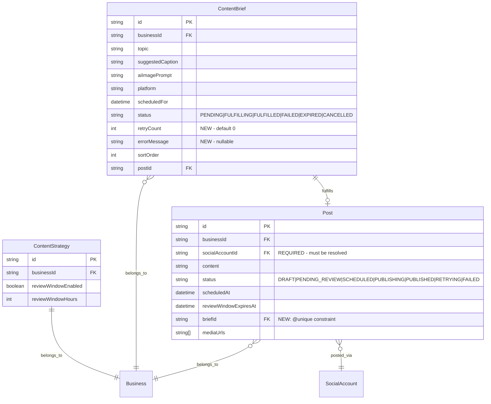

# feat: AI Agent Brief Fulfillment Engine

## Enhancement Summary

**Deepened on:** 2026-03-08
**Research agents used:** 13 (TypeScript reviewer, Performance oracle, Security sentinel, Architecture strategist, Code simplicity reviewer, Data integrity guardian, Data migration expert, Pattern recognition specialist, Frontend races reviewer, Agent-native reviewer, Best practices researcher, Framework docs researcher, Agent-native architecture skill)

### Key Improvements
1. **Simplified from 6 phases to 2** — each phase delivers a testable, shippable vertical slice
2. **Critical bug prevented** — `Post.socialAccountId` is required but was missing from fulfillment logic
3. **Data integrity hardened** — `@unique` on `Post.briefId`, idempotency check before post creation, both linkage fields set in same transaction
4. **3 missing database indexes added** — required for auto-approval, review queue, and daily cap queries
5. **Security hardened** — PATCH endpoint blocks ALL status changes on PENDING_REVIEW posts (both scheduling and drafting paths)
6. **Frontend race conditions addressed** — `activeOp` state machine, `router.refresh()` after mutations, countdown timer with cleanup
7. **Media abstraction simplified** — single `generateImage()` function instead of 3-file interface/factory/mock pattern
8. **Agent-native APIs added** — on-demand fulfillment trigger and strategy read/write endpoints

### Simplifications Applied (from Code Simplicity Review)
- Removed `dailyFulfillmentCap` — briefs cron already controls volume via `postingCadence`
- Removed `generateVideo?` from media interface — YAGNI, VIDEO deferred to phase 2
- Removed MediaProvider interface/factory/mock pattern — single function, mock with `jest.mock`
- Deferred Phase 6 (Business Config UI) — defaults work for 2 users
- Collapsed 6 phases into 2 shippable units

---

## Overview

Complete the autonomous content pipeline by building an AI agent that fulfills ContentBriefs into posts with generated media, routes them through configurable human review, and auto-schedules approved posts. This is the final piece connecting the existing Research → Briefs → ??? → Publish pipeline.

The infrastructure is largely in place: ContentBrief model, PENDING_REVIEW status, reviewWindow fields, publisher cron, and repurpose engine all exist but are not yet wired together.

## Problem Statement

ContentBriefs are generated weekly with ready-to-use captions, platform targeting, and image prompts, but nothing acts on them. Users must manually create posts from briefs via the UI. This defeats the goal of 80% autonomous content creation with human-in-the-loop approval (see brainstorm: `docs/brainstorms/2026-03-08-ai-agent-brainstorm.md`).

## Proposed Solution

A **Brief Fulfillment Engine** — a cron (every 6h) that converts pending ContentBriefs into posts, generates media, and routes through a review queue. Two approval modes per business: explicit manual approval or auto-approve with a configurable review window. Always a human touchpoint.

## Technical Approach

### Architecture

```
┌─────────────────────────────────────────────────────────────────┐
│                    EXISTING PIPELINE                            │
│                                                                 │
│  Research (4h) → Briefs (weekly) → Optimizer (weekly)          │
└──────────────────────────┬──────────────────────────────────────┘
                           │
                           ▼
┌─────────────────────────────────────────────────────────────────┐
│                    NEW: FULFILLMENT ENGINE                       │
│                                                                 │
│  Fulfillment Cron (6h) ──→ Media Generation ──→ S3 Upload      │
│       │                                              │          │
│       ▼                                              ▼          │
│  Pick PENDING briefs ──→ Create Post (PENDING_REVIEW or        │
│  (within 48h window)      SCHEDULED if insufficient review     │
│                           time)                                 │
└──────────────────────────┬──────────────────────────────────────┘
                           │
                           ▼
┌─────────────────────────────────────────────────────────────────┐
│                    NEW: REVIEW QUEUE                             │
│                                                                 │
│  /dashboard/review ──→ Approve (→ SCHEDULED)                   │
│                    ──→ Reject  (→ DRAFT, brief CANCELLED)      │
│                    ──→ Edit + Approve                           │
│                                                                 │
│  Auto-approval (in publisher cron, every 1min):                │
│  PENDING_REVIEW + reviewWindowExpiresAt <= now → SCHEDULED     │
│  (runs BEFORE due-posts query = same-invocation pickup)        │
└──────────────────────────┬──────────────────────────────────────┘
                           │
                           ▼
┌─────────────────────────────────────────────────────────────────┐
│                    EXISTING: PUBLISHER                           │
│                                                                 │
│  Publisher Cron (1min) ──→ Blotato API ──→ PUBLISHED           │
└─────────────────────────────────────────────────────────────────┘
```

### State Machines

**ContentBrief status transitions:**

```
PENDING ──→ FULFILLING ──→ FULFILLED ──→ (CANCELLED on reject)
                │
                └──→ FAILED (after 2 retries)
```

**Post status transitions (AI-generated posts):**

```
                    ┌─── PENDING_REVIEW ──→ SCHEDULED ──→ PUBLISHING ──→ PUBLISHED
FULFILLING creates: │       │                                    │
                    │       ├── (auto-approve)                   └──→ RETRYING ──→ FAILED
                    │       ├── (reject) ──→ DRAFT
                    │       └── (edit + approve) ──→ SCHEDULED
                    │
                    └─── SCHEDULED (if review time insufficient)
```

#### Research Insight: Type-safe transition validation

Extract a pure function for the review mode decision (testable in isolation):

```ts
type ReviewDecision =
  | { status: "PENDING_REVIEW"; reviewWindowExpiresAt: Date }
  | { status: "PENDING_REVIEW"; reviewWindowExpiresAt: null }
  | { status: "SCHEDULED"; reason: "insufficient_review_time" };

function computeReviewDecision(
  reviewWindowEnabled: boolean,
  reviewWindowHours: number,
  scheduledFor: Date,
  now: Date,
): ReviewDecision;
```

Use exhaustive format dispatch via `satisfies Record<BriefFormat, ...>` to ensure all formats are handled at compile time:

```ts
const formatHandlers = {
  TEXT: () => null,
  IMAGE: (prompt: string) => generateImage(prompt),
  CAROUSEL: () => { console.warn("CAROUSEL not supported yet"); return null; },
  VIDEO: () => { console.warn("VIDEO not supported yet"); return null; },
} satisfies Record<BriefFormat, (...args: never[]) => Promise<Buffer | null> | null>;
```

### Review Mode Semantics (Critical Clarification)

The brainstorm decided: "always a human touchpoint, two modes" (see brainstorm). The `reviewWindowEnabled` field controls **auto-approval**, not whether review happens:

| `reviewWindowEnabled` | Behavior | `reviewWindowExpiresAt` |
|---|---|---|
| `false` (default) | **Explicit approval** — posts stay PENDING_REVIEW until manually approved. No auto-approve ever. | `null` |
| `true` | **Auto-approve with window** — posts auto-transition to SCHEDULED after `reviewWindowHours` unless rejected. | Set to `now + reviewWindowHours` |

**Exception:** If the time remaining before `scheduledFor` is less than `reviewWindowHours` (or less than 2 hours for explicit mode), the post skips review and goes straight to SCHEDULED. This prevents posts from missing their scheduled slot.

### Implementation Phases

#### Phase 1: Fulfillment Engine (Schema + Cron + Auto-Approval + APIs)

##### 1a. Schema Migration

**Split into 2 migrations** (PostgreSQL `ALTER TYPE ... ADD VALUE` requires non-transactional migration):

**Migration 1** (`add-brief-status-fulfilling-failed`, non-transactional):
```sql
ALTER TYPE "BriefStatus" ADD VALUE IF NOT EXISTS 'FULFILLING';
ALTER TYPE "BriefStatus" ADD VALUE IF NOT EXISTS 'FAILED';
```
Must include a sibling `migration.toml` with `transactional = false`. Follow the existing pattern in `prisma/migrations/20260308_add_post_status_values/`.

**Migration 2** (`add-fulfillment-fields`, transactional):
```prisma
// ContentBrief additions
retryCount    Int      @default(0)
errorMessage  String?  @db.Text

// Post modification
briefId       String?  @unique    // ADD @unique constraint

// New indexes
@@index([status, reviewWindowExpiresAt])  // on Post — for auto-approval query (every 1min)
@@index([businessId, status])             // on Post — for review queue + badge count
@@index([businessId, createdAt])          // on Post — for daily cap enforcement
```

**Key data integrity decisions:**
- **`@unique` on `Post.briefId`** — prevents duplicate posts per brief at the database level. Acts as a safety net for crash recovery (if Lambda crashes after creating post but before marking brief FULFILLED, re-running fulfillment will get a unique constraint violation instead of creating a duplicate).
- **Both `Post.briefId` AND `ContentBrief.postId` must be set in the same interactive transaction** — prevents orphaned linkages. The existing manual fulfill endpoint at `src/app/api/briefs/[id]/fulfill/route.ts` has this bug (sets `postId` outside the transaction at line 122-125). Fix it as a companion change.

##### 1b. Fulfillment Engine Core

**`src/lib/media.ts`** — single function, not an interface/factory pattern:

```ts
// Simple function. Mock with jest.mock("@/lib/media") in tests.
// When you add a second provider, refactor then.
export async function generateImage(prompt: string): Promise<{ buffer: Buffer; mimeType: string }> {
  // Provider implementation here (Gemini/OpenAI/Replicate)
  // Return buffer + mimeType so caller doesn't assume image/png
}
```

**`src/lib/storage.ts`** — add `uploadBuffer()`:
```ts
async function uploadBuffer(buffer: Buffer, key: string, mimeType: string): Promise<string> {
  await s3.send(new PutObjectCommand({
    Bucket: bucket, Key: key, Body: buffer,
    ContentType: mimeType, ContentLength: buffer.byteLength,
  }));
  return getPublicUrl(key);
}
```

**`src/lib/fulfillment.ts`** — the main fulfillment logic:

```ts
interface FulfillmentResult {
  processed: number;
  created: number;
  skipped: number;
  failed: number;
}

async function runFulfillment(): Promise<FulfillmentResult>
```

```
runFulfillment():
  0. Recover stuck FULFILLING briefs > 10min → reset to PENDING (preserve retryCount)
  1. For each business with a ContentStrategy:
     a. Query PENDING briefs where scheduledFor <= now + 48h
     b. Order by sortOrder ASC
     c. Look up the SocialAccount for the brief's platform on this business
        → If no connected account for platform, skip brief with warning
     d. For each brief (check wall-clock budget BEFORE media generation):
        - Atomic claim: updateMany PENDING → FULFILLING (prevents double-processing)
        - Idempotency check: query Post where briefId = brief.id — if exists, link and skip
        - Generate media if recommendedFormat is IMAGE (90s timeout on provider call)
        - Upload media to S3 via uploadBuffer()
        - Create Post in interactive transaction ($transaction(async (tx) => ...)):
          - status: computeReviewDecision() result
          - scheduledAt = brief.scheduledFor
          - content = brief.suggestedCaption
          - mediaUrls = [s3Url] or []
          - briefId = brief.id
          - socialAccountId = resolved account ID  ← CRITICAL (Post.socialAccountId is required)
          - reviewWindowExpiresAt = computed or null
          - topicPillar = derived from strategy pillars
          - platform = brief.platform
          - Also update brief: status FULFILLED, postId = post.id (SAME transaction)
     e. On failure: catch block increments retryCount, sets errorMessage
        - retryCount < 2: revert to PENDING (retry next 6h cycle)
        - retryCount >= 2: set FAILED, log warning
        - If revert-to-PENDING itself fails, log both errors for debugging
```

**Wall-clock budget:** Check `Date.now() > deadline - WALL_CLOCK_BUFFER_MS` immediately BEFORE the media generation call (inside the per-brief loop, not just per-business). Set `WALL_CLOCK_BUFFER_MS = 90_000` (enough for one media generation + upload + transaction).

**New cron handler** — `src/cron/fulfill.ts`: thin Lambda handler → `runFulfillment()`.
SST config: `schedule: "rate(6 hours)"`, `timeout: "5 minutes"`, `concurrency: 1`.

##### 1c. Auto-Approval (Publisher Cron Extension)

**Modify `src/lib/scheduler.ts`** — add auto-approval step:

```
runScheduler():
  1. recoverStuckPosts()           // existing
  2. NEW: autoApproveExpiredReviews()  // MUST be wrapped in try/catch
     - updateMany: PENDING_REVIEW posts where reviewWindowExpiresAt <= now → SCHEDULED
     - Posts with null reviewWindowExpiresAt (explicit mode) are NOT affected
  3. Query due SCHEDULED + RETRYING posts  // existing — auto-approved posts eligible HERE
  4. Publish them                  // existing
```

**Critical:** Wrap `autoApproveExpiredReviews()` in try/catch. A thrown error must NOT prevent the publisher from running. Log and continue.

**Timing correction:** Auto-approved posts ARE picked up in the **same invocation** (not the next), since the approval runs before the due-posts query.

##### 1d. Approval API + PATCH Guard

**New endpoints** (use Pattern B auth — inline filter with admin bypass, matching sibling `posts/[id]/*` routes):

`POST /api/posts/[id]/approve` (`src/app/api/posts/[id]/approve/route.ts`):
- Auth: session + inline business membership filter (Pattern B with admin bypass)
- Guard: post must be PENDING_REVIEW (return 400 otherwise)
- Action: update status to SCHEDULED
- Idempotent: if already SCHEDULED, return 200 with `{ alreadyApproved: true }`

`POST /api/posts/[id]/reject` (`src/app/api/posts/[id]/reject/route.ts`):
- Auth: same Pattern B
- Guard: post must be PENDING_REVIEW (return 400 otherwise)
- Action: transaction with status guards on BOTH sides:
  ```ts
  prisma.post.updateMany({ where: { id, status: "PENDING_REVIEW" }, data: { status: "DRAFT" } })
  prisma.contentBrief.updateMany({ where: { id: briefId, status: "FULFILLED" }, data: { status: "CANCELLED" } })
  ```
- Idempotent: if already DRAFT, return 200

**On-demand fulfillment trigger** (agent-native parity):

`POST /api/fulfillment/run` (`src/app/api/fulfillment/run/route.ts`):
- Auth: session + business membership (owner only)
- Action: calls `runFulfillment()` for the active business
- Returns: `FulfillmentResult`

**Strategy read/write API** (agent-native parity):

`GET /api/businesses/[id]/strategy` — returns ContentStrategy review/fulfillment fields
`PATCH /api/businesses/[id]/strategy` — updates `reviewWindowEnabled`, `reviewWindowHours` with Zod validation

**PATCH `/api/posts/[id]` guard** — block ALL status-changing operations on PENDING_REVIEW posts:
- If `post.status === "PENDING_REVIEW"` AND request contains `scheduledAt` (either value or null): return 400
- Allow content-only edits (no `scheduledAt` in body) — preserves status, enables edit-in-place flow
- Return current `post.status` in PATCH response body (for frontend race detection)

##### 1e. Phase 1 Tasks

- [ ] Migration 1: Add FULFILLING, FAILED to BriefStatus enum (non-transactional, `migration.toml`)
- [ ] Migration 2: Add retryCount, errorMessage to ContentBrief; add @unique to Post.briefId; add 3 indexes
- [ ] Fix existing `src/app/api/briefs/[id]/fulfill/route.ts` — move `postId` update inside transaction
- [ ] Create `src/lib/media.ts` — single `generateImage()` function
- [ ] Add `uploadBuffer()` to `src/lib/storage.ts` (with `ContentLength`)
- [ ] Create `src/lib/fulfillment.ts` — `runFulfillment()` with atomic claim, idempotency check, media gen, transaction, socialAccountId resolution
- [ ] Create `src/cron/fulfill.ts` (thin handler)
- [ ] Add FulfillmentCron to `sst.config.ts`
- [ ] Add `autoApproveExpiredReviews()` to `src/lib/scheduler.ts` (wrapped in try/catch)
- [ ] Guard PATCH `/api/posts/[id]` — block scheduledAt changes on PENDING_REVIEW, return status in response
- [ ] Create `POST /api/posts/[id]/approve/route.ts`
- [ ] Create `POST /api/posts/[id]/reject/route.ts`
- [ ] Create `POST /api/fulfillment/run/route.ts` (on-demand trigger)
- [ ] Create `GET/PATCH /api/businesses/[id]/strategy/route.ts`

##### 1f. Phase 1 Tests

- [ ] `src/__tests__/lib/fulfillment.test.ts` — core logic (mock Prisma + mock media)
  - Fulfills PENDING briefs within 48h window
  - Resolves socialAccountId for brief's platform
  - Skips briefs with no connected account for platform
  - Atomic claim prevents double-processing
  - Idempotency: skips if Post with briefId already exists
  - Sets correct status based on computeReviewDecision()
  - Skips review when insufficient time before scheduledFor
  - Handles media generation failure with retry
  - Marks FAILED after 2 retries
  - TEXT format creates post without media
  - IMAGE format generates and uploads media (checks mimeType from provider)
  - CAROUSEL/VIDEO format skipped with warning
  - Wall-clock budget bails early (checked before media generation)
  - Recovers stuck FULFILLING briefs (preserves retryCount)
  - Both Post.briefId and ContentBrief.postId set in same transaction
- [ ] `src/__tests__/lib/scheduler-auto-approve.test.ts`
  - Auto-approves posts with expired reviewWindowExpiresAt
  - Does NOT auto-approve posts with null reviewWindowExpiresAt
  - Does NOT auto-approve posts with future reviewWindowExpiresAt
  - Error in autoApproveExpiredReviews does not prevent publisher from running
- [ ] `src/__tests__/api/posts/approve.test.ts` — approve/reject/idempotent/auth
- [ ] `src/__tests__/api/posts/reject.test.ts` — reject with brief CANCELLED/transaction/auth
- [ ] `src/__tests__/api/posts/patch-pending-review-guard.test.ts` — blocks scheduledAt, allows content edits
- [ ] `src/__tests__/lib/storage.test.ts` — uploadBuffer with ContentLength
- [ ] `src/__tests__/api/fulfillment/run.test.ts` — on-demand trigger, owner-only auth
- [ ] `src/__tests__/api/businesses/strategy.test.ts` — GET/PATCH with Zod validation

---

#### Phase 2: Review Queue UI + Sidebar Badge

##### 2a. Review Queue Page

**New page:** `src/app/dashboard/review/page.tsx` (server component)

```tsx
export const dynamic = "force-dynamic"; // always fresh on navigation

export default async function ReviewPage() {
  // Auth + business scoping (existing pattern)
  const posts = await prisma.post.findMany({
    where: { businessId: activeBusinessId, status: "PENDING_REVIEW" },
    orderBy: [{ reviewWindowExpiresAt: "asc" }, { scheduledAt: "asc" }],
    include: { socialAccount: true, contentBrief: true },
    take: 50, // pagination limit — prevents unbounded memory
  });
  return <ReviewQueueClient initialPosts={posts} />;
}
```

**Client wrapper** (`src/app/dashboard/review/review-queue-client.tsx`):
- Wraps server data with client-side polling via `router.refresh()` every 30s
- Catches auto-approval state changes without requiring manual page reload
- Triggers `router.refresh()` on countdown timer expiry (when review window hits zero)

**Empty state:** "No posts to review. The AI agent will generate posts from your content briefs."

##### 2b. ReviewCard Component

**`src/components/review/ReviewCard.tsx`** (client component):

- **Content:** editable textarea with platform character count
- **Media:** image thumbnail or "No media" placeholder
- **Platform badge:** sky/pink/blue/zinc/red per design system
- **Scheduled time:** formatted display
- **Review window:** countdown timer ("Auto-approves in 12h") or "Manual approval required"
- **Actions:** Approve (emerald), Reject (red), Save Edit (violet, appears when content is modified)
- **Mobile:** stacked layout, full-width cards

**Race condition mitigations:**

1. **Double-click prevention** — `activeOp` state machine (copy pattern from PostCard):
   ```ts
   const [activeOp, setActiveOp] = useState<"idle" | "approving" | "rejecting" | "saving">("idle");
   const isBusy = activeOp !== "idle";
   // All 3 buttons disabled when isBusy
   ```

2. **Stale UI after mutations** — `router.refresh()` in `finally` block of every action:
   ```ts
   async function handleApprove() {
     if (isBusy) return;
     setActiveOp("approving");
     try {
       const res = await fetch(`/api/posts/${post.id}/approve`, { method: "POST" });
       if (!res.ok) { /* handle error */ }
     } finally {
       setActiveOp("idle");
       router.refresh(); // re-fetch server data, remove stale cards
     }
   }
   ```

3. **Edit vs. auto-approval race** — PATCH response includes current `post.status`:
   ```ts
   async function handleSaveEdit() {
     const res = await fetch(`/api/posts/${post.id}`, { method: "PATCH", body: ... });
     const data = await res.json();
     if (data.status !== "PENDING_REVIEW") {
       // "This post was auto-approved while you were editing."
       router.refresh();
       return;
     }
   }
   ```

4. **Countdown timer** — `useEffect` with proper cleanup:
   ```ts
   useEffect(() => {
     if (!post.reviewWindowExpiresAt) return;
     const id = setInterval(() => {
       const remaining = new Date(post.reviewWindowExpiresAt).getTime() - Date.now();
       if (remaining <= 0) {
         setCountdownText("Auto-approving...");
         clearInterval(id);
         router.refresh();
         return;
       }
       setCountdownText(formatDuration(remaining));
     }, 60_000);
     return () => clearInterval(id);
   }, [post.reviewWindowExpiresAt, router]);
   ```

##### 2c. Sidebar Badge

**Approach:** Client-side fetch in Sidebar (not prop threading from layout). This avoids polluting `SidebarProps` and adding a query to every page load. The existing `NAV_LINKS` is typed `as const`, so handle the badge outside the static array:

```tsx
// Inside Sidebar component
const [reviewCount, setReviewCount] = useState(0);
useEffect(() => {
  fetch("/api/posts?status=PENDING_REVIEW&count=true")
    .then(res => res.json())
    .then(data => setReviewCount(data.total));
  const id = setInterval(/* same fetch */, 60_000);
  return () => clearInterval(id);
}, [activeBusinessId]);
```

Render badge as a small violet circle with count on the "Review" nav item.

**New nav item** in Sidebar `NAV_LINKS`:
```ts
{ href: "/dashboard/review", label: "Review", icon: FileCheck }
```

##### 2d. Phase 2 Tasks

- [ ] Create `src/app/dashboard/review/page.tsx` — server component with pagination (limit 50)
- [ ] Create `src/app/dashboard/review/review-queue-client.tsx` — polling wrapper
- [ ] Create `src/components/review/ReviewCard.tsx` — card with activeOp, router.refresh, countdown
- [ ] Add "Review" nav item to Sidebar with client-side badge count
- [ ] Mobile-responsive: stacked cards, full-width on mobile

##### 2e. Phase 2 Tests

- [ ] `src/__tests__/components/review/ReviewCard.test.tsx` — renders content, actions, countdown, activeOp states
- [ ] `src/__tests__/app/dashboard/review.test.tsx` — fetches and displays posts, empty state

---

### ERD — New/Modified Models



## System-Wide Impact

### Interaction Graph

- Fulfillment cron → Prisma (brief query + post create) → Media generation API → S3 upload
- Auto-approval in publisher cron (before due-posts query) → Prisma updateMany → same-invocation publish → Blotato API → SES alert on failure
- Review queue page → approve/reject API → Prisma update → (publisher picks up SCHEDULED posts)
- PATCH `/api/posts/[id]` → guards block ALL status changes on PENDING_REVIEW posts
- On-demand `POST /api/fulfillment/run` → calls `runFulfillment()` for single business

### Error Propagation

- Media provider failure → caught per-brief → retryCount incremented → brief stays PENDING (retry) or marked FAILED
- Media generation timeout (90s) → same retry path
- S3 upload failure → same retry path as media failure
- Prisma transaction failure → brief reverts to PENDING (atomic claim protects against partial state)
- Publisher auto-approval failure → **caught by try/catch, logged, does NOT block publisher**
- All errors contained per-brief; one failure does not block other briefs
- Revert-to-PENDING failure → logged with both errors for debugging, 10-min recovery catches it

### State Lifecycle Risks

- **Double fulfillment**: Mitigated by FULFILLING atomic claim + `@unique` on Post.briefId (database-level prevention)
- **Orphaned FULFILLING status**: Recovery at top of `runFulfillment()`: reset FULFILLING briefs older than 10 minutes to PENDING (preserves retryCount and errorMessage)
- **Crash after post creation but before brief update**: Idempotency check (`findFirst where briefId`) detects existing post and links the brief instead of creating a duplicate
- **Brief FULFILLED but post rejected**: Brief transitions FULFILLED → CANCELLED via transaction with status guard on both sides. Post moves to DRAFT.
- **Config change with existing PENDING_REVIEW posts**: Existing posts retain their state. New mode only applies to newly fulfilled posts.
- **PATCH bypass of PENDING_REVIEW**: Hard guard blocks ALL status-changing PATCH operations on PENDING_REVIEW posts. Content-only edits allowed.
- **DELETE of PENDING_REVIEW posts**: Should also cancel linked brief (companion fix needed on DELETE endpoint)

### API Surface Parity

- New endpoints: `POST /api/posts/[id]/approve`, `POST /api/posts/[id]/reject`
- New endpoints: `POST /api/fulfillment/run` (on-demand trigger, owner-only)
- New endpoints: `GET/PATCH /api/businesses/[id]/strategy` (agent-native config access)
- Modified endpoint: `PATCH /api/posts/[id]` — PENDING_REVIEW guard + status in response

### Security Considerations

- **PATCH guard**: Must block BOTH `scheduledAt` (→ SCHEDULED) AND `scheduledAt: null` (→ DRAFT) paths for PENDING_REVIEW posts. Without this, the entire review queue can be bypassed.
- **Auth pattern**: Approve/reject use Pattern B (inline filter with admin bypass) matching sibling `posts/[id]/*` routes.
- **Role-based auth**: For now, any business member can approve/reject (acceptable for 2-person team). Document as a known limitation; add role restriction if team grows.
- **Media prompt safety**: Validate/sanitize `aiImagePrompt` before passing to provider (max length, strip control characters). Commercial providers (Gemini, DALL-E) enforce content safety server-side.
- **Zod validation**: Add Zod schemas to approve/reject endpoints and PATCH endpoint (currently missing Zod on PATCH).

## Acceptance Criteria

### Functional Requirements

- [ ] Fulfillment cron runs every 6 hours and creates posts from PENDING briefs within 48h of scheduledFor
- [ ] Fulfillment resolves `socialAccountId` for each brief's platform (skips if no connected account)
- [ ] Posts created with PENDING_REVIEW status (or SCHEDULED if insufficient review time)
- [ ] Media generated for IMAGE-format briefs, uploaded to S3 with correct mimeType
- [ ] TEXT-format briefs create text-only posts (no media)
- [ ] CAROUSEL/VIDEO briefs skipped with warning log (phase 2)
- [ ] Atomic claim (FULFILLING status) prevents double-processing
- [ ] `@unique` on Post.briefId prevents duplicate posts at database level
- [ ] Idempotency check prevents duplicates on crash recovery
- [ ] Failed fulfillments retry up to 2 times, then mark FAILED
- [ ] Review queue at /dashboard/review shows PENDING_REVIEW posts (paginated, limit 50)
- [ ] Approve action transitions post to SCHEDULED
- [ ] Reject action transitions post to DRAFT, brief to CANCELLED (in transaction)
- [ ] Edit-in-place allows content changes; still requires explicit Approve
- [ ] Auto-approval fires in publisher cron for posts with expired reviewWindowExpiresAt
- [ ] Posts with null reviewWindowExpiresAt (explicit mode) never auto-approve
- [ ] Auto-approval error does not prevent publisher from running
- [ ] Sidebar badge shows pending review count (client-side polling)
- [ ] PATCH /api/posts/[id] blocked from ALL status changes on PENDING_REVIEW posts
- [ ] On-demand fulfillment available via POST /api/fulfillment/run
- [ ] Strategy settings readable/writable via API

### Non-Functional Requirements

- [ ] Fulfillment cron completes within 5-minute Lambda timeout
- [ ] Wall-clock budget checked before each media generation call (90s buffer)
- [ ] Media generation has 90s HTTP timeout per call
- [ ] Concurrency: 1 for fulfillment cron (no overlap)
- [ ] Review queue is mobile-responsive
- [ ] Test coverage maintained at 75%+ thresholds

## Dependencies & Prerequisites

- **Media provider** — single `generateImage()` function; actual provider chosen during implementation. Mock for dev/testing.
- **Existing infrastructure** — publisher cron, Blotato publishing, S3 storage, ContentBrief model all must be working
- **Schema migration** — must be split into 2 migrations (enum non-transactional, fields transactional)
- **Companion fix** — existing `src/app/api/briefs/[id]/fulfill/route.ts` postId update must be moved inside transaction

## Risk Analysis & Mitigation

| Risk | Likelihood | Impact | Mitigation |
|---|---|---|---|
| Media generation Lambda timeout | Medium | High | Wall-clock budget (90s buffer), per-brief check, 90s HTTP timeout on provider |
| Double fulfillment from EventBridge | Low | High | FULFILLING atomic claim + @unique Post.briefId (proven publisher pattern) |
| Review window expires after scheduledFor | Medium | High | computeReviewDecision() skips review if insufficient time |
| Media provider rate limiting | Medium | Medium | Sequential processing, retry with 6h backoff (next cron cycle) |
| Stuck FULFILLING briefs | Low | Medium | Recovery at top of runFulfillment(): reset > 10min, preserve retryCount |
| Crash mid-fulfillment creates orphaned post | Low | Medium | Idempotency check: query Post by briefId before creating |
| PATCH endpoint bypasses review queue | Medium | High | Hard guard on PENDING_REVIEW — blocks ALL status-changing operations |
| Scaling beyond 10 businesses | Low | Medium | Document: at 10+ businesses with IMAGE briefs, consider per-business fan-out (SQS) |

## Future Considerations (Not in Scope)

- **LLM agent loop**: Evolve fulfillment from hardcoded cron to actual agent with tools (caption refinement, prompt enhancement, judgment calls). Build the primitive APIs now; insert agent later.
- **Business Config UI**: Defaults work for 2 users. Build settings page when friction arises.
- **CAROUSEL/VIDEO media generation**: Add when a video provider is selected.
- **Rejection reasons**: Add structured enum (OFF_BRAND, TONE_MISMATCH, etc.) to feed back into prompt improvement.
- **Bulk approve/reject**: Add when review volume warrants it.
- **Re-queue rejected briefs**: Allow CANCELLED → PENDING transition for second attempts.
- **Notification on auto-approval**: Email/push when posts are auto-approved.
- **Per-business fulfillment context**: Accumulated learning file for improving captions over time.

## Sources & References

### Origin

- **Brainstorm document:** [docs/brainstorms/2026-03-08-ai-agent-brainstorm.md](docs/brainstorms/2026-03-08-ai-agent-brainstorm.md) — Key decisions: brief fulfillment approach over autonomous loop, two approval modes (explicit + auto-approve with window), configurable per business, rejection cancels brief, server-side media upload, captions used as-is from briefs.

### Internal References

- Publisher cron atomic claim pattern: `src/lib/scheduler.ts:107-134`
- Wall-clock budget pattern: `src/lib/briefs.ts:90`
- Repurpose post creation in transaction: `src/app/api/posts/repurpose/route.ts:102-124`
- ContentBrief model: `prisma/schema.prisma:205-228`
- ContentStrategy model: `prisma/schema.prisma:88-106`
- Sidebar nav (as const): `src/components/dashboard/Sidebar.tsx:29-36`
- Dashboard layout: `src/app/dashboard/layout.tsx:42-46`
- Storage upload: `src/lib/storage.ts:12-27`
- SST cron config: `sst.config.ts:98-153`
- Existing brief fulfillment API (has postId bug): `src/app/api/briefs/[id]/fulfill/route.ts:122-125`
- PENDING_REVIEW UI badges: `src/components/posts/PostCard.tsx:17`
- Post.socialAccountId (required field): `prisma/schema.prisma:132`
- Existing PATCH endpoint: `src/app/api/posts/[id]/route.ts:52-64`
- PostCard activeOp pattern: `src/components/posts/PostCard.tsx`

### External References

- Next.js App Router revalidation: `revalidatePath` vs `router.refresh()` — use `router.refresh()` for client-side polling, Server Actions with `revalidatePath` for mutations
- AWS S3 PutObjectCommand accepts Buffer directly — set `ContentLength` for explicit sizing
- PostgreSQL enum ALTER TYPE ADD VALUE — safe in transactions on PG 16+ (Neon), but Prisma may still generate non-transactional migrations

### Research Agents

- **TypeScript**: Remove generateVideo?, exhaustive format dispatch, computeReviewDecision pure function, FulfillmentResult return type, try/catch auto-approval
- **Performance**: 3 missing indexes, per-brief wall-clock check, media timeout, review queue pagination, badge count batching
- **Security**: PATCH guard both paths, role-based auth decision, Zod validation, media prompt sanitization
- **Architecture**: socialAccountId resolution, auto-approval same-invocation pickup, MediaProvider return mimeType
- **Simplicity**: Collapse to 2 phases, single media function, remove dailyFulfillmentCap, defer config UI
- **Data Integrity**: @unique Post.briefId, idempotency check, interactive transaction for both linkage fields, stuck recovery preserves retryCount
- **Migration**: Split into 2 migrations, IF NOT EXISTS for idempotency, migration.toml for non-transactional
- **Pattern Consistency**: Pattern B auth for approve/reject, client-side badge fetch, socialAccountId omission
- **Frontend Races**: activeOp state machine, router.refresh() in finally, countdown useEffect cleanup, PATCH returns status
- **Agent-Native**: On-demand fulfillment API, strategy read/write endpoints, future agent loop evolution

### SpecFlow Analysis

Critical gaps identified and resolved:
- `reviewWindowEnabled` semantics clarified (controls auto-approval, not whether review happens)
- FULFILLING status added to prevent double-processing
- Review window vs. scheduledFor time guard added
- PATCH endpoint guard for PENDING_REVIEW bypass (both paths)
- FAILED status + retryCount for unrecoverable brief failures
- TEXT/CAROUSEL/VIDEO format handling specified
- Edit-in-place interaction defined (edit content, still must approve)
- socialAccountId resolution specified (was missing — would cause runtime error)
- Duplicate post prevention via @unique + idempotency check
