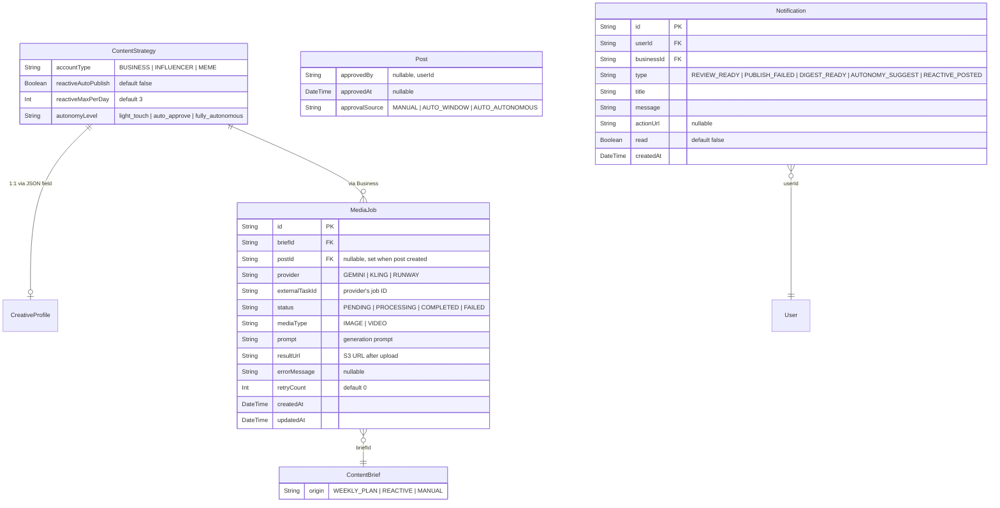

# feat: Revised Platform Roadmap

## Enhancement Summary

**Deepened on:** 2026-03-09
**Sections enhanced:** 12
**Review agents used:** TypeScript Reviewer, Security Sentinel, Performance Oracle, Architecture Strategist, Data Integrity Guardian, Code Simplicity Reviewer, Deployment Verification Agent

### Key Improvements

1. **Reactive pipeline extraction** — reactive content generation MUST be a separate cron (every 15 min), not embedded in the research pipeline. Coupling them risks cascading failures and Lambda timeouts.
2. **Security hardening** — SSRF vulnerability when downloading Kling videos (must validate URLs), missing auth on batch-approve/notification endpoints, need a global daily cost cap across all workspaces.
3. **Simplification opportunities** — consider increasing Lambda timeout to 15 min instead of MediaJob+polling cron; Notification model may be premature for 2 users; ContentPattern can be `isStarred` + `patternTags` on Post instead of a new model; `autonomyLevel` may be redundant with existing `reviewWindowEnabled`/`reviewWindowHours`.
4. **Data integrity** — MediaJob needs `onDelete: Cascade` on briefId, blotatoAccountId migration requires duplicate audit query before applying, compound indexes needed on MediaJob `[status, updatedAt]`.

### New Considerations Discovered

- Stream video downloads from Kling (don't buffer entire video in memory — videos can be 50MB+)
- Add `AbortController` timeouts to all external API calls (Gemini, Kling)
- Set Lambda memory to 512MB+ for media-handling crons
- Media-poll cron needs `concurrency: 1` to prevent duplicate processing
- S3 CORS changes must be additive (don't break existing CloudFront access)
- SES sandbox mode is sufficient for 2 users — skip production SES verification initially
- Define provider interfaces (`ImageProvider`, `VideoProvider`) in Phase 1 alongside first integration, not deferred to Phase 3

---

## Overview

Four-phase roadmap to take ai-social from staging-only to a production autonomous AI social media platform managing 2-3 brands (business, influencer, meme accounts) across Instagram + TikTok (primary). The platform generates 100% AI content (text + images + video), starts with light-touch human review, and graduates to fully autonomous operation.

This plan supersedes the original 6-milestone roadmap. Key simplifications: no Thompson Sampling bandit, no pluggable module registry, no client portal, no LoRA fine-tuning (see brainstorm: `docs/brainstorms/2026-03-09-revised-platform-roadmap-brainstorm.md`).

## Problem Statement

The autonomous content pipeline is built end-to-end (research → briefs → fulfillment → review → publish → optimize) but:
1. **Not in production** — no custom domain, no prod database, no real Blotato API usage
2. **No real media** — image generation returns a 1x1 transparent PNG; video is a no-op
3. **No trend reactivity** — weekly batch cycle is too slow for meme/viral accounts
4. **No creative identity** — no Brand Kit or Creative Profile; AI generates generic visuals
5. **2 remaining P1 bugs** + 18 P2 issues in tech debt backlog

## Proposed Solution

### Phase 0: Production-Ready (Week 1-2)
### Phase 1: Real Media Generation + Creative Profile (Week 2-3)
### Phase 2: Reactive Pipeline + Operations Polish (Week 3-4)
### Phase 3: Toward Full Autonomy (Post-launch, ongoing)

---

## Technical Approach

### Architecture

#### New Models (ERD)



#### Key Architectural Decision: Async Media Generation

Kling AI video generation takes 2-10+ minutes. The fulfillment Lambda has a 5-minute timeout. **Solution: split fulfillment into "submit" and "collect" phases.**

1. **Submit phase** (existing fulfillment cron, every 6h): For IMAGE briefs, call Gemini Imagen synchronously (2-5 sec latency), upload to S3, create post immediately. For VIDEO briefs, submit job to Kling API, create `MediaJob` record with `externalTaskId`, leave brief in FULFILLING status.

2. **Collect phase** (new `media-poll` cron, every 2 min): Query all `MediaJob` records with status=PROCESSING. Poll each provider for completion. On success: download media, upload to S3, create Post, transition brief to FULFILLED. On failure after retries: mark MediaJob FAILED, transition brief to FAILED, send alert.

This avoids Lambda timeout issues and keeps the existing fulfillment engine largely unchanged.

```
src/cron/media-poll.ts       → new cron handler
src/lib/media-jobs.ts        → MediaJob orchestration
src/lib/providers/gemini.ts  → Gemini Imagen integration
src/lib/providers/kling.ts   → Kling AI integration
src/lib/media.ts             → updated to dispatch by provider
```

---

### Implementation Phases

#### Phase 0: Production-Ready

**0.1 — Fix remaining P1 bugs**
- Add `@unique` to `blotatoAccountId` on SocialAccount in `prisma/schema.prisma`
- Create migration: `npx prisma migrate dev --name add-blotato-account-unique`
- Update `prisma.config.ts` to prefer `DIRECT_URL` env var, falling back to `DATABASE_URL`
- Update CI migration step to use `DIRECT_URL` instead of string replacement hack

Files: `prisma/schema.prisma`, `prisma.config.ts`, `.github/workflows/ci.yml`

**0.2 — Production SST stage**
- Register domain, create Route53 hosted zone (or use existing DNS with `dns: false` + ACM cert in us-east-1)
- Add `domain` property to `sst.aws.Nextjs` with per-stage subdomain pattern:
  ```typescript
  domain: {
    name: $app.stage === "production" ? "app.yourdomain.com" : `${$app.stage}.app.yourdomain.com`,
    dns: sst.aws.dns({ zone: "ZONE_ID" })
  }
  ```
- Make S3 CORS origins stage-aware (replace hardcoded CloudFront URL with domain)
- Create production Neon database (separate project from staging)
- Set all 16 SST secrets for production stage: `npx sst secret set <name> <value> --stage production`
- Set `NEXTAUTH_URL` to production domain
- Verify SES sender domain for production email

Files: `sst.config.ts`

**0.3 — Fix high-impact P2s**
- Add missing database indexes:
  - `SocialAccount`: `@@index([businessId])`
  - `BusinessMember`: `@@index([userId])`
  - `ContentBrief`: `@@index([businessId, scheduledFor])`
  - `Post`: `@@index([businessId, publishedAt])`
- Fix review page membership check (`todos/040`)
- Fix strategy PATCH owner check (`todos/038`)
- Fix PATCH posts Zod validation (`todos/039`)

Files: `prisma/schema.prisma`, `src/app/dashboard/review/page.tsx`, `src/app/api/businesses/[id]/strategy/route.ts`, `src/app/api/posts/[id]/route.ts`

**0.4 — E2E verification**
- Disable mocks in staging, connect a test social account via real Blotato API
- Compose, schedule, and publish a real post end-to-end
- Verify metrics collection works
- Run full E2E test suite

**Exit criteria:** `sst deploy --stage production` succeeds. Manual post publishes to a real account in production.

#### Phase 0 — Research Insights

**Deployment Verification:**
- Before applying `blotatoAccountId` unique constraint, run duplicate audit: `SELECT "blotatoAccountId", COUNT(*) FROM "SocialAccount" WHERE "blotatoAccountId" IS NOT NULL GROUP BY "blotatoAccountId" HAVING COUNT(*) > 1;` — fix any duplicates before migration.
- S3 CORS changes must be additive — keep `d11oxnidmahp76.cloudfront.net` origin AND add new domain origin. Removing the CloudFront origin breaks staging.
- SES sandbox mode supports 200 emails/day — sufficient for 2 users. Skip production SES domain verification initially; add it when scaling.
- Verify `NEXTAUTH_URL` matches the exact production domain (including protocol) — mismatches cause silent auth failures.

**Security:**
- Ensure batch-approve and notification endpoints scope queries to `session.user.id` (standard auth pattern per CLAUDE.md).
- Add global daily cost cap: `MAX_DAILY_MEDIA_COST` env var, tracked via a simple counter (sum of MediaJob records created today × provider cost).

---

#### Phase 1: Real Media Generation + Creative Profile

**1.1 — Creative Profile model**

Add fields to `ContentStrategy` (not a separate model — avoids join complexity):

```prisma
// prisma/schema.prisma additions to ContentStrategy
accountType       String   @default("BUSINESS") // BUSINESS | INFLUENCER | MEME
visualStyle       String?  @db.Text             // "clean minimalist", "chaotic meme energy"
colorPalette      String[] @default([])          // hex codes
referenceImageUrls String[] @default([])         // S3 URLs of example images
logoUrl           String?                        // S3 URL
```

Creative Profile is per-workspace (see brainstorm). Platform-specific style overrides deferred — start simple, the AI adapts based on platform in the generation prompt.

Update `WizardAnswersSchema` in `src/lib/strategy/schemas.ts` to add `accountType` and `visualStyle` questions. Update `extractContentStrategy()` tool in `src/lib/ai/index.ts` to output new fields. Update `StrategyPatchSchema` to allow editing these fields.

Files: `prisma/schema.prisma`, `src/lib/strategy/schemas.ts`, `src/lib/ai/index.ts`, `src/app/api/businesses/[id]/strategy/route.ts`, `src/app/api/businesses/[id]/onboard/route.ts`

**1.2 — MediaJob model + polling cron**

New `MediaJob` model in schema:

```prisma
model MediaJob {
  id              String   @id @default(cuid())
  briefId         String
  brief           ContentBrief @relation(fields: [briefId], references: [id])
  postId          String?
  post            Post?    @relation(fields: [postId], references: [id])
  provider        String   // GEMINI | KLING
  externalTaskId  String?  // provider's async job ID
  status          String   @default("PENDING") // PENDING | PROCESSING | COMPLETED | FAILED
  mediaType       String   // IMAGE | VIDEO
  prompt          String   @db.Text
  resultUrl       String?  // S3 URL after upload
  errorMessage    String?
  retryCount      Int      @default(0)
  createdAt       DateTime @default(now())
  updatedAt       DateTime @updatedAt

  @@index([status])
  @@index([briefId])
}
```

New cron in `sst.config.ts`:
```typescript
new sst.aws.Cron("MediaPoll", {
  schedule: "rate(2 minutes)",
  function: { handler: "src/cron/media-poll.handler", timeout: "55 seconds" },
  environment
});
```

Files: `prisma/schema.prisma`, `src/lib/media-jobs.ts`, `src/cron/media-poll.ts`, `sst.config.ts`

**1.3 — Gemini Imagen integration**

New provider module: `src/lib/providers/gemini.ts`

```typescript
// Interface
export interface ImageGenerationResult {
  buffer: Buffer;
  mimeType: string;
}

export async function generateImageGemini(prompt: string, options: {
  aspectRatio?: string;  // "1:1" | "9:16" | "16:9"
  style?: string;        // from Creative Profile
  colorPalette?: string[];
}): Promise<ImageGenerationResult>
```

- Uses `POST https://generativelanguage.googleapis.com/v1beta/models/imagen-4:generateContent`
- Auth: `GOOGLE_AI_API_KEY` env var (add to `src/env.ts` + `sst.config.ts`)
- Prompt construction: incorporate `visualStyle`, `colorPalette`, `accountType` from Creative Profile
- Response: base64 PNG → `Buffer`
- Mock guard: `shouldMockExternalApis()` → return current 1x1 PNG stub
- Cost: ~$0.04/image (Imagen 4 Standard)

Update `src/lib/media.ts` `generateImage()` to call `generateImageGemini()` instead of returning stub. Keep `GeneratedImage` interface unchanged so fulfillment engine needs no changes for IMAGE briefs.

Add env vars: `GOOGLE_AI_API_KEY` to `src/env.ts` (optional, mocked when absent) and `sst.config.ts` (new secret, conditional per stage).

Files: `src/lib/providers/gemini.ts`, `src/lib/media.ts`, `src/env.ts`, `sst.config.ts`

**1.4 — Kling AI video integration**

New provider module: `src/lib/providers/kling.ts`

```typescript
export async function submitVideoJob(prompt: string, options: {
  duration?: number;     // 5 | 10 seconds
  aspectRatio?: string;  // "9:16" for TikTok/Reels, "16:9" for YouTube
  style?: string;
}): Promise<{ taskId: string }>

export async function pollVideoJob(taskId: string): Promise<{
  status: "processing" | "completed" | "failed";
  videoUrl?: string;  // provider's temporary URL
  error?: string;
}>
```

- Auth: JWT generated from `KLING_ACCESS_KEY` + `KLING_SECRET_KEY` env vars
- Submit: `POST https://api.klingai.com/v1/videos/text2video`
- Poll: `GET https://api.klingai.com/v1/videos/{taskId}`
- On completion: download video from provider URL, upload to S3 via `uploadBuffer()`
- Mock guard: return mock task_id and immediately "complete" with a placeholder video
- Cost: ~$0.29/10-second clip

Update fulfillment engine `formatHandlers.VIDEO` to: create `MediaJob` record, call `submitVideoJob()`, store `externalTaskId`, leave brief in FULFILLING status. The media-poll cron handles the rest.

Add env vars: `KLING_ACCESS_KEY`, `KLING_SECRET_KEY` to `src/env.ts` + `sst.config.ts`.

Files: `src/lib/providers/kling.ts`, `src/lib/fulfillment.ts`, `src/lib/media-jobs.ts`, `src/env.ts`, `sst.config.ts`

**1.5 — Wire Creative Profile into generation prompts**

Update `generatePostContent()` in `src/lib/ai/index.ts` to accept Creative Profile fields and incorporate them into the system prompt (tone adjustment for meme vs. business accounts).

Update `generateImageGemini()` prompt construction to reference `visualStyle`, `colorPalette`, and `accountType`.

Update `submitVideoJob()` prompt construction similarly.

Files: `src/lib/ai/index.ts`, `src/lib/providers/gemini.ts`, `src/lib/providers/kling.ts`

**Exit criteria:** Fulfilled IMAGE briefs produce real AI-generated images via Gemini. VIDEO briefs submit to Kling, poll for completion, and attach real video to posts. Creative Profile influences visual output.

#### Phase 1 — Research Insights

**Simplification Decision: MediaJob + Polling Cron vs. Inline Polling**
The simplicity reviewer flagged that a separate MediaJob model + polling cron may be over-engineered for the current scale. Alternative: increase the fulfillment Lambda timeout to 15 minutes and poll inline with `await sleep()` loops. This eliminates the MediaJob model, the media-poll cron, and the FULFILLING state entirely. **Trade-off:** simpler code vs. Lambda cost (billed per-ms) and blocking the fulfillment cron during video generation. **Recommendation:** Start with MediaJob+polling cron — it's more robust for production and the incremental complexity is manageable.

**Performance:**
- Stream video downloads from Kling — do NOT buffer entire video in memory. Videos can be 50MB+. Use Node.js streams: `fetch(url).then(res => res.body.pipe(uploadStream))`.
- Set Lambda memory to 512MB+ for media-handling crons (`media-poll`, `fulfillment`). Default 128MB will OOM on video processing.
- Add `AbortController` with 30-second timeout to Gemini API calls and 10-second timeout to Kling poll calls.
- Media-poll cron needs `concurrency: 1` in SST config to prevent duplicate processing of the same MediaJob.

**Security:**
- **SSRF on Kling video download (HIGH):** Kling returns a temporary URL for the completed video. Before downloading, validate it's a legitimate Kling domain (e.g., `*.klingai.com`). Do NOT pass arbitrary URLs to `fetch()`.
- **Prompt injection via Creative Profile (MEDIUM):** User-supplied `visualStyle` and `referenceImageUrls` are passed to generation prompts. Sanitize: strip control characters, limit length (500 chars for visualStyle), validate URLs are S3 URLs only.

**TypeScript:**
- Use Prisma enums for `provider` and `status` fields on MediaJob, not raw strings. Define: `enum MediaProvider { GEMINI KLING }` and `enum MediaJobStatus { PENDING PROCESSING COMPLETED FAILED }`.
- Define provider interfaces in Phase 1 alongside Gemini integration (not deferred to Phase 3). Simple interface now prevents refactoring later.

**Data Integrity:**
- MediaJob needs `onDelete: Cascade` on the `brief` relation — if a brief is deleted, orphaned MediaJobs should be cleaned up.
- Add compound index `@@index([status, updatedAt])` on MediaJob for efficient polling queries.
- Wrap MediaJob creation + brief status update in a Prisma `$transaction` to prevent orphaned state.

---

#### Phase 2: Reactive Pipeline + Operations Polish

**2.1 — Add `origin` field to ContentBrief**

```prisma
// Add to ContentBrief model
origin String @default("WEEKLY_PLAN") // WEEKLY_PLAN | REACTIVE | MANUAL
```

This enables rate limiting and analytics separation for reactive posts.

Files: `prisma/schema.prisma`, `src/lib/briefs.ts`, `src/lib/ai/briefs.ts`

**2.2 — Reactive content pipeline**

Add `reactiveAutoPublish` (Boolean, default false) and `reactiveMaxPerDay` (Int, default 3) to ContentStrategy.

Modify `runResearchPipeline()` in `src/lib/research.ts`: after storing `ResearchSummary`, check for themes with `relevanceScore >= 0.8` (Claude already returns relevance scores in synthesis). For each high-relevance theme:

1. Count reactive briefs created today for this workspace — skip if at `reactiveMaxPerDay` limit
2. Call `generateBriefs()` with `cadencePerPlatform: { [primaryPlatform]: 1 }` and the single theme
3. Create `ContentBrief` with `origin: "REACTIVE"`
4. If `strategy.reactiveAutoPublish === true`: immediately call fulfillment for this brief (inline, not waiting for 6h cron), set post status to SCHEDULED
5. If `strategy.reactiveAutoPublish === false`: create post as PENDING_REVIEW with `reviewWindowExpiresAt = min(4 hours, reviewWindowHours)` (reactive content has a shorter shelf life)
6. Send notification (in-app + email) to workspace owners

Deduplication: before generating a reactive brief, check recent ContentBriefs (last 48h) for the same workspace + similar topic (fuzzy match via Claude or keyword overlap). Skip if duplicate detected.

Files: `prisma/schema.prisma`, `src/lib/research.ts`, `src/lib/strategy/schemas.ts`

**2.3 — Notification model + in-app center**

New `Notification` model:

```prisma
model Notification {
  id         String   @id @default(cuid())
  userId     String
  user       User     @relation(fields: [userId], references: [id], onDelete: Cascade)
  businessId String?
  business   Business? @relation(fields: [businessId], references: [id], onDelete: Cascade)
  type       String   // REVIEW_READY | PUBLISH_FAILED | DIGEST_READY | REACTIVE_POSTED
  title      String
  message    String   @db.Text
  actionUrl  String?
  read       Boolean  @default(false)
  createdAt  DateTime @default(now())

  @@index([userId, read])
  @@index([userId, createdAt])
}
```

API endpoints:
- `GET /api/notifications` — list unread + recent (last 7 days)
- `PATCH /api/notifications/[id]` — mark as read
- `POST /api/notifications/read-all` — mark all as read

UI: notification bell icon in sidebar header, dropdown panel with notification list, unread count badge. Poll every 30 seconds (simpler than WebSocket for 2 users).

Replace direct SES calls in `src/lib/notifications.ts` with a `notify()` helper that creates a Notification record AND sends email (dual delivery).

Files: `prisma/schema.prisma`, `src/app/api/notifications/route.ts`, `src/app/api/notifications/[id]/route.ts`, `src/components/dashboard/NotificationBell.tsx`, `src/lib/notifications.ts`

**2.4 — Review queue UX improvements**

- **Batch approve**: checkbox per post + "Approve Selected" button. API: `POST /api/posts/batch-approve` accepting `{ postIds: string[] }`
- **Show AI reasoning**: display brief's `rationale` and `contentGuidance` in expandable panel on `ReviewCard`
- **Badge updates**: sidebar review count badge already exists — ensure it polls on 30-second interval (same as notifications)

Files: `src/app/dashboard/review/page.tsx`, `src/components/review/ReviewCard.tsx`, `src/app/api/posts/batch-approve/route.ts`

**2.5 — Analytics improvements**

- Add date range picker (last 7d, 30d, 90d, custom) to analytics page
- Add engagement rate over time line chart (using a lightweight chart library — Recharts or Chart.js)
- Add content type breakdown (format mix performance: IMAGE vs VIDEO vs TEXT)
- Add `@@index([businessId, publishedAt])` to Post model for efficient date range queries

Files: `prisma/schema.prisma`, `src/app/dashboard/analytics/page.tsx`, `src/app/dashboard/analytics/analytics-client.tsx`, `src/app/api/analytics/route.ts`

**Exit criteria:** Meme account workspace auto-generates reactive posts from trending topics within the 4-hour research cycle. In-app notifications work. Review queue supports batch approve with AI reasoning visible. Analytics show trends over time.

#### Phase 2 — Research Insights

**Architecture (CRITICAL): Extract Reactive Pipeline**
The architecture strategist and performance oracle both flagged that embedding reactive brief generation inside `runResearchPipeline()` is too coupled. The research cron already takes ~20 seconds per workspace. Adding fulfillment inline could push it past Lambda timeout and means a research failure kills reactive posting.

**Recommendation:** Create a separate `src/cron/reactive.ts` cron running every 15 minutes:
1. Query recent `ResearchSummary` records (last 4h) with high-relevance themes
2. Check if reactive briefs already generated for those themes (dedup)
3. Generate + fulfill reactive briefs independently
4. This decouples research failures from reactive posting and allows different scaling

SST config: `new sst.aws.Cron("Reactive", { schedule: "rate(15 minutes)", ... })`

**Simplification Decisions:**

- **Notification model:** For 2 users, a full Notification model with polling and bell icon may be premature. Consider keeping SES email notifications and adding the in-app system only when email proves insufficient. **Counter-argument:** The notification bell + dropdown is straightforward UI and provides better UX for the business partner. **Recommendation:** Keep it — the implementation cost is low and UX benefit is meaningful.

- **Analytics improvements (2.5):** Consider deferring date range picker and charts to Phase 3. The weekly digest already surfaces key insights. Focus Phase 2 on the reactive pipeline and review queue UX. **Recommendation:** Defer to Phase 3 unless the business partner specifically requests it.

**Security:**
- Batch-approve endpoint must verify the authenticated user has membership in the business that owns each post. Don't trust client-provided `postIds` — re-query with business scoping.
- Notification API must scope to `session.user.id` — never return another user's notifications.

---

#### Phase 3: Toward Full Autonomy (Post-launch, ongoing)

**3.1 — Autonomy level setting**

Add `autonomyLevel` enum field to ContentStrategy: `light_touch` (default), `auto_approve`, `fully_autonomous`.

- `light_touch`: all posts go through review (maps to current `reviewWindowEnabled=false`)
- `auto_approve`: posts auto-publish after review window (maps to `reviewWindowEnabled=true`)
- `fully_autonomous`: posts publish immediately, no review step (fulfillment creates as SCHEDULED directly)

Update `computeReviewDecision()` in `src/lib/fulfillment.ts` to use `autonomyLevel` as the primary decision input.

Files: `prisma/schema.prisma`, `src/lib/fulfillment.ts`, `src/app/dashboard/strategy/strategy-client.tsx`

**3.2 — Approval tracking for graduated trust**

Add to Post model:
```prisma
approvedBy      String?   // userId of manual approver
approvedAt      DateTime? // when approved
approvalSource  String?   // MANUAL | AUTO_WINDOW | AUTO_AUTONOMOUS
```

Update approve endpoint to record `approvedBy` and `approvedAt`. Update `autoApproveExpiredReviews()` in scheduler to set `approvalSource: "AUTO_WINDOW"`.

Weekly optimizer: calculate approval rate per workspace (manual approvals / total posts needing review). If > 95% over 2 weeks, create a Notification suggesting autonomy upgrade.

Files: `prisma/schema.prisma`, `src/app/api/posts/[id]/approve/route.ts`, `src/lib/scheduler.ts`, `src/lib/optimizer/run.ts`

**3.3 — Scheduling intelligence**

Update weekly optimizer to analyze engagement by hour-of-day and day-of-week per platform per workspace. Update `optimalTimeWindows` JSON field with data-driven values. Minimum sample size: 20 posts per platform before overriding defaults.

Update brief generation to use data-driven optimal times instead of `suggestOptimalTimes()` defaults.

Files: `src/lib/optimizer/analyze.ts`, `src/lib/optimizer/run.ts`, `src/lib/ai/briefs.ts`

**3.4 — Content library**

New `ContentPattern` model:

```prisma
model ContentPattern {
  id           String   @id @default(cuid())
  businessId   String
  business     Business @relation(fields: [businessId], references: [id], onDelete: Cascade)
  postId       String
  post         Post     @relation(fields: [postId], references: [id])
  topicPillar  String?
  format       String   // TEXT | IMAGE | VIDEO
  tone         String?
  engagementScore Float
  patternTags  String[] // extracted themes/patterns
  createdAt    DateTime @default(now())

  @@index([businessId, engagementScore])
}
```

Weekly optimizer: auto-save top 5 performing posts as patterns. AI brief generation receives top patterns as context in the prompt.

Manual: user can mark any post as a "saved pattern" from the PostCard UI.

Files: `prisma/schema.prisma`, `src/lib/optimizer/run.ts`, `src/lib/ai/briefs.ts`, `src/components/posts/PostCard.tsx`

**3.5 — Provider abstraction**

Create `src/lib/providers/types.ts` with interfaces:

```typescript
export interface ImageProvider {
  generateImage(prompt: string, options: ImageOptions): Promise<ImageResult>;
}

export interface VideoProvider {
  submitJob(prompt: string, options: VideoOptions): Promise<{ taskId: string }>;
  pollJob(taskId: string): Promise<JobResult>;
}
```

Wrap Gemini and Kling in these interfaces. Add config to select provider per workspace or globally. This enables swapping to better models (e.g., Runway, newer Gemini versions) without touching the fulfillment engine.

Files: `src/lib/providers/types.ts`, `src/lib/providers/gemini.ts`, `src/lib/providers/kling.ts`, `src/lib/media.ts`

**Exit criteria:** At least one workspace runs fully autonomous for 2+ weeks with stable or improving engagement.

#### Phase 3 — Research Insights

**Simplification Decisions:**

- **`autonomyLevel` enum:** The simplicity reviewer noted this may be redundant with existing `reviewWindowEnabled` + `reviewWindowHours` fields. `light_touch` = `reviewWindowEnabled: false` (manual approval required). `auto_approve` = `reviewWindowEnabled: true` + `reviewWindowHours: 24`. `fully_autonomous` = skip review entirely (new boolean). **Recommendation:** Keep `autonomyLevel` as a high-level enum for clarity in UI/business logic, but implement it as a wrapper that sets the underlying fields. Don't maintain two parallel control paths.

- **ContentPattern model:** Instead of a separate model, add `isStarred Boolean @default(false)` and `patternTags String[]` directly to the Post model. The weekly optimizer queries top-performing posts by engagement and auto-stars them. Users can manually star posts. Brief generation queries starred posts for context. This eliminates a model, a relation, and a join. **Recommendation:** Use this simpler approach.

- **Provider abstraction (3.5):** The simplicity reviewer says this is premature — you have one image provider and one video provider. Just write concrete functions. Abstract only when you actually add a second provider. **Recommendation:** Define interfaces in Phase 1 (lightweight, informs API design) but don't build a registry or factory pattern.

- **Scheduling intelligence (3.3):** Requires 20+ posts per platform to be meaningful. Defer until you have real production data. The existing `suggestOptimalTimes()` is sufficient for launch.

---

## System-Wide Impact

### Interaction Graph

**Media generation flow:**
1. Fulfillment cron picks up brief → calls `formatHandlers[format]`
2. IMAGE: `generateImage()` → `generateImageGemini()` → Gemini API → buffer → `uploadBuffer()` → S3 → Post created
3. VIDEO: `submitVideoJob()` → Kling API → `MediaJob` record created → brief stays FULFILLING
4. Media-poll cron: queries PROCESSING MediaJobs → polls Kling → downloads video → `uploadBuffer()` → S3 → Post created → brief → FULFILLED
5. Post created triggers: notification (if PENDING_REVIEW), auto-approve scheduler check (every 1 min)

**Reactive pipeline flow:**
1. Research cron runs → stores ResearchSummary → checks for high-relevance themes (score >= 0.8)
2. High-relevance theme found → check daily reactive limit → generate single brief (origin: REACTIVE)
3. If reactiveAutoPublish: fulfill immediately → Post SCHEDULED → publisher picks up
4. If !reactiveAutoPublish: fulfill → Post PENDING_REVIEW → notification sent → shorter review window (4h max)

### Error & Failure Propagation

- **Gemini API failure**: `generateImage()` throws → fulfillment catches → brief retried (MAX_RETRIES=2) → brief FAILED → alert sent
- **Kling API submit failure**: `submitVideoJob()` throws → MediaJob created as FAILED → brief retried or FAILED
- **Kling API poll timeout**: MediaJob stays PROCESSING → after 30 min, media-poll marks as FAILED → brief FAILED → alert
- **S3 upload failure**: throws → caught in fulfillment/media-poll → retry or fail
- **Reactive rate limit hit**: logged, skipped (no error, just no brief generated)

### State Lifecycle Risks

- **Orphaned MediaJobs**: If Kling job completes but media-poll Lambda fails mid-processing, the MediaJob stays PROCESSING. Mitigation: media-poll checks for PROCESSING jobs older than 30 min and marks them FAILED with a cleanup sweep.
- **Duplicate reactive briefs**: Research cron could detect the same trend in consecutive runs. Mitigation: check recent briefs (48h) for topic overlap before generating.
- **Brief stuck in FULFILLING**: If fulfillment creates a MediaJob but crashes before committing the brief status update, the brief stays PENDING and gets re-fulfilled (creating a duplicate MediaJob). Mitigation: use Prisma transaction to atomically create MediaJob + update brief status.

### Integration Test Scenarios

1. **Full video pipeline**: Submit a brief with VIDEO format → verify MediaJob created → mock Kling poll response as completed → verify video downloaded, uploaded to S3, Post created with mediaUrls, brief marked FULFILLED
2. **Reactive pipeline end-to-end**: Seed a high-relevance research theme → run research pipeline → verify reactive brief created → verify fulfillment triggered → verify notification sent
3. **Auto-approval with reactive content**: Create a reactive PENDING_REVIEW post with 4h window → advance time 4.5h → run scheduler → verify post auto-approved with `approvalSource: "AUTO_WINDOW"`
4. **Media generation failure recovery**: Mock Gemini API error → verify brief retried → mock success on retry → verify post created
5. **Reactive rate limiting**: Create 3 reactive briefs for a workspace (at limit) → trigger research with another trend → verify no new brief created

---

## Acceptance Criteria

### Phase 0
- [ ] `blotatoAccountId` has `@unique` constraint with migration
- [ ] `prisma.config.ts` uses `DIRECT_URL` env var (not string replacement)
- [ ] Production SST stage deploys successfully with custom domain
- [ ] Missing indexes added (SocialAccount, BusinessMember, ContentBrief, Post)
- [ ] Review page, strategy PATCH, and posts PATCH have proper auth checks
- [ ] A real post publishes end-to-end in production

### Phase 1
- [ ] Creative Profile fields added to ContentStrategy with migration
- [ ] Onboarding wizard captures accountType and visualStyle
- [ ] `generateImage()` calls Gemini Imagen and returns real images
- [ ] IMAGE briefs produce posts with AI-generated images
- [ ] MediaJob model exists with polling cron (every 2 min)
- [ ] VIDEO briefs submit to Kling, poll for completion, and produce posts with real video
- [ ] Creative Profile influences image/video generation prompts
- [ ] Mock guards work for dev/staging (no real API calls unless configured)
- [ ] Tests cover: image generation success/failure, video job lifecycle, Creative Profile prompt injection

### Phase 2
- [ ] `origin` field on ContentBrief distinguishes WEEKLY_PLAN vs REACTIVE vs MANUAL
- [ ] Research pipeline detects high-relevance themes and auto-generates reactive briefs
- [ ] Reactive posts respect per-workspace daily limit
- [ ] Reactive posts use shorter review window (4h max) when review is enabled
- [ ] Duplicate reactive topics are detected and skipped
- [ ] Notification model exists with in-app bell icon and dropdown
- [ ] Review queue supports batch approve with checkbox selection
- [ ] Review cards show AI reasoning (brief rationale + content guidance)
- [ ] Analytics page has date range picker and engagement trend chart

### Phase 3
- [ ] `autonomyLevel` field on ContentStrategy with three options
- [ ] Fulfillment respects autonomy level for post status decisions
- [ ] Approval tracking fields on Post (approvedBy, approvedAt, approvalSource)
- [ ] Weekly optimizer suggests autonomy upgrade when approval rate > 95% over 2 weeks
- [ ] Data-driven optimal posting times replace static defaults after 20+ posts
- [ ] ContentPattern model stores top performers; AI references them in brief generation

---

## Dependencies & Risks

| Risk | Likelihood | Impact | Mitigation |
|------|-----------|--------|------------|
| Kling API waitlist/access delay | Medium | Blocks Phase 1 video | Start with image-only; add Runway as backup provider |
| Gemini Imagen quality insufficient for social media | Low | Degrades content quality | Fall back to gpt-image-1; provider abstraction makes swapping easy |
| Domain/DNS setup delays | Low | Blocks Phase 0 production | Can deploy to production on CloudFront URL first, add domain later |
| API cost runaway | Medium | Budget impact | Per-workspace daily caps, reactive rate limits, cost logging |
| Video generation latency (2-10 min) misses posting windows | Medium | Content may post late | Submit jobs well ahead of scheduled time (fulfillment runs 6h before) |
| Research pipeline produces too many false-positive trends | Medium | Spam-like reactive posting | High relevance threshold (0.8), daily cap, dedup check |

---

## Sources & References

### Origin

- **Brainstorm document:** [docs/brainstorms/2026-03-09-revised-platform-roadmap-brainstorm.md](docs/brainstorms/2026-03-09-revised-platform-roadmap-brainstorm.md)
  - Key decisions: Creative Profile over Brand Kit, reactive pipeline with configurable auto-publish, graduated autonomy (light-touch → fully autonomous), Gemini for images + Kling for video, scrapped bandit/module registry/client portal

### Internal References

- Fulfillment engine: `src/lib/fulfillment.ts` (format handlers at lines 87-101, review decision at lines 50-80)
- Media stub: `src/lib/media.ts` (entire file, 31 lines)
- Research pipeline: `src/lib/research.ts` (trend synthesis at lines 280-310)
- Brief generation: `src/lib/ai/briefs.ts` (generateBriefs at line 92)
- Scheduler auto-approve: `src/lib/scheduler.ts` (lines 129-141)
- Strategy schemas: `src/lib/strategy/schemas.ts` (StrategyPatchSchema at lines 108-128)
- SST config: `sst.config.ts` (secrets lines 14-34, crons lines 100-140)
- Env config: `src/env.ts` (all env vars)
- Deployment learnings: `docs/solutions/deployment-failures/staging-deploy-failures.md`

### External References

- Gemini Imagen API: https://ai.google.dev/gemini-api/docs/image-generation
- Kling AI API: https://app.klingai.com/global/dev/document-api/quickStart/productIntroduction/overview
- Runway API (backup): https://docs.dev.runwayml.com/api/
- SST v3 custom domains: https://sst.dev/docs/component/aws/nextjs (domain property)
- OpenAI gpt-image-1 (backup): https://platform.openai.com/docs/guides/image-generation

### Related Work

- Previous PRs: #19 (mobile), #21 (repurposing), #22 (mock APIs), #23 (fulfillment), #24 (notifications), #25 (security cleanup), #26 (insights)
- Open branch: `feat/content-strategy-settings` (3 commits, strategy settings UI)
- Original roadmap brainstorm: `docs/brainstorms/2026-03-05-autonomous-social-platform-roadmap-brainstorm.md` (superseded)
- Original M1-M4 brainstorm: `docs/brainstorms/2026-03-07-autonomous-ai-social-media-manager-brainstorm.md` (superseded)
