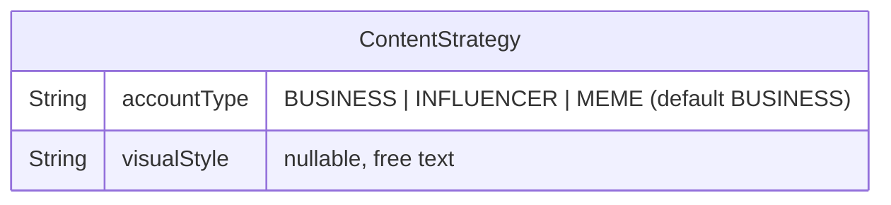

# feat: Real Image Generation + Creative Profile

## Enhancement Summary

**Deepened on:** 2026-03-10
**Review agents used:** TypeScript, Security, Performance, Architecture, Data Integrity, Simplicity, Deployment, Frontend Races, Pattern Recognition

### Key Improvements
1. **Simplified architecture** — Remove `src/lib/providers/` directory and `types.ts`; wire Gemini directly into `src/lib/media.ts` (consensus from architecture, simplicity, and pattern reviewers)
2. **Security hardened** — Add business membership check to generate-image endpoint, prompt injection mitigation for visualStyle, audit logging for all image generation
3. **Frontend race conditions addressed** — AbortController ref pattern, mutual exclusion between upload and generate, nonce-based stale response detection in PostComposer

### New Considerations Discovered
- Skip onboarding wizard changes for v1 — both users are already onboarded, add via strategy settings page only (simplicity reviewer)
- Make GoogleGenAI client a module-level singleton to avoid re-instantiation per request (performance reviewer)
- Default aspect ratio to 1:1 everywhere for v1 to reduce complexity; platform-aware ratios can be a fast follow (simplicity reviewer)
- Log all image generation prompts for audit trail (security reviewer)

---

## Overview

Replace the stub image generator (1x1 transparent PNG) with Gemini Imagen 4, add Creative Profile fields (`accountType`, `visualStyle`) to ContentStrategy, and wire them into all generation prompts. Users validate image quality via a "Generate Image" button in the Post Composer before connecting real social accounts.

**Scope:** Images only. Video generation (Kling/Runway) deferred to a fast follow (see brainstorm).

## Problem Statement

The autonomous content pipeline is fully wired end-to-end (research → briefs → fulfillment → review → publish → optimize) but every generated image is a 1x1 transparent PNG. The AI has no concept of workspace identity — a meme account and a corporate brand get identical output. Real media generation with creative context is the last blocker before connecting real social accounts.

## Proposed Solution

1. **Gemini Imagen 4 integration** — `@google/genai` SDK, synchronous image generation, $0.04/image
2. **Creative Profile** — `accountType` (BUSINESS/INFLUENCER/MEME) and `visualStyle` (free text) on ContentStrategy
3. **Prompt augmentation** — Creative Profile context wired into image prompts, text generation, and brief generation
4. **Composer preview** — "Generate Image" button in PostComposer for manual quality validation
5. **Strategy settings page** — Editable Creative Profile fields on the existing strategy settings page

## Technical Approach

### Architecture



#### Image Generation Flow

```
PostComposer "Generate Image" click
  → POST /api/ai/generate-image { prompt, businessId }
  → verify business membership (session.user.id owns businessId)
  → load ContentStrategy (accountType, visualStyle)
  → build augmented prompt with Creative Profile context
  → call Gemini Imagen 4 (or mock stub)
  → receive base64 PNG → Buffer
  → uploadBuffer() to S3
  → return { url } to client
  → display in media preview grid

Fulfillment cron (existing, modified)
  → brief.aiImagePrompt ?? brief.topic
  → load strategy.accountType, strategy.visualStyle
  → build augmented prompt
  → generateImage(augmentedPrompt)
  → uploadBuffer() to S3
  → Post.mediaUrls = [url]
```

#### Key Architectural Decisions

| Decision | Choice | Rationale |
|----------|--------|-----------|
| File structure | Wire Gemini directly into `src/lib/media.ts` | Matches domain-based organization convention. No `src/lib/providers/` directory — YAGNI, only one provider exists. Reviewers unanimously agreed. |
| Prompt augmentation location | In the caller, not inside `generateImage()` | Keeps `generateImage` a pure provider wrapper. Callers (fulfillment, Composer API) have the ContentStrategy context. Matches existing pattern where `generatePostContent` builds its own prompt. |
| accountType storage | String with `@default("BUSINESS")` + Zod enum validation | Matches `optimizationGoal` pattern in the codebase. Avoids migration for each new value. Zod enforces valid values at API boundaries. |
| Gemini SDK | `@google/genai` SDK | Official SDK, handles auth/retry/types. npm package: `@google/genai`. |
| Image format | PNG from Gemini, uploaded as-is to S3 | Gemini returns base64 PNG. No server-side format conversion needed. Social platforms accept PNG. |
| Aspect ratio | Default 1:1 everywhere for v1 | Simplifies implementation. Platform-aware ratios (9:16 for TikTok, 16:9 for Twitter) can be a fast follow. |
| Onboarding wizard | Skip for v1 | Both users already onboarded. Creative Profile set via strategy settings page. Wizard steps deferred. |
| GoogleGenAI client | Module-level singleton | Avoid re-instantiation per request. Matches Anthropic client pattern in `src/lib/ai/index.ts`. |

### Research Insights (Architecture)

**Pattern compliance:**
- `src/lib/providers/` directory would break the project's domain-based organization convention (`src/lib/media.ts`, `src/lib/ai/`, `src/lib/storage.ts`). Gemini integration belongs in `media.ts`.
- The `types.ts` interface file is premature abstraction — there is no second provider to abstract over. Delete it.
- The mock guard (`shouldMockExternalApis()`) belongs in `media.ts`, not in the Gemini-specific code. This matches the existing pattern in `src/lib/ai/index.ts`.

**Null safety:**
- Handle `strategy.accountType` and `strategy.visualStyle` being null/undefined gracefully in all callers (existing workspaces won't have these set).
- `buildImagePrompt()` should treat missing `accountType` as `"BUSINESS"` and missing `visualStyle` as a no-op.

---

### Implementation Phases

#### Phase 1: Schema + Creative Profile Fields

**1.1 — Prisma schema migration**

Add to `ContentStrategy` model in `prisma/schema.prisma` (~line 107):

```prisma
accountType       String   @default("BUSINESS") // BUSINESS | INFLUENCER | MEME
visualStyle       String?  @db.Text             // "clean minimalist", "chaotic meme energy"
```

Run: `npx prisma migrate dev --name add-creative-profile-fields`

Existing workspaces get `accountType = "BUSINESS"` and `visualStyle = null` (sensible defaults, no user action needed).

Files: `prisma/schema.prisma`

**1.2 — Update all TypeScript schemas and selects**

- `src/lib/strategy/schemas.ts`:
  - Add `accountType: z.enum(["BUSINESS", "INFLUENCER", "MEME"]).optional()` and `visualStyle: z.string().max(500).nullable().optional()` to `StrategyPatchSchema`
- `src/lib/ai/index.ts`:
  - Add `accountType` and `visualStyle` to `ContentStrategyInputSchema` (line 51)
  - Add corresponding properties to `contentStrategyTool` input_schema (line 68)
  - Update the few-shot example to include these fields
- `src/app/dashboard/strategy/page.tsx`: Add `accountType: true, visualStyle: true` to `STRATEGY_SELECT` (line 39)
- `src/app/api/businesses/[id]/strategy/route.ts`: Add same fields to `STRATEGY_SELECT` (line 9)
- `src/app/dashboard/strategy/strategy-client.tsx`: Add fields to `Strategy` interface (line 24)

**Data integrity note:** Extract `STRATEGY_SELECT` to a shared constant (e.g., `src/lib/strategy/constants.ts`) to prevent the two copies from drifting out of sync. Both `page.tsx` and `route.ts` import from the same source.

Files: `src/lib/strategy/schemas.ts`, `src/lib/ai/index.ts`, `src/app/dashboard/strategy/page.tsx`, `src/app/api/businesses/[id]/strategy/route.ts`, `src/app/dashboard/strategy/strategy-client.tsx`, `src/lib/strategy/constants.ts` (new, small)

**1.3 — Strategy settings page: Creative Profile section**

Add a new "Creative Profile" section (section key: `"creative"`) to `strategy-client.tsx`:
- `accountType`: radio/card selector with 3 options (BUSINESS, INFLUENCER, MEME) with descriptions
- `visualStyle`: textarea with placeholder "e.g., clean minimalist, bold and colorful, chaotic meme energy"
- Follows existing section pattern (view/edit/save states, PATCH to strategy API)

Files: `src/app/dashboard/strategy/strategy-client.tsx`

### Research Insights (Phase 1)

**Data integrity:**
- Make `accountType` and `visualStyle` optional in `extractContentStrategy()` tool schema with sensible defaults. New workspaces that go through the wizard won't break if these aren't captured.
- The `@default("BUSINESS")` in Prisma ensures all existing rows get a valid value on migration.

**Simplicity:**
- Wizard changes deferred — both active users are already onboarded. They can set Creative Profile via the strategy settings page.
- If wizard steps are needed later, add them as a separate PR.

---

#### Phase 2: Gemini Imagen Integration

**2.1 — Environment and secrets**

Add to `src/env.ts`:
```typescript
GOOGLE_AI_API_KEY: isMocked ? z.string().default("mock-key") : z.string().min(1),
```

Add to `sst.config.ts`:
```typescript
// In secrets object:
googleAiApiKey: new sst.Secret("GoogleAiApiKey"),

// In environment mapping:
GOOGLE_AI_API_KEY: secrets.googleAiApiKey.value,
```

Provision: `npx sst secret set GoogleAiApiKey "<key>" --stage staging` and `--stage production`.

Files: `src/env.ts`, `sst.config.ts`

**2.2 — Update `src/lib/media.ts` with Gemini integration**

Replace the stub with real Gemini integration directly in `media.ts`. No separate provider file.

```typescript
import { GoogleGenAI } from "@google/genai";
import { env } from "@/env";
import { shouldMockExternalApis } from "@/lib/mocks/config";

export interface GeneratedImage {
  buffer: Buffer;
  mimeType: string;
}

// Module-level singleton (matches Anthropic client pattern in ai/index.ts)
const ai = new GoogleGenAI({ apiKey: env.GOOGLE_AI_API_KEY });

const GEMINI_TIMEOUT_MS = 30_000;

export async function generateImage(prompt: string): Promise<GeneratedImage> {
  if (shouldMockExternalApis()) {
    return mockGenerateImage();
  }

  // Sanitize prompt: limit length, strip control characters
  const sanitizedPrompt = prompt
    .replace(/[\x00-\x1F\x7F]/g, "")
    .slice(0, 1900); // Gemini limit ~480 tokens ≈ ~1900 chars

  // Audit log: capture prompt for debugging/review
  console.log("[image-gen] prompt:", sanitizedPrompt.slice(0, 200));

  const controller = new AbortController();
  const timeout = setTimeout(() => controller.abort(), GEMINI_TIMEOUT_MS);

  try {
    const response = await ai.models.generateImages({
      model: "imagen-4.0-generate-001",
      prompt: sanitizedPrompt,
      config: {
        numberOfImages: 1,
        aspectRatio: "1:1", // Default for v1; platform-aware ratios in fast follow
      },
    });

    const image = response.generatedImages?.[0];
    if (!image?.image?.imageBytes) {
      throw new Error("Gemini returned no image data");
    }

    return {
      buffer: Buffer.from(image.image.imageBytes, "base64"),
      mimeType: "image/png",
    };
  } finally {
    clearTimeout(timeout);
  }
}

function mockGenerateImage(): GeneratedImage {
  // 1x1 transparent PNG (existing stub)
  const buffer = Buffer.from(
    "iVBORw0KGgoAAAANSUhEUgAAAAEAAAABCAYAAAAfFcSJAAAADUlEQVR42mP8/5+hHgAHggJ/PchI7wAAAABJRU5ErkJggg==",
    "base64"
  );
  return { buffer, mimeType: "image/png" };
}
```

Install: `npm install @google/genai`

Files: `src/lib/media.ts`

### Research Insights (Phase 2)

**Performance:**
- GoogleGenAI client should be a module-level singleton (created once, reused across requests). This matches the Anthropic client pattern in `src/lib/ai/index.ts`.
- No response caching needed — each image prompt is unique, and Gemini doesn't support caching for image generation.
- 1024MB Lambda memory is sufficient for handling PNG buffers from Gemini (typical image ~200KB-1MB).

**Security:**
- `env.GOOGLE_AI_API_KEY` access is server-side only. Never expose in client bundles. Next.js `src/env.ts` ensures this is validated at startup, not leaked via `NEXT_PUBLIC_` prefix.
- Prompt sanitization (control char stripping, length limit) is essential to prevent prompt injection via user-controlled `visualStyle` text.
- Audit log the sanitized prompt for debugging and abuse review. Use `console.log("[image-gen]")` prefix for easy CloudWatch filtering.

**Simplicity:**
- No `src/lib/providers/` directory, no `types.ts` interface file. Wire Gemini directly into `media.ts`.
- No AbortController signal pass-through to Gemini SDK (Gemini SDK doesn't support abort signals in `generateImages`). The timeout + `controller.abort()` is for future-proofing only — the `clearTimeout` in `finally` is the important cleanup.
- Default aspect ratio 1:1 everywhere. Skip platform-aware aspect ratios for v1.

---

#### Phase 3: Wire Creative Profile into Generation

**3.1 — Prompt augmentation (inline in callers)**

Add a `buildImagePrompt()` helper in `src/lib/ai/prompts.ts`:

```typescript
export function buildImagePrompt(
  basePrompt: string,
  creative: { accountType?: string; visualStyle?: string | null }
): string {
  const parts = [basePrompt];

  if (creative.accountType === "MEME") {
    parts.push("Style: bold, eye-catching, meme-format, high contrast, internet culture aesthetic.");
  } else if (creative.accountType === "INFLUENCER") {
    parts.push("Style: aspirational, lifestyle photography, warm tones, authentic feel.");
  } else {
    parts.push("Style: professional, clean, brand-appropriate, polished.");
  }

  if (creative.visualStyle) {
    // Sanitize: limit length, quote to prevent prompt injection
    const safe = creative.visualStyle.replace(/[\x00-\x1F\x7F]/g, "").slice(0, 500);
    parts.push(`Visual direction: "${safe}".`);
  }

  return parts.join(" ");
}
```

Files: `src/lib/ai/prompts.ts`

**3.2 — Update fulfillment to pass Creative Profile**

In `src/lib/fulfillment.ts`, update the IMAGE format handler (~line 89) to augment the prompt with Creative Profile context:

```typescript
IMAGE: async (prompt: string) => {
  // strategy is already in scope from fulfillOneBrief
  const augmented = buildImagePrompt(
    prompt,
    { accountType: strategy.accountType, visualStyle: strategy.visualStyle }
  );
  return generateImage(augmented);
},
```

The `strategy` variable is already available in `fulfillOneBrief` scope (line 141). The format handler closure captures it.

Files: `src/lib/fulfillment.ts`

**3.3 — Update `generatePostContent()` with Creative Profile**

Expand function signature:

```typescript
export async function generatePostContent(
  topic: string,
  platform: string,
  tone?: string,
  creative?: { accountType?: string; visualStyle?: string | null }
): Promise<string>
```

Update the prompt to include account type and visual style context. Add personality hints:
- MEME: casual, funny, uses internet slang, trending references
- INFLUENCER: personal, authentic, storytelling, call to action
- BUSINESS: professional, informative, brand-aligned

Update callers:
- `/api/ai/generate` route: load ContentStrategy for active business, pass creative fields
- Brief generation: already has strategy in scope, pass through

Files: `src/lib/ai/index.ts`, `src/app/api/ai/generate/route.ts`

**3.4 — Update brief generation with Creative Profile**

In `src/lib/ai/briefs.ts`, update `generateBriefs()` to include accountType and visualStyle in the prompt context. This ensures `aiImagePrompt` values generated by Claude are already style-aware.

Files: `src/lib/ai/briefs.ts`

### Research Insights (Phase 3)

**Security (prompt injection):**
- `visualStyle` is user-controlled free text that gets injected into Gemini prompts. Mitigate:
  - Length limit (500 chars, enforced in Zod schema AND in `buildImagePrompt`)
  - Strip control characters
  - Quote the value in the prompt (`Visual direction: "..."`) to reduce injection surface
  - Gemini's own safety filters provide a backstop
- This is rated **HIGH** risk by security reviewer — the sanitization is essential, not optional.

**TypeScript:**
- Consider using an options object for `generatePostContent()` instead of adding a 4th positional parameter:
  ```typescript
  generatePostContent(topic: string, platform: string, options?: { tone?: string; creative?: CreativeProfile })
  ```
  This is more extensible and avoids the "boolean trap" of positional params.

---

#### Phase 4: Composer "Generate Image" Button

**4.1 — API endpoint**

New file: `src/app/api/ai/generate-image/route.ts`

```typescript
// POST /api/ai/generate-image
// Body: { prompt: string, businessId: string }
// Response: { url: string }
//
// 1. getServerSession → reject if no session
// 2. Verify business membership (session.user.id owns businessId) ← CRITICAL
// 3. Load ContentStrategy for businessId
// 4. buildImagePrompt(prompt, { accountType, visualStyle })
// 5. generateImage(augmentedPrompt)
// 6. uploadBuffer() to S3 at key: media/{businessId}/composer/{cuid}.png
// 7. Return { url }
```

Zod validation:
```typescript
const schema = z.object({
  prompt: z.string().min(1).max(2000),
  businessId: z.string().min(1),
});
```

Files: `src/app/api/ai/generate-image/route.ts`

**4.2 — PostComposer UI changes**

In `src/components/posts/PostComposer.tsx`:

- Add "Generate Image" button in the AI section (below the existing "Generate" text button, ~line 503)
- Button uses the post content (or topic input) as the prompt
- Disabled when content is empty and no topic is entered
- Loading state: spinner + "Generating image..." text (Gemini takes ~3-8 seconds)
- On success: add returned URL to `mediaUrls` state (replaces existing media to avoid confusion)
- On error: show error toast/alert
- Prevent double-clicks and handle race conditions (see research insights below)

```tsx
// New state
const [isGeneratingImage, setIsGeneratingImage] = useState(false);
const abortControllerRef = useRef<AbortController | null>(null);

// Handler
async function handleGenerateImage() {
  // Abort any in-flight generation request
  abortControllerRef.current?.abort();
  const controller = new AbortController();
  abortControllerRef.current = controller;

  setIsGeneratingImage(true);
  try {
    const res = await fetch("/api/ai/generate-image", {
      method: "POST",
      headers: { "Content-Type": "application/json" },
      body: JSON.stringify({
        prompt: content || topic,
        businessId: activeBusinessId,
      }),
      signal: controller.signal,
    });
    if (controller.signal.aborted) return;
    if (!res.ok) throw new Error("Failed to generate image");
    const { url } = await res.json();
    if (!controller.signal.aborted) {
      setMediaUrls([url]); // Replace existing media with AI-generated image
    }
  } catch (err) {
    if (err instanceof DOMException && err.name === "AbortError") return;
    // Show error in UI
  } finally {
    setIsGeneratingImage(false);
  }
}

// Cleanup on unmount
useEffect(() => {
  return () => abortControllerRef.current?.abort();
}, []);
```

Mutual exclusion: disable "Generate Image" button while an upload is in progress, and disable upload while generation is in progress. Use `isGeneratingImage || isUploading` guard.

Files: `src/components/posts/PostComposer.tsx`

### Research Insights (Phase 4)

**Frontend race conditions (HIGH priority):**
- **AbortController ref pattern**: Store an AbortController in a ref. On each new generation request, abort the previous one. Pass `signal` to `fetch()`. This prevents stale responses from overwriting newer ones.
- **Mutual exclusion**: Disable the "Generate Image" button while uploading, and disable the upload button while generating. A simple state guard (`isGeneratingImage || isUploading`) is sufficient.
- **Cleanup on unmount**: `useEffect` cleanup aborts any in-flight request if the component unmounts mid-generation.
- **Nonce pattern (optional)**: For extra safety, generate a nonce before each request and check it matches before applying state. The AbortController pattern above is sufficient for v1.

**Security:**
- **Business membership check is CRITICAL** — without it, any authenticated user could generate images against any business's Creative Profile. Verify `session.user.id` has a membership for the requested `businessId` before proceeding.
- Rate limiting is not needed for v1 (only 2 users), but note it as a future consideration.

**Pattern recognition:**
- The endpoint follows the same pattern as `POST /api/ai/generate` — session check, business context load, AI call, response. Keep them consistent.

---

## System-Wide Impact

### Interaction Graph

1. User clicks "Generate Image" in Composer → `POST /api/ai/generate-image` → verifies business membership → loads ContentStrategy → builds prompt → `generateImage()` → Gemini API → base64 → Buffer → `uploadBuffer()` → S3 → URL returned → displayed in media grid
2. Fulfillment cron fires → picks up IMAGE brief → loads strategy → `buildImagePrompt()` with Creative Profile → `generateImage()` → same Gemini path → S3 URL → Post.mediaUrls
3. Brief generation → Claude receives accountType + visualStyle context → generates style-aware `aiImagePrompt` → stored on ContentBrief → used by fulfillment in step 2

### Error & Failure Propagation

- **Gemini API timeout** (30s): timeout fires → `generateImage()` throws → fulfillment catches → brief retried (MAX_RETRIES=2) → after retries, brief FAILED → SES alert. In Composer: error shown to user.
- **Gemini content policy rejection**: Response returns empty `generatedImages` → "Gemini returned no image data" error → same retry/fail path.
- **Gemini API key invalid/missing**: First call fails with auth error → same error propagation.
- **S3 upload failure**: `uploadBuffer()` throws → caught by caller → retry or error.
- **Mock mode**: `shouldMockExternalApis()` → 1x1 PNG returned → no external calls made.

### State Lifecycle Risks

- **No new state machines** — IMAGE fulfillment remains synchronous (generate → upload → create post). No MediaJob, no FULFILLING state.
- **Existing `recoverStuckBriefs`** handles any brief stuck in FULFILLING for >10 minutes (covers Gemini timeout edge case in fulfillment).

### Integration Test Scenarios

1. **Full image generation flow**: Mock Gemini response → call `generateImage()` with Creative Profile → verify prompt contains accountType/visualStyle → verify buffer returned → verify S3 upload called with correct key
2. **Mock mode bypass**: Set `MOCK_EXTERNAL_APIS=true` → call `generateImage()` → verify Gemini SDK NOT called → verify 1x1 PNG returned
3. **Fulfillment with Creative Profile**: Create brief with IMAGE format → set strategy accountType=MEME, visualStyle="chaotic energy" → run fulfillment → verify Gemini called with augmented prompt → verify Post created with mediaUrls
4. **Composer generate-image endpoint**: POST with valid businessId → verify membership check → verify strategy loaded → verify image URL returned
5. **Strategy settings round-trip**: PATCH accountType + visualStyle → GET → verify values persisted and returned

## Acceptance Criteria

### Phase 1: Schema + Creative Profile
- [ ] `accountType` and `visualStyle` columns added to ContentStrategy with migration
- [ ] `StrategyPatchSchema` accepts accountType (enum: BUSINESS/INFLUENCER/MEME) and visualStyle (string, max 500 chars)
- [ ] Strategy settings page shows "Creative Profile" section with accountType selector and visualStyle textarea
- [ ] `STRATEGY_SELECT` extracted to shared constant used by both page.tsx and route.ts
- [ ] `extractContentStrategy()` handles new fields in tool schema with sensible defaults
- [ ] Existing workspaces default to BUSINESS / null (no action needed)

### Phase 2: Gemini Integration
- [ ] `@google/genai` installed as dependency
- [ ] `GOOGLE_AI_API_KEY` env var added (optional when mocked, required in production)
- [ ] `GoogleAiApiKey` SST secret added to `sst.config.ts`
- [ ] `generateImage()` in `src/lib/media.ts` calls Gemini Imagen 4 with 30s timeout
- [ ] GoogleGenAI client is a module-level singleton
- [ ] Mock mode returns 1x1 PNG stub when `shouldMockExternalApis()` is true
- [ ] Prompt sanitized: control chars stripped, length limited to 1900 chars
- [ ] Prompt logged for audit trail

### Phase 3: Creative Profile Wiring
- [ ] `buildImagePrompt()` augments base prompt with accountType personality + visualStyle
- [ ] Fulfillment IMAGE handler passes strategy context to prompt builder
- [ ] `generatePostContent()` accepts optional creative context and adjusts tone
- [ ] `generateBriefs()` includes accountType + visualStyle in Claude prompt (affects aiImagePrompt generation)
- [ ] Default aspect ratio 1:1 for all platforms (v1)

### Phase 4: Composer Preview
- [ ] `POST /api/ai/generate-image` endpoint with auth + business membership check
- [ ] "Generate Image" button in PostComposer, disabled when content is empty
- [ ] AbortController ref prevents stale response races
- [ ] Mutual exclusion between upload and generation operations
- [ ] Loading spinner during generation (~3-8 seconds)
- [ ] Generated image displayed in existing media preview grid
- [ ] Error handling shown to user on failure

### Testing (TDD — tests first)
- [ ] Unit tests: `generateImage()` with mocked GoogleGenAI SDK, prompt sanitization
- [ ] Unit tests: `buildImagePrompt()` with all accountType/visualStyle combinations
- [ ] Unit tests: fulfillment IMAGE handler with Creative Profile augmentation
- [ ] Unit tests: `/api/ai/generate-image` route with mocked `generateImage`, membership check
- [ ] Unit tests: strategy PATCH with new fields
- [ ] Coverage thresholds maintained (75% statements/lines/branches, 70% functions)

## Deployment Checklist

### Pre-deploy
- [ ] Provision `GoogleAiApiKey` SST secret for both stages:
  - `npx sst secret set GoogleAiApiKey "<key>" --stage staging`
  - `npx sst secret set GoogleAiApiKey "<key>" --stage production`
- [ ] Verify Google AI API key has Imagen 4 access enabled
- [ ] Run `npm run ci:check` passes
- [ ] E2E tests pass locally

### Migration verification
- [ ] Migration adds `accountType` (String, default "BUSINESS") and `visualStyle` (String?, nullable)
- [ ] Verify migration is safe: `ALTER TABLE ... ADD COLUMN` with defaults is non-locking in PostgreSQL
- [ ] Existing ContentStrategy rows get `accountType = 'BUSINESS'`, `visualStyle = NULL`

### Post-deploy verification
- [ ] Staging: Set Creative Profile via strategy settings page → verify saved
- [ ] Staging: Click "Generate Image" in PostComposer → verify real image returned (not 1x1 PNG)
- [ ] Staging: Run fulfillment cron → verify IMAGE briefs generate real images with style context
- [ ] Monitor CloudWatch for `[image-gen]` logs confirming prompt flow

### Rollback procedure
- [ ] If Gemini API fails: set `GOOGLE_AI_API_KEY` to empty string → triggers mock mode via `shouldMockExternalApis()` fallback. No code rollback needed.
- [ ] If migration fails: migration is additive (new nullable columns). Revert by deploying previous code — new columns are ignored.

## Dependencies & Risks

| Risk | Likelihood | Impact | Mitigation |
|------|-----------|--------|------------|
| Gemini Imagen quality insufficient | Low | Content quality | Can swap to gpt-image-1 by changing provider in `media.ts` |
| Gemini content policy blocks legitimate prompts | Medium | Some images fail | Retry with simplified prompt; log blocked prompts for review |
| API cost runaway from Composer clicks | Low | Budget | $0.04/image is negligible for 2 users. Add rate limit later if needed |
| Gemini API rate limits during batch fulfillment | Low | Brief failures | Fulfillment already has retry logic with backoff |
| Prompt injection via visualStyle | Medium | Off-brand content | Sanitize input (500 char limit, strip control chars, quote in prompt), Gemini safety filters as backstop |
| IDOR on generate-image endpoint | High if missed | Cross-workspace access | Business membership check is mandatory in endpoint |

## Sources & References

### Origin

- **Brainstorm document:** [docs/brainstorms/2026-03-10-media-generation-creative-profile-brainstorm.md](docs/brainstorms/2026-03-10-media-generation-creative-profile-brainstorm.md)
  - Key decisions: Gemini Imagen 4, images-only (video deferred), accountType + visualStyle only, validation via Post Composer, both wizard + settings page

### Internal References

- Media stub: `src/lib/media.ts` (entire file, 31 lines — to be replaced)
- Fulfillment IMAGE handler: `src/lib/fulfillment.ts:89-92`
- AI generation: `src/lib/ai/index.ts:14-47` (`generatePostContent`), `src/lib/ai/index.ts:166-196` (`extractContentStrategy`)
- Brief generation: `src/lib/ai/briefs.ts:92` (`generateBriefs`)
- Post Composer: `src/components/posts/PostComposer.tsx:503-538` (AI section)
- Strategy schemas: `src/lib/strategy/schemas.ts:108-128` (`StrategyPatchSchema`)
- Strategy settings: `src/app/dashboard/strategy/strategy-client.tsx:24-38` (`Strategy` interface)
- Onboarding wizard: `src/app/dashboard/businesses/[id]/onboard/page.tsx:11-52` (`STEPS` array)
- Storage: `src/lib/storage.ts:29-44` (`uploadBuffer`)
- Env config: `src/env.ts:3-4` (`isMocked` pattern)
- SST config: `sst.config.ts:14-34` (secrets)
- Mock config: `src/lib/mocks/config.ts` (`shouldMockExternalApis`)

### External References

- Gemini Imagen 4 API: https://ai.google.dev/gemini-api/docs/imagen
- `@google/genai` SDK: https://www.npmjs.com/package/@google/genai
- Gemini pricing: https://ai.google.dev/gemini-api/docs/pricing ($0.04/image standard)

### Institutional Learnings

- **Always run `prisma migrate dev`** after schema changes, not just `prisma generate` (see `docs/solutions/deployment-failures/staging-deploy-failures.md`)
- **SST secrets must be stage-aware** — make `GoogleAiApiKey` conditional per stage with mock fallback
- **Branch from `origin/main`** and rebase before PR (see `docs/solutions/workflow-issues/`)
