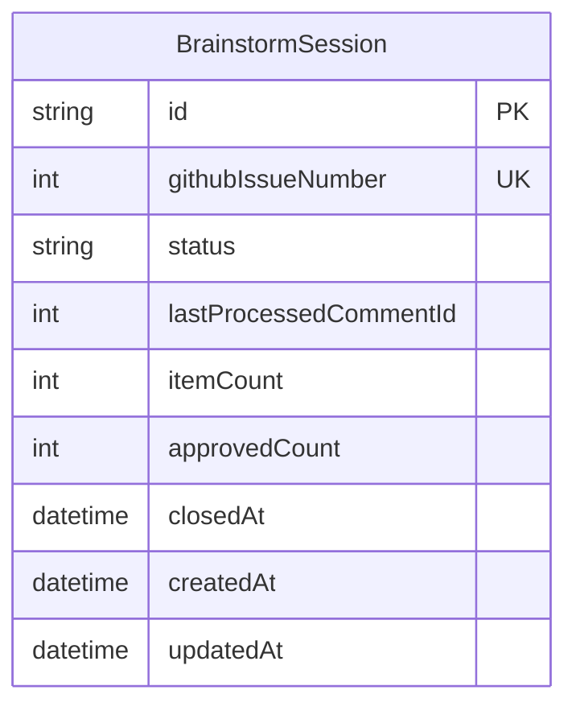

# AI Brainstorm Agent Pipeline

## Overview

Build an autonomous AI brainstorm agent that periodically generates roadmap ideas as GitHub issues, supports iterative refinement through issue comments, and feeds approved ideas into the existing plan/work pipeline. The entire workflow lives in GitHub Issues — no in-app UI.

## Problem Statement / Motivation

Currently, roadmap ideation is manual and sporadic. The platform has a mature autonomous pipeline for content (research → briefs → fulfillment → review → publish → metrics → optimize), but nothing for product development itself. An AI brainstorm agent would:

- Continuously surface relevant feature ideas grounded in the project's current state and industry trends
- Reduce the gap between "idea" and "actionable plan" via the existing plan-executor pipeline
- Keep the roadmap fresh without requiring dedicated planning sessions
- Create a documented history of considered ideas (accepted and rejected)

## Proposed Solution

A single Lambda cron (`BrainstormAgent`) runs hourly and handles three responsibilities:

1. **Generate** — Only when no open brainstorm exists (and a minimum cooldown has passed), gather project context + business vision, use Claude to synthesize ideas, create a GitHub issue with checkbox items
2. **Iterate** — Detect new human comments on the open brainstorm issue, re-run the AI with the feedback, update the issue body, reply with a summary of changes
3. **Promote** — Detect newly checked checkboxes, create a "Plan: ..." issue for each approved item, update the brainstorm issue with links to the plan issues
4. **Auto-close** — When all items in a brainstorm are resolved (each either promoted to a plan or left unchecked with no further discussion), auto-close the issue to unblock the next generation cycle

**At most one open brainstorm issue exists at any time.** Generation is gated on the previous brainstorm being closed — either manually by the human or auto-closed when all items are resolved. This prevents flooding the issue view with unaddressed brainstorms. The `BRAINSTORM_FREQUENCY_DAYS` env var acts as a minimum cooldown between generations (default: 7 days).

```
┌──────────────────────────────────────────────────────────────┐
│  EventBridge Cron (hourly)                                   │
│  src/cron/brainstorm.ts                                      │
│                                                              │
│  ┌──────────────┐  ┌──────────────┐  ┌───────────────────┐  │
│  │  Generate?    │  │  Comments?   │  │  Approvals?       │  │
│  │  (no open +   │  │  (any new)   │  │  (checked ☑)      │  │
│  │   cooldown)   │  │              │  │                   │  │
│  └──────┬───────┘  └──────┬───────┘  └──────┬────────────┘  │
│         │                 │                  │               │
│         ▼                 ▼                  ▼               │
│  Create issue      AI iterates &      Create "Plan:..."     │
│  "Brainstorm:..."  updates body       issues, add links     │
│                    + reply comment    + auto-close if done   │
└──────────────────────────────────────────────────────────────┘
                            │
                            ▼
               Human reviews in GitHub
               (check boxes, leave comments)
                            │
                            ▼
               Plan issues → issue-worker → PRs
```

## Technical Approach

### Architecture

#### New Files

| File | Purpose |
|------|---------|
| `src/lib/github.ts` | Octokit client singleton, helper methods (create issue, update issue, list comments, etc.) |
| `src/lib/brainstorm/generate.ts` | Context gathering + AI synthesis + issue creation |
| `src/lib/brainstorm/iterate.ts` | Comment processing + AI iteration + issue update |
| `src/lib/brainstorm/promote.ts` | Checkbox detection + plan issue creation |
| `src/lib/brainstorm/prompts.ts` | System/user prompt templates for generation and iteration |
| `src/lib/brainstorm/run.ts` | Orchestrator: calls generate/iterate/promote in sequence |
| `src/lib/brainstorm/types.ts` | Zod schemas and TypeScript types |
| `src/lib/brainstorm/markdown.ts` | Parse/serialize brainstorm issue body (checkboxes, items, metadata) |
| `src/cron/brainstorm.ts` | Lambda handler (thin wrapper) |
| `src/lib/mocks/brainstorm.ts` | Mock responses for testing |
| `docs/brainstorm-context.md` | Business vision + goals doc (read by agent via GitHub API) |

#### Scoping: Project-Level (Not Per-Business)

This is the first cron that operates at the **project level** rather than iterating over businesses. The brainstorm agent ideates about the ai-social platform's roadmap, not per-business content strategy. This is an intentional architectural departure from the existing per-business crons (research, briefs, fulfill, optimize).

#### Database Changes

```prisma
model BrainstormSession {
  id                      String    @id @default(cuid())
  githubIssueNumber       Int       @unique
  status                  String    @default("OPEN") // OPEN, CLOSED
  lastProcessedCommentId  Int?      // GitHub comment ID, null = no comments processed
  itemCount               Int       @default(0)
  approvedCount           Int       @default(0)
  closedAt                DateTime? // When session was closed (for cooldown calculation)
  createdAt               DateTime  @default(now())
  updatedAt               DateTime  @updatedAt

  @@index([status])
}
```

Minimal DB footprint — the GitHub issue body is the source of truth for item content and approval state. The DB tracks:
- Which issues are brainstorm sessions (for efficient querying)
- Last processed comment ID (to avoid re-processing)
- Counts for quick stats

No `BrainstormItem` model needed. Items are parsed from the issue markdown when the cron runs.
No `Business` relation — this is project-level, not per-business.

#### ERD



### Implementation Phases

#### Phase 1: Foundation (GitHub Client + DB + Config)

**Goal:** Establish GitHub API integration and data model.

**Tasks:**
- [ ] Install `@octokit/rest` dependency
- [ ] Add `GITHUB_TOKEN` optional secret to `sst.config.ts` (set to `null`, follow BlotatoApiKey pattern)
- [ ] Add `GITHUB_TOKEN` to `src/env.ts` as `z.string().optional()`
- [ ] Add `GITHUB_REPO_OWNER` and `GITHUB_REPO_NAME` to `src/env.ts` as `z.string().optional()` (defaults to `jsilvia721` / `ai-social`)
- [ ] Create `src/lib/github.ts` — Octokit client with helper methods:
  - `createIssue(title, body, labels)` → issue number + URL
  - `updateIssueBody(issueNumber, body)` → void
  - `getIssueBody(issueNumber)` → string
  - `listComments(issueNumber, sinceId?)` → Comment[]
  - `createComment(issueNumber, body)` → comment ID
  - `getRepoFile(path)` → string (for reading brainstorm-context.md)
  - `listIssues(labels, state)` → Issue[]
  - `listRecentPRs(days)` → PR[]
- [ ] Add `BrainstormSession` model to `prisma/schema.prisma` (project-level, no Business relation)
- [ ] Run `npx prisma migrate dev --name add_brainstorm_session`
- [ ] Add `BRAINSTORM_FREQUENCY_DAYS` to `src/env.ts` as `z.coerce.number().optional()` (default: 7)
- [ ] Add `GITHUB_BOT_USERNAME` to `src/env.ts` as `z.string().optional()` (for filtering bot's own comments)
- [ ] Create `docs/brainstorm-context.md` with business vision, goals, and focus areas (seeded from existing memory)
- [ ] Create `src/lib/mocks/github.ts` — mock Octokit responses following `shouldMockExternalApis()` pattern
- [ ] Tests: `src/__tests__/lib/github.test.ts` — mock Octokit, verify all helpers

**Key decisions:**
- **Project-level, not per-business** — brainstorms the ai-social product roadmap, not individual business content. First cron to break the per-business pattern.
- GitHub token is optional — brainstorm features degrade gracefully when not configured
- Repo coordinates in env vars so they work across forks/environments
- Business vision in a committed markdown file, read via GitHub API at runtime (Lambda doesn't have filesystem access to repo)
- Frequency as env var (not DB) — simple, matches existing config pattern, change requires redeploy which is fine for weekly cadence

#### Phase 2: Brainstorm Generation

**Goal:** AI agent generates brainstorm issues on a configurable schedule.

**Tasks:**
- [ ] Create `src/lib/brainstorm/types.ts` — Zod schemas:
  - `BrainstormItemSchema` (title, rationale, scope: S/M/L, visionAlignment, category)
  - `BrainstormOutputSchema` (items array, projectSummary, researchInsights)
- [ ] Create `src/lib/brainstorm/prompts.ts` — prompt templates:
  - System prompt: role as product strategist, understanding of social media management space
  - Context template: current project state, open issues, recent PRs, business vision
  - Generation instruction: produce 5-7 actionable ideas with rationale
- [ ] Create `src/lib/brainstorm/markdown.ts` — markdown utilities:
  - `renderBrainstormIssue(output: BrainstormOutput)` → markdown string with checkboxes
  - `parseBrainstormIssue(markdown: string)` → parsed items with checked/unchecked state
  - `updateItemWithPlanLink(markdown, itemIndex, planIssueNumber)` → updated markdown
- [ ] Create `src/lib/brainstorm/generate.ts`:
  - Gather context: `github.listIssues()`, `github.listRecentPRs()`, `github.getRepoFile("docs/brainstorm-context.md")`
  - Call Claude with tool-use pattern (force structured output via `BrainstormOutputSchema`)
  - Render markdown and create GitHub issue with label `brainstorm`
  - Create `BrainstormSession` DB record
- [ ] Create `src/lib/mocks/brainstorm.ts` — mock generation output for tests
- [ ] Tests: `src/__tests__/lib/brainstorm/generate.test.ts`
- [ ] Tests: `src/__tests__/lib/brainstorm/markdown.test.ts`

**Issue body format:**
```markdown
# Brainstorm: Week of March 17, 2026

> AI-generated roadmap ideas based on project analysis and industry research.

## Project Snapshot
- **Open issues:** 12 (3 bugs, 9 features)
- **Recent focus:** Content pipeline automation, TikTok integration
- **Current capabilities:** Multi-platform publishing, AI content generation, analytics

## Research Insights
Brief summary of industry trends and opportunities identified...

## Ideas

- [ ] **1. A/B Testing Framework**
  - **Rationale:** Historical engagement data shows variance by posting time and tone. A/B testing would enable data-driven optimization.
  - **Scope:** Large (2-3 weeks)
  - **Vision Alignment:** Directly supports "AI handles 80%+ of content creation" goal by enabling learning loops.
  - **Category:** Intelligence

- [ ] **2. Webhook-Based Platform Notifications**
  - **Rationale:** ...
  - **Scope:** Medium (1 week)
  - **Vision Alignment:** ...
  - **Category:** Infrastructure

...

---
*Check items to approve for plan generation. Leave a comment to discuss or refine ideas.*
<!-- brainstorm-meta: {"version": 1, "generatedAt": "2026-03-17T00:00:00Z"} -->
```

**AI prompt design:**
- Uses tool-use pattern consistent with existing `src/lib/ai/index.ts`
- Forces structured output via `tool_choice: { type: "tool", name: "generate_brainstorm" }`
- System prompt establishes role as product strategist for social media management platforms
- Context includes: open issues (titles + labels), recent PR titles, business vision doc, current ContentStrategy from DB
- Instruction asks for 5-7 ideas spanning categories: Intelligence, Infrastructure, UX, Growth, Operations

#### Phase 3: Comment-Driven Iteration

**Goal:** Human comments on brainstorm issues trigger AI re-evaluation and issue body updates.

**Tasks:**
- [ ] Create `src/lib/brainstorm/iterate.ts`:
  - Query `BrainstormSession` records with status `OPEN`
  - For each, call `github.listComments(issueNumber, sinceId: lastProcessedCommentId)`
  - Filter out bot comments (from the agent's own GitHub user)
  - For each new human comment:
    - Read current issue body via `github.getIssueBody()`
    - Call Claude with: current brainstorm + comment + original context
    - Claude returns updated brainstorm items (using tool-use pattern)
    - Re-render issue body and call `github.updateIssueBody()`
    - Post reply comment summarizing what changed
    - Update `BrainstormSession.lastProcessedCommentId`
- [ ] Add iteration prompt to `src/lib/brainstorm/prompts.ts`:
  - System: "You are refining a brainstorm based on human feedback"
  - User: current brainstorm markdown + human comment
  - Instruction: update/add/remove/reorder items based on feedback, explain changes
- [ ] Tests: `src/__tests__/lib/brainstorm/iterate.test.ts`

**Comment handling rules:**
- Process comments chronologically (oldest unprocessed first)
- Skip comments from the bot's own GitHub user (avoid infinite loops)
- If multiple unprocessed comments exist, process them one at a time in sequence (each iteration feeds into the next)
- Update `lastProcessedCommentId` after each successful processing
- Bump `version` in the `<!-- brainstorm-meta -->` HTML comment on each update

**Example interaction:**
```
Human comment: "I like #1 and #3 but #2 feels premature. Can you replace it
with something around improving the onboarding wizard?"

Bot reply: "Updated the brainstorm:
- Kept #1 (A/B Testing) and #3 (Webhook Notifications) unchanged
- Replaced #2 with 'Onboarding Wizard Validation & Polish' — addresses
  the P1 security gap in wizard input validation and improves the first-run
  experience
- Reordered by priority based on your feedback

See the updated brainstorm above."
```

#### Phase 4: Approval → Plan Pipeline

**Goal:** Checked checkboxes trigger plan issue creation.

**Tasks:**
- [ ] Create `src/lib/brainstorm/promote.ts`:
  - For each open `BrainstormSession`, fetch issue body
  - Parse checkboxes using `markdown.parseBrainstormIssue()`
  - Identify items that are checked (`[x]`) but don't have a `→ Plan #` link
  - For each newly approved item:
    - Create a "Plan: {item title}" issue with body containing:
      - The item's rationale, scope, and vision alignment from the brainstorm
      - Link back to the parent brainstorm issue
      - Label: `plan`
    - Update the brainstorm issue body: add `→ [Plan #N](url)` after the checked item
    - Increment `BrainstormSession.approvedCount`
- [ ] Tests: `src/__tests__/lib/brainstorm/promote.test.ts`

**Promotion format in issue body:**
```markdown
- [x] **1. A/B Testing Framework** → [Plan #52](https://github.com/jsilvia721/ai-social/issues/52)
```

**Plan issue body format:**
```markdown
# Plan: A/B Testing Framework

> Promoted from [Brainstorm: Week of March 17, 2026](#48)

## Context
Historical engagement data shows variance by posting time and tone.
A/B testing would enable data-driven optimization.

## Scope
Large (2-3 weeks)

## Vision Alignment
Directly supports "AI handles 80%+ of content creation" goal by
enabling learning loops.

## Category
Intelligence

## Acceptance Criteria
- [ ] To be defined during planning phase

---
*This issue was auto-generated from an approved brainstorm item.
Use plan-executor to break this into work issues.*
```

**Auto-close logic:** After promote() runs, check if all items are resolved:
- An item is "resolved" if it's either checked (with a plan link) or unchecked (explicitly left behind)
- If every item is resolved AND no new comments have been posted in the last 24 hours → auto-close the GitHub issue, update `BrainstormSession.status` to `CLOSED`
- The human can also close the issue manually at any time (the cron detects this via GitHub API and updates the DB)

**Edge cases:**
- Item unchecked after being checked but before cron runs → no action (not checked when cron reads it)
- Item unchecked after plan issue created → plan issue remains (manual cleanup; brainstorm link stays)
- Human closes issue manually → next cron run syncs status to CLOSED in DB, unblocking next generation
- All items promoted → auto-close triggers, next generation after cooldown

#### Phase 5: Orchestrator + Cron + Infrastructure

**Goal:** Wire everything together as an EventBridge Lambda cron.

**Tasks:**
- [ ] Create `src/lib/brainstorm/run.ts` — orchestrator:
  ```
  1. Guard: if GITHUB_TOKEN not configured, return early
  2. Guard: if shouldMockExternalApis(), log and return (no mock brainstorm creation)
  3. Initialize wall-clock deadline: Date.now() + WALL_CLOCK_BUDGET_MS (4.5 min)
  4. Query OPEN BrainstormSessions
  5. If no OPEN session exists:
     a. Check cooldown: last session's closedAt + BRAINSTORM_FREQUENCY_DAYS
     b. If cooldown passed → generate() new brainstorm
  6. If OPEN session exists (at most one):
     a. iterate() — process new comments (MUST run before promote)
     b. promote() — process newly checked items
     c. Auto-close check: if all items are resolved (promoted or explicitly skipped), close the GitHub issue + update session status to CLOSED
  7. Each step checks deadline before proceeding; if exceeded, log and return early
  ```
  **At most one open brainstorm:** Generation is gated on no OPEN sessions existing AND the cooldown having passed. This guarantees at most one brainstorm issue is open at any time.

  **Critical ordering:** Iterate runs BEFORE promote. Both modify the issue body. Running them sequentially with iterate first ensures promote reads the latest body (including any iteration updates). This prevents the write-write conflict where promote's body update gets overwritten by a concurrent iterate.
- [ ] Create `src/cron/brainstorm.ts`:
  ```ts
  import { runBrainstormAgent } from "@/lib/brainstorm/run";
  export const handler = async () => { await runBrainstormAgent(); };
  ```
- [ ] Add to `sst.config.ts`:
  ```ts
  // ── Cron: Brainstorm Agent (every hour) ────────────────────
  new sst.aws.Cron("BrainstormAgent", {
    schedule: "rate(60 minutes)",
    job: {
      handler: "src/cron/brainstorm.handler",
      environment,
      timeout: "5 minutes",
      logging: { retention: "1 month" },
      concurrency: 1,
    },
  });
  ```
- [ ] Add `GITHUB_TOKEN` to the `environment` object in `sst.config.ts` (conditional, like `ADMIN_EMAILS`)
- [ ] Add `GITHUB_REPO_OWNER` and `GITHUB_REPO_NAME` as hardcoded env vars (not secrets) in `sst.config.ts`
- [ ] Create `docs/brainstorm-context.md` with seeded content from business objective memory
- [ ] Tests: `src/__tests__/lib/brainstorm/run.test.ts` — integration test for orchestrator
- [ ] Tests: `src/__tests__/cron/brainstorm.test.ts`

**Wall-clock budget:** Following existing patterns from `src/lib/research.ts` and `src/lib/fulfillment.ts`:
```ts
const WALL_CLOCK_BUDGET_MS = 4.5 * 60_000; // 4.5 min (Lambda timeout: 5 min)
const WALL_CLOCK_BUFFER_MS = 30_000;        // 30s buffer for cleanup
```
Generation is the most expensive step (~30-60 seconds for Claude call + GitHub API). Iteration and promotion are fast. Each step checks `Date.now() < deadline` before proceeding.

**Error reporting:** Use existing `reportServerError()` for all caught errors (fire-and-forget). Use `sendFailureAlert()` for terminal failures that prevent the entire cron from running (e.g., GitHub auth failure). Per-session errors are logged and skipped — the session will be retried next run.

**Mock strategy:** Every function that calls GitHub API or Claude API checks `shouldMockExternalApis()` at the top and returns early or returns canned data. The GitHub client (`src/lib/github.ts`) guards all methods. Mock responses live in `src/lib/mocks/github.ts` and `src/lib/mocks/brainstorm.ts`. In local dev, no GitHub issues are created — the cron logs what it would do.

## System-Wide Impact

### Interaction Graph
- `BrainstormAgent cron` → `src/lib/brainstorm/run.ts` → `generate/iterate/promote` → GitHub API (Octokit) + Anthropic API + Prisma
- No interaction with existing crons (publish, metrics, research, briefs, fulfill, optimize)
- Plan issues created by `promote` are consumed by the existing `plan-executor` agent skill (manual trigger)
- `issue-worker` agent eventually picks up work issues from plan-executor output

### Error Propagation
- GitHub API failures (rate limit, auth) → caught per-session, logged via `reportServerError()`, retried next cron run
- Claude API failures → caught, logged, retried next run
- Prisma failures → caught, logged; DB state remains consistent since GitHub is source of truth
- No cascading failures — each brainstorm session is processed independently

### State Lifecycle Risks
- **Partial comment processing:** If the cron fails mid-iteration (after updating issue body but before updating `lastProcessedCommentId`), the comment will be re-processed next run. This is safe — re-running the same feedback on the already-updated brainstorm is idempotent in practice.
- **Partial promotion:** If the cron creates a plan issue but fails to update the brainstorm body, the next run will see the checked item without a plan link and try to create another plan issue. **Mitigation:** Check for existing plan issues with the same title before creating a new one.
- **Concurrent Lambda invocations:** Unlikely with hourly schedule, but mitigate with `concurrency: 1` in SST config.

### API Surface Parity
- No API routes needed — everything is cron-driven + GitHub API
- No UI components needed — interaction is via GitHub Issues

### Integration Test Scenarios
1. Full lifecycle: generate brainstorm → comment → iterate → check item → plan created
2. Multiple comments processed in sequence (order matters)
3. Bot comment filtering (agent doesn't respond to its own comments)
4. Graceful degradation when GITHUB_TOKEN is not set
5. Rate limit handling when many sessions are open

## Acceptance Criteria

### Functional Requirements
- [ ] Weekly brainstorm issues created automatically with 5-7 actionable ideas
- [ ] Human comments on brainstorm issues trigger AI iteration and issue body updates
- [ ] Bot replies summarize what changed after each iteration
- [ ] Checked items create "Plan: ..." issues with full context
- [ ] Brainstorm issue body updated with links to created plan issues
- [ ] At most one open brainstorm issue at any time — generation gated on previous being closed
- [ ] Minimum cooldown of `BRAINSTORM_FREQUENCY_DAYS` between generations (default: 7)
- [ ] Auto-close when all items are resolved and no recent comments
- [ ] Human can close manually to unblock next generation
- [ ] Graceful no-op when GITHUB_TOKEN is not configured
- [ ] Bot never processes its own comments (filtered by `GITHUB_BOT_USERNAME`)
- [ ] Plan issue deduplication: checks for existing plan with same title before creating

### Non-Functional Requirements
- [ ] Cron completes within 5-minute Lambda timeout (4.5 min wall-clock budget)
- [ ] Mock support for all external calls (GitHub API, Claude API) via `shouldMockExternalApis()`
- [ ] No impact on existing cron jobs
- [ ] Comment processing is idempotent (safe to re-run)
- [ ] Error reporting via `reportServerError()` for all failures
- [ ] `concurrency: 1` in SST config to prevent concurrent invocations
- [ ] Issue body stays under GitHub's 65,536 character limit

### Quality Gates
- [ ] Test coverage for all new modules (generate, iterate, promote, markdown, run)
- [ ] Mock tests for GitHub client
- [ ] CI passes: lint + typecheck + coverage

## Dependencies & Prerequisites

| Dependency | Type | Status |
|------------|------|--------|
| `@octokit/rest` | npm package | New |
| `GITHUB_TOKEN` | SST Secret | New (optional) |
| `GITHUB_BOT_USERNAME` | Env var | New (optional, for comment filtering) |
| `GITHUB_REPO_OWNER` | Env var | New (hardcoded in SST config) |
| `GITHUB_REPO_NAME` | Env var | New (hardcoded in SST config) |
| `BRAINSTORM_FREQUENCY_DAYS` | Env var | New (optional, default 7) |
| `ANTHROPIC_API_KEY` | SST Secret | Existing |
| `BrainstormSession` model | Prisma migration | New |
| `docs/brainstorm-context.md` | Repo file | New |

**New SST secrets required:**
```bash
npx sst secret set GithubToken "ghp_..." --stage staging
npx sst secret set GithubToken "ghp_..." --stage production
```
Token needs `repo` scope (read/write issues, read repo contents).

## Risk Analysis & Mitigation

| Risk | Likelihood | Impact | Mitigation |
|------|-----------|--------|------------|
| GitHub API rate limiting | Low (hourly cron, few API calls) | Medium | Exponential backoff, early termination |
| AI generates low-quality ideas | Medium | Low | Iterate via comments; improve prompts over time |
| Infinite comment loop (bot replies to itself) | Low | High | Filter bot comments by GitHub user; never process own comments |
| Plan issue duplication | Low | Low | Check for existing plan issues with same title before creating |
| Lambda timeout during long Claude call | Low | Medium | Wall-clock budget with early termination |

## Future Considerations

- **Web search integration** (v2): Add Perplexity/Tavily API for real-time industry research instead of relying on Claude's training data
- **Multi-business brainstorms**: Generate separate brainstorms per business with different contexts
- **Brainstorm templates**: Let users define focus areas or constraints for specific brainstorm sessions
- **Auto-close old sessions**: Automatically close brainstorm issues after N days or when all items are resolved
- **Metrics**: Track approval rate, idea quality over time, time-to-plan conversion

## Sources & References

### Internal References
- Cron pattern: `src/cron/publish.ts`, `src/cron/metrics.ts`
- AI tool-use pattern: `src/lib/ai/index.ts:77-99`
- SST config: `sst.config.ts:14-37` (secrets), `sst.config.ts:100-167` (crons)
- Env validation: `src/env.ts`
- Optional secret pattern: `sst.config.ts:26` (replicateApiToken), `sst.config.ts:34` (sesFromEmail)
- Existing brainstorm docs: `docs/brainstorms/` (8 files — product brainstorms, not infrastructure)

### External References
- Octokit REST: https://github.com/octokit/rest.js
- GitHub Issues API: https://docs.github.com/en/rest/issues

### Institutional Learnings Applied
- SST secret must be optional to avoid deploy failures (`docs/solutions/deployment-issues/sst-secret-not-set-causes-deploy-failure.md`)
- Always use `npx prisma migrate dev --name <name>` not just generate (`docs/solutions/deployment-failures/staging-deploy-failures.md`)
- Mock guard at top of every external API function (existing AI pattern)
